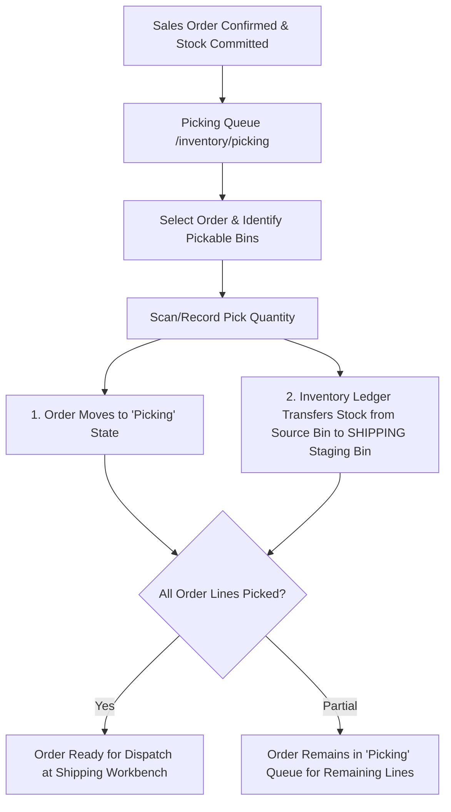

# Picking Operations

The **Picking** module manages the retrieval of allocated stock from warehouse storage bins, transferring items into designated staging areas for outbound packaging and dispatch.

---

## Picking Lifecycle & Inventory Movement



### 1. Physical Stock Movement to SHIPPING Staging
Unlike basic reservation systems, HeroBM records an explicit **Perpetual Inventory Ledger movement** upon every recorded pick:
* Stock is decremented from the source pickable storage bin (`storage`, `pick`, or `bulk`).
* Stock is simultaneously incremented in the warehouse location's designated **`SHIPPING` staging bin**.
* This ensures bin balances accurately reflect shelf reality while items are being collected.

### 2. Auto-State Transitions
* **Order State Transition**: When an order is in `Confirmed` state, recording the first item pick automatically advances the Sales Order state to **`Picking`**.
* **Completion**: Once all physical lines are fully picked, the order becomes ready for immediate dispatch at the Shipping desk or fast-track Scan-to-Dispatch station.

### 3. Scan-to-Pick Barcode Format
Mobile barcode scanners and paper pick lists utilize the canonical barcode format:

```text
PICK:{orderId}:{lineId}:{binId}:{quantity}
```

* **`orderId`**: UUID of the sales order.
* **`lineId`**: UUID of the sales order line item.
* **`binId`**: UUID of the source bin location.
* **`quantity`**: Quantity collected (defaults to `1` if omitted).

*(Shorthand format `{orderId}:{lineId}:{binId}:{quantity}` is also supported by the scanner).*

---

## Step-by-Step Workflows

### 1. Picking an Order from the Queue
1. Go to **Inventory** → **Picking** (`/inventory/picking`).
2. Select an assigned sales order from the queue.
3. Review the line items, required quantities, and available pickable bins.
4. Scan or select the **Source Bin** and confirm the **Quantity Picked**.
5. Click **Record Pick**. The stock transfers to the location's `SHIPPING` bin, and the pick progress updates in real time.

### 2. Cancelling an Accidental Pick
1. In the active order picking summary, locate the recorded pick line under the Picks table.
2. Click **Cancel Pick** (trash icon).
3. The system reverses the inventory movement, returning the units from the `SHIPPING` staging bin back to the original source bin, and updates the remaining pick requirement.

---

## Field Reference

| Field | Description |
| :--- | :--- |
| **Sales Order** | Target customer order being fulfilled (`ORD-...`). |
| **Bin Location** | Storage bin coordinate where stock is physically picked. |
| **Quantity Ordered** | Total units requested on the sales order line. |
| **Quantity Picked** | Confirmed physical units transferred to the `SHIPPING` staging bin. |
| **Barcode Payload** | Encoded scan string (`PICK:{orderId}:{lineId}:{binId}:{quantity}`). |
| **Pick Status** | Status of the individual pick entry (`Picked`, `Cancelled`). |
