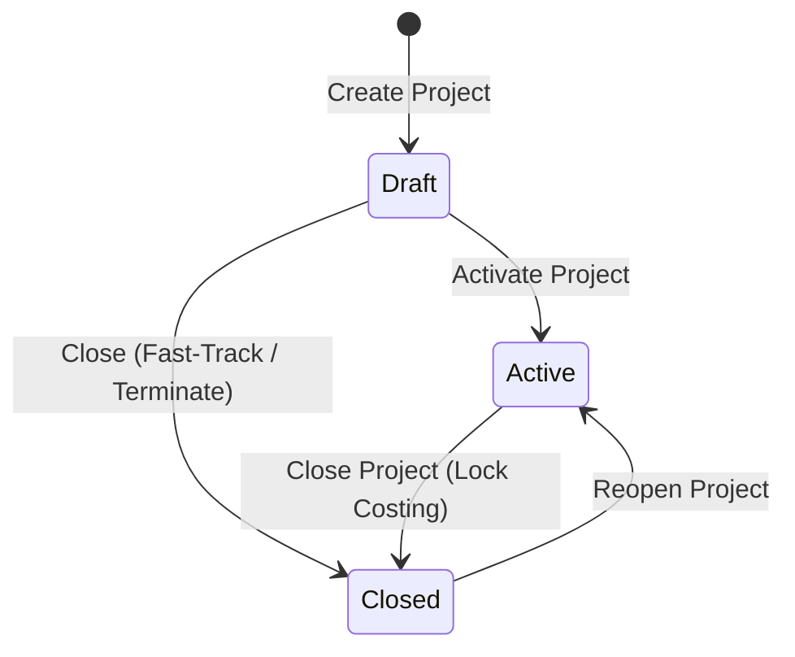
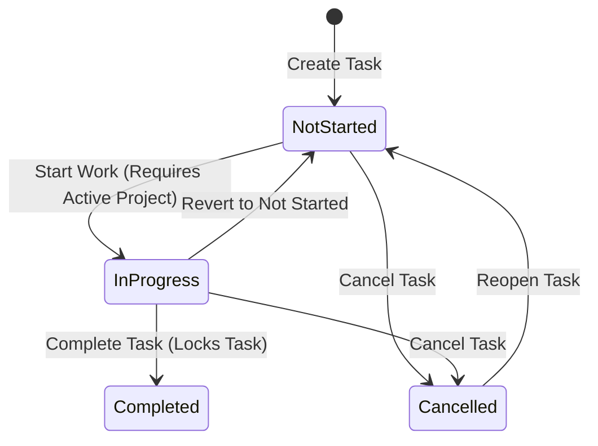
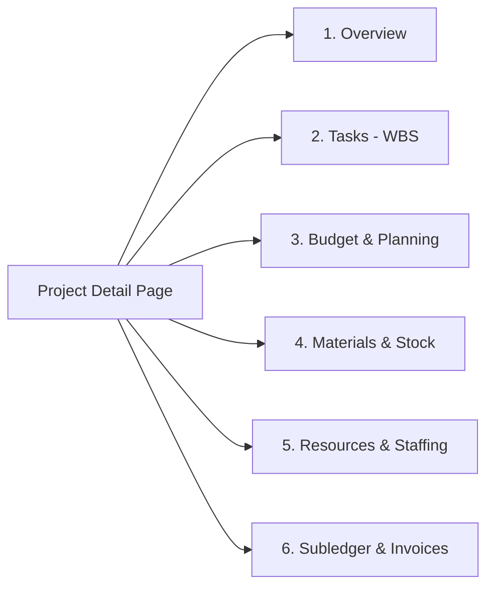
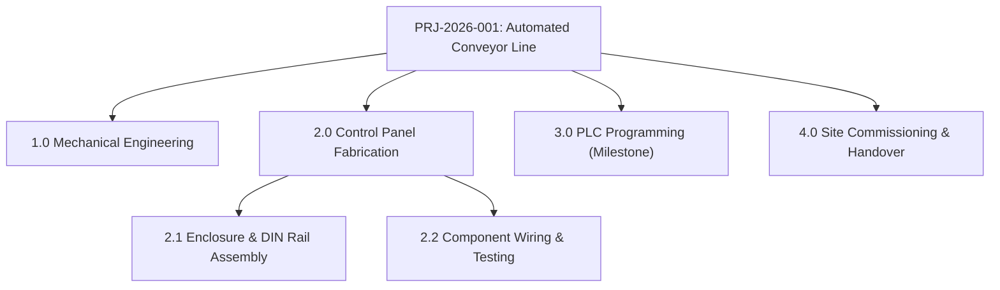
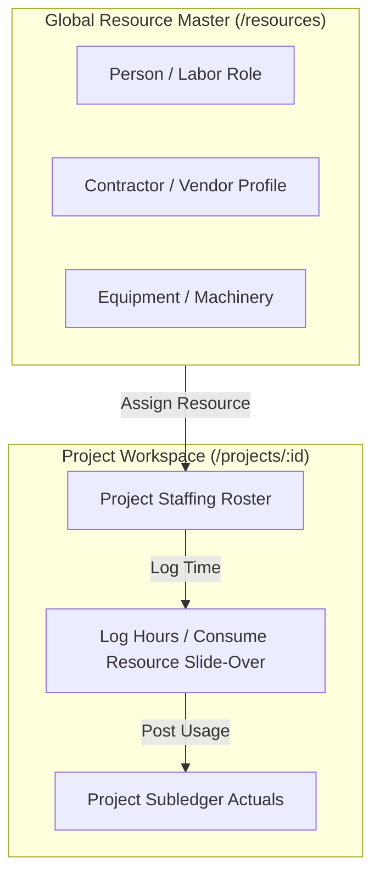
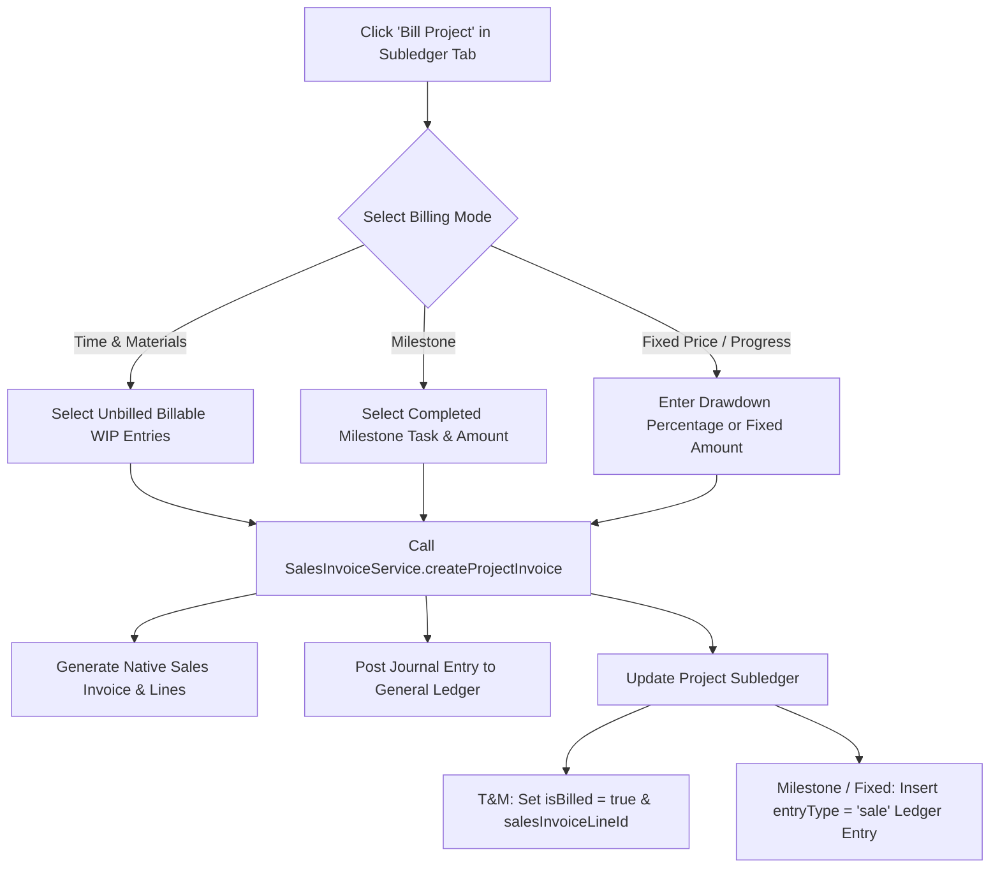

# Projects & Job Costing

The **Projects & Job Costing** module manages complex service engagements, engineering jobs, fabrication deliverables, and client contracts. It unifies Work Breakdown Structures (WBS), resource labor profiles & staffing rosters, budget estimates with discount tiers, warehouse material staging & task allocations, immutable financial subledgers, native Sales Invoice generation, and real-time profitability analytics.

---

## Project Lifecycle, Operational Stages & Task States

The Projects module clearly distinguishes between **Governed Lifecycle States** (which control editability and financial posting), **Operational Stages** (which represent delivery progress), and **Task States** (which govern individual WBS deliverable status).

### 1. Project Lifecycle States (`stateCode`)

Project lifecycle states are strictly governed by the application state machine:



* **`Draft` (`draft`)**: Initial project setup. WBS tasks, budget estimates, resource assignments, and staging bins can be configured.
* **`Active` (`active`)**: Active operational execution. Labor hours and direct expenses can be posted to the subledger, warehouse materials issued and returned, WBS tasks progressed, and progress/milestone invoices billed.
* **`Closed` (`closed`)**: Financial and operational closure. The subledger and tasks are locked against further changes. Automatically sets `actualEndDate` if not previously populated. Can be reopened to `Active` if adjustments or warranty billing are required.

---

### 2. Operational Stages (`stage`)

Independent of the state machine, projects progress through standardized delivery stages configured on the project header:

| Stage | Sequence | Purpose |
| :--- | :--- | :--- |
| **Planning** | Stage 1 | WBS scoping, rate card assignment, and baseline budget estimation. |
| **In Progress** | Stage 2 | Active project execution, material staging, and labor consumption. |
| **On Hold** | Stage 3 | Project temporarily paused due to client review, permits, or supply chain delay. |
| **QA & Review** | Stage 4 | Final inspection, client commissioning, punch list resolution, and testing. |
| **Completed** | Stage 5 | Operational delivery completed; awaiting final invoicing and financial reconciliation. |
| **Cancelled** | Stage 6 | Terminated scope or aborted client contract. |

---

### 3. Work Breakdown Structure Task States (`stateCode`)

Every task within the project's Work Breakdown Structure (WBS) follows an independent lifecycle:



> [!IMPORTANT]
> **Task Completion Invariant**: When a task reaches **`Completed`**, its details and planned budget allocations become immutable. You cannot modify task details, delete the task, or add new budget lines to a completed task. This guarantees baseline integrity for job auditability.

---

## Project Detail Workspace (Tab Architecture)

The Project Detail page (`/projects/:id`) is organized into six functional subpage workspaces:



1. **Overview (`overview`)**: Header metadata, customer relationship, project manager, staging location/bin assignment, trading & payment terms, default discount %, dynamic custom fields, chronological internal notes, financial KPI summary cards, and event audit trail.
2. **Tasks (WBS) (`wbs`)**: Hierarchical tree of project deliverables, milestones, billability toggles, planned/actual schedules, and task state management.
3. **Budget & Planning (`budget`)**: Task-level budget allocations for Labor (*Resource*), Materials (*Item*), and Expenses (*Expense*) with line discounts and real-time database actuals roll-ups.
4. **Materials & Stock (`materials`)**: Dedicated project staging inventory pipeline, inbound transfer orders (arriving), open returns (returning), material task allocations, staging charges, and return putaway cost credits.
5. **Resources & Staffing (`resources`)**: Project-specific staffing roster, resource consumption tracking (logged hours vs total cost), contractor rate cards, global resource master integration, and timesheet logging.
6. **Subledger & Invoices / Accounts (`accounts`)**: Immutable single-source-of-truth subledger (`project_ledger_entries`), direct expense logging, billable status toggles, unbilled entry modifications, native Project Billing (generating official Sales Invoices), and linked invoice history.

---

## Commercial Configurations & Accounting Models

### 1. Billing Types (`billingType`)

The billing type dictates the commercial invoicing model and how customer invoices are generated from project activity:

| Billing Type | Code | Invoicing Mechanics & Workflow | Best Used For |
| :--- | :--- | :--- | :--- |
| **Time & Materials** | `time_and_materials` | Invoices are generated directly from unbilled subledger entries (`isBillable = true`, `isBilled = false`). In the **Subledger & Invoices** tab, clicking **Bill Project** allows selecting specific time, material, and expense lines to invoice. Upon generation, lines are marked `isBilled = true` with linked `salesInvoiceLineId`. | Consulting, field services, custom fabrication, repairs, and variable-scope engagements. |
| **Fixed Price** | `fixed_price` | Customer is invoiced an agreed total contract amount. Invoicing is executed through progress drawdowns (fixed currency amount or percentage of total contract). Creates synthetic `sale` entries in the subledger while actual incurred costs track margin variance. | Turnkey installations, fixed-bid deliverables, and standard scope contracts. |
| **Milestone Based** | `milestone` | Invoicing is triggered when key deliverable tasks marked with `isMilestone = true` reach `Completed` state. In the billing dialog, selecting a milestone creates a corresponding invoice line and posts a `sale` entry to the subledger. | Phased engineering projects, multi-stage construction, and deliverable-gated contracts. |
| **Cost Plus** | `cost_plus` | Invoices actual incurred costs (labor, materials, direct expenses) plus an agreed contract markup percentage. | Research & development, technical investigations, and cost-reimbursable agreements. |

---

### 2. Customer Discount Matrix & Line Discounts

HeroBM provides tiered commercial discounting across project budgets and actual postings:

1. **Automatic Matrix Resolution**: When creating a project for a customer, the system automatically queries the **Discount Matrix** (`discount_matrix`) for customer-specific or customer-group pricing rules (`resolveEffectiveDiscount`) and populates the project's default `discountPercentage`.
2. **Project Header Default**: Stored on `projects.discountPercentage` and pre-filled across all new budget lines, material issues, and timesheets.
3. **Line-Level Overrides**: Budget lines and subledger postings support explicit `discountPercentage` overrides, calculating net line price via `computeLinePrice` (`Total Price = Quantity * Unit Price * (1 - Discount% / 100)`).

---

## Work Breakdown Structure (WBS) & Tasks

The **Tasks (WBS)** workspace structures the project into deliverables, phases, and work packages.



### Task Attributes & Controls

* **Task Code (`taskCode`)**: Structured hierarchical identifier (e.g. `1.0`, `1.1`, `2.0`).
* **Parent Task (`parentTaskId`)**: Establishes parent-child relationships for nested subtask trees. A task with subtasks cannot be deleted until its child tasks are removed or reassigned.
* **Milestone Flag (`isMilestone`)**: Marks key deliverable gates. For **Milestone Based** projects, completed milestones unlock billing drawdowns.
* **Billable Flag (`isBillable`)**:
  * **Billable (`true`)**: Resource time, materials, and expenses logged against this task are eligible for customer invoicing.
  * **Non-Billable (`false`)**: Incurred costs are tracked in project actuals but excluded from billing queues (e.g. internal warranty rework, non-billable travel, rework).
* **Schedule Timeline**: Tracks `plannedStartDate`, `plannedEndDate`, `actualStartDate`, and `actualEndDate`.
* **Safe Deletion Guards**: A task cannot be deleted if it has child subtasks, linked budget line allocations, or posted actual subledger transactions.

---

## Budget Planning & Actuals Variance Tracking

The **Budget & Planning** workspace allows project managers to construct baseline cost and revenue estimates across three resource categories:

| Budget Line Type | Entity Linkage | Pricing & Rate Pre-population |
| :--- | :--- | :--- |
| **Resource (Labor)** | `resourceId` (`project_resources`) | Pre-fills `unitCost` from resource `directUnitCost` and `unitPrice` from resource `unitPrice`. |
| **Item (Material)** | `productId` (`products`) | Pre-fills `unitCost` from product standard/WAC cost and `unitPrice` from product list price. |
| **Expense** | Free-text description | Direct estimated out-of-pocket expenses (permits, travel, tooling, logistics). |

### Real-Time Actuals Aggregation

Budget lines are dynamically aggregated against actual subledger postings in the database:
* **Actual Cost (`actualCost`)**: Real-time sum of `totalCostBase` across all ledger entries referencing the budget line.
* **Actual Revenue (`actualRevenue`)**: Real-time sum of `totalPriceBase` across all ledger entries referencing the budget line.
* **Actual Quantity (`actualQuantity`)**: Real-time sum of units or hours consumed.
* **Over Budget Indicator (`isOverBudget`)**: Highlighted badge triggered when `actualCost > totalCost`.

---

## Resource Profiles, Global Catalog & Staffing Roster

HeroBM supports two layers of resource management: the **Global Resource Master** (`/resources`) and **Project Resource Assignments** (`project_resource_assignments`).



### 1. Global Resource Catalog (`/resources`)

* **Resource Types (`resourceType`)**:
  * **Person (`person`)**: Internal staff member or labor profile (e.g. Senior Systems Engineer, Welder). Linked to system user (`userId`) and Service Product (`serviceProductId`). A single user can have multiple labor profiles with distinct rate cards.
  * **Contractor (`contractor`)**: External specialist linked to a supplier account (`vendorId`) and service product. If direct cost is omitted, cost rates automatically populate from `product_suppliers` rate cards.
  * **Equipment (`equipment`)**: Tooling, vehicles, or test rigs billed by operating time.
* **Rate Cards & Units**: Standard cost rate (`directUnitCost`), list bill rate (`unitPrice`), and base unit of measure (`baseUom`, e.g. `HOUR`, `DAY`).
* **Active / Archived Status**: Resources can be archived (`isActive = false`) to prevent new assignments while preserving historical subledger audit records. Resources with existing budget lines or ledger postings cannot be deleted.

### 2. Project Staffing Roster & Resource Consumption

* **Staffing Roster (`project_resource_assignments`)**: In the **Resources & Staffing** tab, project managers assign specific global resources to the project team roster with optional assignment notes.
* **Consumption Tracking**: The roster displays real-time cumulative hours/units consumed (`consumedQuantity`) and actual cost incurred (`totalCost`) per assigned resource.
* **Logging Hours (`ConsumeProjectResourceSlideOver` / `POST /projects/:id/consume-resource`)**:
  1. Select target WBS task and assigned resource.
  2. Enter quantity (hours/days), unit cost, unit billable price, and posting date.
  3. Automatically posts a `usage` entry (`lineType = 'resource'`, `sourceType = 'timesheet'`) to the Project Subledger.
* **Timesheet Management**: Unbilled resource usage entries can be modified or deleted directly from the table slide-over.

---

## Material Movements & Staging-at-Cost Model

The Projects module operates on the **Staging-at-Cost (Project WIP Costing)** model. Materials transferred into the project staging bin are debited to project WIP upon putaway, and returned stock posts symmetric compensating credits that cleanly net out to **0.00**.

```mermaid
sequenceDiagram
    participant PM as Project Team
    participant TO as Transfer Order & Putaway Queue
    participant Inv as Staging Bin (bin_contents)
    participant Sub as Project Subledger (project_ledger_entries)

    Note over PM,Sub: 1. Inbound Material Staging (Transfer Order Putaway)
    PM->>TO: Transfer stock from Warehouse to Project Staging Bin
    TO->>Inv: Confirm Putaway into Staging Bin (binType = 'project')
    TO->>Sub: Auto-Post Debit Usage (+Cost) via recordProjectStagingCharge

    Note over PM,Sub: 2. Task Allocation (Material Issue)
    PM->>Inv: Issue Material to WBS Task (STK-PRJ-ISSUE)
    Inv->>Inv: Deduct physical stock from staging bin
    Inv->>Sub: Reallocate Cost from Staging Pool to Target WBS Task

    Note over PM,Sub: 3. Return Unused Material to Warehouse Storage
    PM->>TO: Create Return Transfer Order (isProjectReturn: true)
    Note over Inv,TO: Stock marked as Returning; Available Qty = Staged - Returning
    TO->>Inv: Ship Return (Deduct physical stock from staging bin)
    TO->>Inv: Putaway into Warehouse Storage Bin
    TO->>Sub: Auto-Post Compensating Return Credit (-Cost) via recordProjectReturnCredit
```

### 1. Dedicated Staging Location & Staging Bin

* **Staging Location (`stagingLocationId`) & Bin (`stagingBinId`)**: Each project can be assigned a dedicated staging location and bin.
* **Project Bin Validation**: Staging bins must have `binType = 'project'` and belong to the selected staging location.
* **Live Inventory Pipeline**: The **Materials & Stock** tab provides full pipeline visibility:

| Pipeline Column | Source | Formula / Definition |
| :--- | :--- | :--- |
| **Staged** | `bin_contents` | Physical on-hand quantity currently residing in the project's assigned `stagingBinId`. |
| **Arriving** | Inbound `transfer_orders` | Ordered or in-transit stock awaiting putaway into the staging bin. |
| **Returning** | Return `transfer_orders` | Stock on open return transfer orders (`Confirmed` or `Picking`) physically in the bin awaiting dispatch. |
| **Available** | Staging Calculation | Real-time consumable stock: `Max(0, Staged - Returning)`. |
| **Consumed** | `project_ledger_entries` | Cumulative units issued from the staging bin and allocated to project tasks. |
| **Returned** | `project_ledger_entries` | Cumulative units restocked to warehouse storage that have received return credits. |
| **Actual Cost** | `project_ledger_entries` | Net actual material expenditure debited to the project subledger. |

### 2. Task Material Consumption (`issueInventoryToProject`)

1. In the **Materials & Stock** tab, click **Issue Material**.
2. Select target WBS task, product SKU, source location, and bin (defaults to project staging bin).
3. System creates an inventory movement (`STK-PRJ-ISSUE`), decrements `bin_contents`, and records a project subledger entry.
4. If drawn from the staging bin, the system automatically offsets the general staging charge to allocate cost specifically to the selected WBS task without double-counting project totals.

### 3. Returning Unused Stock (`Return Transfer Orders & Putaway Credit`)

1. Click **Return Stock** in the **Materials & Stock** tab to generate a **Return Transfer Order** (`isProjectReturn: true`).
2. While open (`Confirmed` / `Picking`), items remain in `bin_contents` but are deducted from **Available** as **Returning**.
3. When dispatched (`Shipped`), physical units are deducted from the staging bin.
4. When warehouse operators confirm **Putaway** into warehouse storage bins (`/inventory/putaway`), the system automatically calls `recordProjectReturnCredit`, posting a compensating negative cost entry to the project subledger (`entryType = 'usage'`, negative quantity and cost), restoring budget headroom.

---

## Direct Expenses & Subledger Management

### 1. Recording Direct Expenses (`ConsumeProjectExpenseSlideOver`)

Direct project expenses (travel, lodging, equipment rentals, municipal permits, subcontract invoices) are recorded directly in the **Subledger & Invoices** tab:
* Linked to a specific WBS task and optional budget line.
* Includes supplier reference numbers, descriptions, quantity, unit cost, billable unit price, discount %, and posting dates.
* Posts an immediate `usage` entry (`lineType = 'expense'`, `sourceType = 'manual_journal'` or `purchase_invoice`).

### 2. Subledger Controls

The immutable **Project Subledger** (`project_ledger_entries`) serves as the single source of truth for all job costing:
* **Cursor-Paginated Querying**: Accessible via `GET /projects/:id/ledger-entries` with filters for task, line type (`resource`, `item`, `expense`), entry type (`usage`, `sale`), billable status, and date range.
* **Billable Status Toggle (`PATCH /projects/:id/ledger-entries/:id/billable`)**: Unbilled ledger entries can be toggled between billable and non-billable without deleting the cost record.
* **Unbilled Entry Modifications (`PATCH` / `DELETE`)**: Unbilled usage entries can be adjusted or removed prior to billing. Billed entries are locked against modification.

---

## Project Billing & Sales Invoice Generation

HeroBM features a native Project Billing engine that generates official **Sales Invoices** (`sales_invoices`) directly from project activity and posts them to the General Ledger.



### 1. Billing Execution (`BillProjectSlideOver` / `POST /projects/:id/bill`)

1. Open the project detail page and switch to the **Subledger & Invoices** tab.
2. Click **Bill Project** to launch the billing slide-over.
3. Choose the billing mode:
   * **Time & Materials**: View all unbilled billable labor hours, material issues, and expenses. Check specific lines to include on the invoice.
   * **Milestone Billing**: Select deliverable milestone tasks and enter contract milestone billable amounts.
   * **Progress Drawdown / Fixed Price**: Specify a progress billing percentage or fixed lump-sum drawdown.
4. Set invoice date, payment due date, optional memo, and tax settings.
5. Click **Generate Invoice**:
   * Generates a native Sales Invoice (`sales_invoices`) under the customer account.
   * Delegates GL receivable and revenue postings to `SalesInvoiceService` (adhering to the Single-Writer Domain Principle).
   * Updates selected T&M entries to `isBilled: true` with the generated `salesInvoiceLineId`.
   * For milestones and fixed drawdowns, inserts synthetic `sale` entries (`entryType = 'sale'`) into the subledger.
   * Emits project audit events (`project_billed`).

### 2. Automated Billing Reversal (Invoice Cancellation)

If a generated project sales invoice is subsequently cancelled:
* The system automatically invokes `unbillProjectInvoiceHelper`.
* Linked actual usage entries are cleanly reverted to unbilled (`isBilled = false`, `salesInvoiceLineId = null`).
* Synthetic milestone/drawdown `sale` entries generated for that invoice are deleted.
* Emits a `project_invoice_cancelled` audit event, instantly restoring unbilled WIP balances.

---

## Real-Time Profitability KPIs

Project gross margins and cost variances are computed in real time via `ProjectsInventoryService.getProfitability`:

| Metric | Calculation Formula | Purpose |
| :--- | :--- | :--- |
| **Total Budget Cost** | Sum of (plannedQuantity * unitCost) across all budget lines | Total planned baseline expenditure. |
| **Target Budget Price** | Sum of (plannedQuantity * unitPrice * (1 - discount)) across all budget lines | Total planned project revenue. |
| **Total Actual Cost** | Sum of totalCostBase across all ledger usage entries | Real-time actual costs incurred (Labor + Material + Expense). |
| **Billable Revenue** | Sum of totalPriceBase across all ledger usage entries | Cumulative billable value generated by delivery. |
| **Billed Revenue** | Sum of totalPriceBase where isBilled = true | Value formally invoiced to client. |
| **Cost Variance** | Total Budget Cost - Total Actual Cost | Budget headroom (positive = under budget; negative = cost overrun). |
| **Estimated Margin %** | ((Target Budget Price - Total Budget Cost) / Target Budget Price) * 100 | Projected gross profit margin at planning stage. |
| **Actual Margin %** | ((Billable Revenue - Total Actual Cost) / Billable Revenue) * 100 | Real-time delivery profit margin based on actual postings. |

### Cost Stream Breakdown

* **Labor Actual Cost**: Subledger cost stream from employee and contractor labor hours (`lineType = 'resource'`).
* **Material Actual Cost**: Net material expenditure debited to project staging and tasks minus return credits (`lineType = 'item'`).
* **Expense Actual Cost**: Direct project expenses, permits, travel, and vendor charges (`lineType = 'expense'`).

---

## Step-by-Step Workflows

### 1. Creating a New Project
1. Navigate to **Projects** (`/projects`) and click **New Project** (`/projects/new`).
2. Select the **Customer**. Operating currency and default payment terms populate automatically.
3. Enter **Project Name**, **Start Date**, **Target End Date**, and assign a **Project Manager**.
4. Select **Billing Type** (*Time & Materials*, *Fixed Price*, *Milestone*, *Cost Plus*) and **WIP Method**.
5. (Optional) Assign dedicated **Staging Location** and **Staging Bin** (must be `binType = 'project'`).
6. Review or adjust the default **Discount %** resolved from the customer discount matrix.
7. Click **Create Project**.

### 2. Setting Up WBS Deliverables & Budget
1. In the project detail workspace, open the **Tasks (WBS)** tab and click **Add Task**.
2. Enter task code (e.g. `1.0`), name, dates, milestone flag, and billable toggle.
3. Switch to the **Budget & Planning** tab and click **Add Budget Line**.
4. Select target task, line type (*Resource*, *Item*, *Expense*), planned quantity, unit cost, and billable price.
5. Review the header KPI card to verify **Estimated Margin %**.

### 3. Assigning Staff & Logging Labor Hours
1. In the **Resources & Staffing** tab, click **Assign Resource** to add team members from the global catalog.
2. To log hours, click **Log Hours / Consume Resource**.
3. Select the task, resource profile, hours worked, and posting date.
4. The system immediately posts a usage entry to the project subledger.

### 4. Staging & Consuming Warehouse Materials
1. Transfer inventory from main warehouse storage to the project's staging bin via standard Transfer Orders.
2. Putaway into the staging bin automatically debits upfront material WIP to the project.
3. In the **Materials & Stock** tab, click **Issue Material** to allocate stock from staging to a specific WBS task.
4. To return unused stock, click **Return Stock** to generate a return transfer order. Warehouse putaway into storage bins automatically credits the project subledger.

### 5. Invoicing & Project Closure
1. In the **Subledger & Invoices** tab, click **Bill Project**.
2. Select unbilled T&M lines, milestone deliverables, or progress percentages.
3. Click **Generate Invoice** to post the Sales Invoice and GL journal entries.
4. Once all deliverables are completed and accounts reconciled, click **Close Project** in the header action bar to lock the project against further changes.

---

## Field Reference

| Field Name | Database Column | Data Type | UI Location | Description |
| :--- | :--- | :--- | :--- | :--- |
| **Project Number** | `project_number` | `text (UNIQUE)` | Header, List | Unique auto-generated identifier (`PRJ-YYYYMMDD-XXXX`). |
| **Project Name** | `name` | `text` | Header, Overview | Descriptive project or commercial contract title. |
| **Customer** | `customer_id` | `uuid (FK)` | Overview Tab | Client account purchasing deliverables. Determines operating currency. |
| **Opportunity** | `opportunity_id` | `uuid (FK)` | Overview Tab | Linked CRM sales pipeline opportunity. |
| **Status** | `state_code` | `text (ENUM)` | Header Badge | Governed state machine status (`draft`, `active`, `closed`). |
| **Stage** | `stage` | `text` | Header Badge, Overview | Operational stage (`Planning`, `In Progress`, `On Hold`, `QA & Review`, `Completed`, `Cancelled`). |
| **Billing Type** | `billing_type` | `text (ENUM)` | Overview Tab | Invoicing model (`time_and_materials`, `fixed_price`, `milestone`, `cost_plus`). |
| **WIP Method** | `wip_method` | `text (ENUM)` | Overview Tab | Balance sheet WIP method (`percentage_of_completion`, `cost_value`, `cost_of_sales`, `none`). |
| **Project Manager** | `project_manager_id` | `uuid (FK)` | Header Subtitle, Overview | Assigned staff member responsible for delivery. |
| **Staging Location** | `staging_location_id` | `uuid (FK)` | Overview, Materials Tab | Warehouse facility assigned for project material staging. |
| **Staging Bin** | `staging_bin_id` | `uuid (FK)` | Overview, Materials Tab | Dedicated project staging bin (`binType = 'project'`). |
| **Default Discount %** | `discount_percentage` | `numeric(5,2)` | Overview Tab | Default commercial discount percentage applied to lines. |
| **Task Code** | `task_code` | `text` | Tasks (WBS) Tab | Hierarchical WBS code (e.g. `1.0`, `1.1`, `2.0`). |
| **Is Milestone** | `is_milestone` | `boolean` | Tasks Tab | Milestone deliverable flag used for milestone billing. |
| **Is Billable** | `is_billable` | `boolean` | Tasks Tab, Subledger | Controls whether time, materials, and expenses can be billed to the client. |
| **Budget Total Cost** | `total_cost` | `numeric(12,2)` | Budget Tab | Total planned baseline expenditure for a budget line. |
| **Budget Total Price** | `total_price` | `numeric(12,2)` | Budget Tab | Total planned baseline billable revenue for a budget line. |
| **Subledger Cost Base** | `total_cost_base` | `numeric(12,2)` | Subledger Tab | Base currency actual cost incurred for a usage entry. |
| **Subledger Price Base** | `total_price_base` | `numeric(12,2)` | Subledger Tab | Base currency billable revenue generated by a usage or sale entry. |
| **Is Billed** | `is_billed` | `boolean` | Subledger Tab | Indicates whether a ledger entry has been invoiced to the client. |
| **Sales Invoice Line** | `sales_invoice_line_id`| `uuid` | Subledger Tab | Foreign key linking billed ledger entry to generated Sales Invoice line. |
