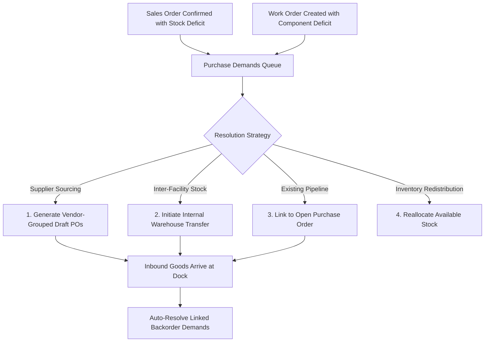

# Purchase Demands & Backorders

The **Purchase Demands** queue consolidates all unallocated stock requirements across the enterprise — unifying customer sales order backorders and manufacturing work order component shortages into a centralized procurement and allocation workbench.

---

## Demand Generation & Resolution Architecture

### 1. Demand Sources
Shortage records enter the queue through two primary operational channels:
* **Customer Sales Orders**: When confirming a Sales Order where `Quantity Ordered > Available Stock`, the unallocated balance is logged as an active backorder demand.
* **Manufacturing Work Orders**: When a production job requires component parts or raw materials exceeding available storage stock, component shortages (`workOrderComponentId`) enter the queue tagged with the parent work order.

### 2. Sourcing & Allocation Options

Operators can resolve demands using four built-in fulfillment actions:

1. **Vendor Sourcing (`Generate Purchase Orders`)**:
   * Selected demands are automatically aggregated by **Preferred Supplier**.
   * Vendor SKU, supplier currency, and contracted unit costs are populated directly from supplier mappings to generate draft Purchase Orders.
2. **Inter-Warehouse Transfers (`Internal Transfer`)**:
   * The **Stock Elsewhere** indicator highlights stock availability across other company warehouse locations.
   * Operators can launch an immediate Transfer Order to move stock from a surplus warehouse to the demanding fulfillment location.
3. **Link to Open Purchase Order (`Link to PO`)**:
   * If a Purchase Order is already on order with a supplier, operators can bind open demand lines directly to the pending PO.
4. **Stock Reallocation (`Reallocate`)**:
   * If limited stock is available or priorities change, operators can reassign committed stock from lower-priority orders to urgent customer demands.

### 3. Inbound Dock Receipt & Auto-Resolution
When goods are received at the warehouse dock against a linked Purchase Order or incoming Transfer Order:
* Inbound items increase physical warehouse stock and update inventory ledgers.
* The system executes automated demand resolution (`resolveOpenDemands`), clearing the matched backorder records and committing the newly arrived stock directly to the waiting Sales Order or Work Order.

---

## Step-by-Step Workflows

### 1. Generating Purchase Orders from Demands
1. Go to **Purchasing** → **Demand** (`/purchase-orders/demands`).
2. Review the shortage list. Filter by fulfillment warehouse location or supplier.
3. Select the checkboxes for the lines you wish to order from suppliers.
4. Click **Generate Purchase Orders**.
5. The system generates draft Purchase Orders grouped by vendor, automatically populating vendor costs and quantities.
6. Review the created draft orders in **Purchasing** → **Purchase Orders** (`/purchase-orders`).

### 2. Transferring Stock from Another Warehouse
1. In the Demands queue, locate an item displaying available units in the **Stock Elsewhere** column.
2. Click the item row or select the line, then click **Internal Transfer**.
3. Select the **Source Warehouse** with available stock and specify the **Transfer Quantity**.
4. Click **Create Transfer**. A new Transfer Order is created in `draft` or `requested` status.

### 3. Linking Demand to an Existing Open PO
1. Select a demand row in the queue.
2. Click **Link to PO**.
3. In the slide-over drawer, select from active, on-order Purchase Orders that have unallocated incoming line capacity.
4. Confirm the linked quantity.

---

## Field Reference

| Field | Description |
| :--- | :--- |
| **Order** | Linked Sales Order number (`ORD-...`) or Work Order number (`WO-...`). |
| **Product** | Product SKU / Item Number. |
| **Description** | Product title and specification. |
| **Quantity** | Unallocated shortage quantity required. |
| **Status** | State of linked purchase order or transfer order (e.g. `Draft`, `Ordered`, `Awaiting Receipt`). |
| **Supplier** | Preferred vendor configured on the product record. |
| **Cost Price** | Purchasing unit cost in supplier currency. |
| **Fulfillment Location** | Target warehouse facility requiring stock. |
| **Stock Elsewhere** | Summary of available stock residing in other company warehouses. |
