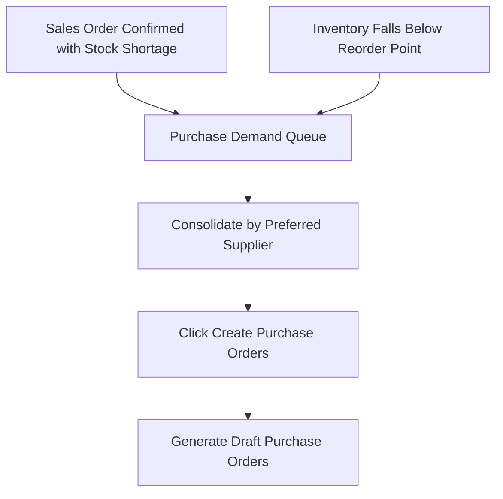

# Purchase Demands & Reordering

The **Purchase Demands** queue consolidates all stock replenishment needs across the business — aggregating customer sales order backorders and minimum reorder point deficits.

---

## Demand Generation & Consolidation

### 1. Automated Backorder Triggers
When an operator confirms a sales order with an inventory gap and selects **Generate Backorders**, demand records are immediately created with direct links back to the originating customer order lines.

### 2. Supplier Consolidation
The demand board groups all open item shortages by their **Preferred Supplier**, enabling procurement officers to raise unified purchase orders with maximum volume efficiency.

---

## Step-by-Step Workflows

### 1. Converting Demands to Purchase Orders
1. Go to **Purchasing** → **Demand** (`/purchase-orders/demands`).
2. Review the list of open stock shortages.
3. Select the check-boxes for the demands you wish to order.
4. Click **Generate Purchase Orders**.
5. The system creates draft Purchase Orders grouped by vendor, automatically populating vendor costs and quantities.
6. Open the newly generated Purchase Orders to review and send to suppliers.

---

## Field Reference

| Field | Description |
| :--- | :--- |
| **Product** | Replenishment item. |
| **Required Quantity** | Total shortage units. |
| **Source Order** | Linked customer sales order. |
| **Expected Unit Cost** | Standard replacement unit cost. |
