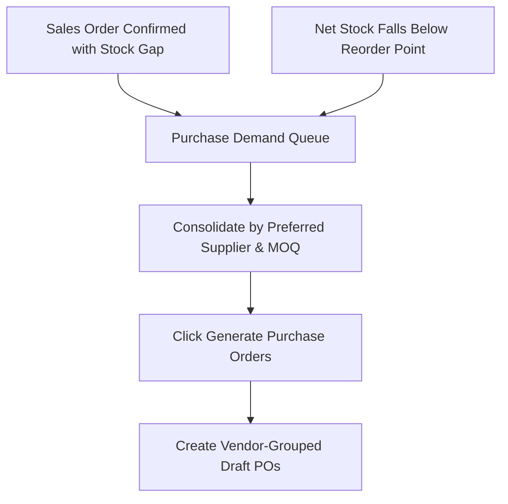

# Purchase Demands & Reordering

The **Purchase Demands** queue consolidates all stock replenishment requirements across the enterprise — unifying customer sales order backorders and automated reorder point deficits.

---

## Demand Generation & Reordering Logic



### 1. Net Inventory Position & Shortage Triggers
The system evaluates stock replenishment using the enterprise net position formula:

```
Net Available Stock = Available On-Hand + On-Order (Open POs) - Allocated Reservations - Quarantine
```

* **Shortage Condition**: A replenishment demand is triggered whenever:
  ```
  Net Available Stock < Reorder Point (Safety Stock Level)
  ```
* **Suggested Order Quantity**:
  ```
  Suggested PO Quantity = max(Max Stock Level - Net Available Stock, Vendor Minimum Order Quantity)
  ```
  If the vendor specifies a **Purchasing Pack Size** (e.g. box of 25), the suggested quantity automatically rounds up to the nearest multiple.

### 2. Backorder Pegging & Cross-Docking
* When confirming a customer Sales Order with an inventory gap, selecting **Generate Backorders** creates a demand record with direct relational pointers to the `sales_order_id` and `sales_order_line_id`.
* When the resulting Purchase Order is received at the dock, warehouse operators receive an immediate **Backorder Cross-Dock Prompt**, allowing goods to be routed directly to the staging area for immediate customer dispatch.

### 3. Supplier Consolidation Algorithm
* Demands across multiple products are automatically aggregated by **Preferred Supplier**.
* Sourcing data (Supplier SKU, purchasing currency, standard lead time, and contracted unit price) is pulled automatically from supplier catalogs to build complete draft Purchase Orders with a single click.

---

## Step-by-Step Workflows

### 1. Generating Purchase Orders from Demands
1. Go to **Purchasing** → **Demand** (`/purchase-orders/demands`).
2. Review the consolidated shortage list. Filter by warehouse facility or preferred supplier.
3. Select the check-boxes for the lines you wish to purchase.
4. Click **Generate Purchase Orders**.
5. The system creates draft Purchase Orders grouped by vendor, automatically populating vendor costs and quantities.
6. Open the generated draft Purchase Orders (`/purchase-orders`) to review and send to suppliers.

---

## Field Reference

| Field | Description |
| :--- | :--- |
| **Product** | Replenishment item requiring stock. |
| **Required Quantity** | Calculated units needed to satisfy backorders or reach max stock. |
| **Source Sales Order** | Linked customer order number for direct backorder pegging. |
| **Preferred Supplier** | Default vendor configured on the product record. |
| **Expected Unit Cost** | Contracted unit purchase price in supplier currency. |

