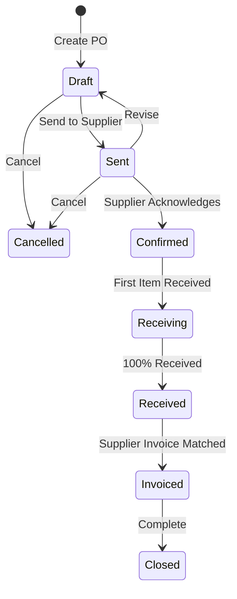

# Purchase Orders

The **Purchase Orders** module manages procurement with external vendors. It tracks order placement, expected shipping schedules, and dock receiving.

---

## Purchase Order Lifecycle & Rules

### State Definitions

| State | Meaning | What can be changed? |
| :--- | :--- | :--- |
| **Draft** | Order is being prepared. | Everything (supplier, lines, costs, quantities). |
| **Sent** | Order transmitted to supplier. | Locked. Can return to Draft to modify or move to Confirmed. |
| **Confirmed** | Supplier confirmed price and delivery date. | Locked. Ready for dock receiving. |
| **Receiving** | Warehouse has received partial quantities. | Locked. Open for further receipts. |
| **Received** | All line quantities fully received at the dock. | Locked. Ready for 3-way invoice matching. |
| **Invoiced** | Supplier bill matched and posted to AP. | Closed. |
| **Cancelled** | Order was cancelled. | Closed. |

---

## Step-by-Step Workflows

### 1. Creating and Sending a Purchase Order
1. Go to **Purchasing** → **Purchase Orders** (`/purchase-orders`).
2. Click **+ New Purchase Order**.
3. Select the **Supplier**. Currency and terms fill automatically.
4. Set the **Expected Delivery Date** and **Receiving Warehouse**.
5. Add line items, quantities, and agreed unit costs.
6. Click **Save as Draft**.
7. Click **Send Order**, then click **PDF** or **Email** to issue the order to the vendor.

### 2. Receiving and Completing an Order
1. When goods arrive at the dock, warehouse staff receive items via **Inventory** → **Receiving**.
2. When all items are received, the PO automatically moves to **Received**.
3. When the supplier bill arrives, match it in **Supplier Invoices** to complete the order.

---

## Field Reference

| Field | Description |
| :--- | :--- |
| **Supplier** | Vendor account. |
| **PO Number** | Unique purchase order reference. |
| **Expected Delivery** | Scheduled dock arrival date. |
| **Receiving Warehouse** | Target warehouse facility. |
| **Unit Cost** | Agreed purchase price per unit in supplier currency. |
| **Status** | Stage in procurement lifecycle. |
