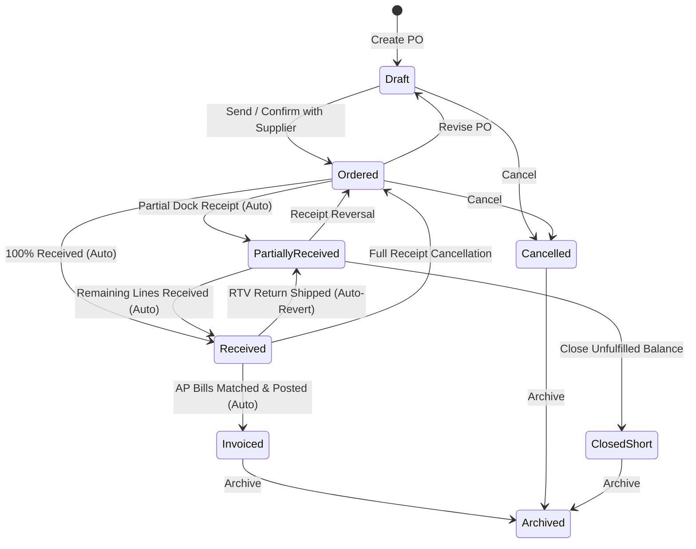

# Purchase Orders

The **Purchase Orders** module manages procurement with external vendors. It tracks order placement, supplier purchasing holds, expected shipping schedules, automated document emailing, and dock receiving integration.

---

## Purchase Order Lifecycle & Automated Rules

### Automated State Transition Rules Engine

The PO lifecycle rules engine continuously monitors warehouse and accounting events:

| Rule Name | Event Trigger | Evaluation Condition | Target State |
| :--- | :--- | :--- | :--- |
| **`auto-receive-when-fully-received`** | Goods Receipt Created | All lines have `Quantity Received >= Ordered Quantity` | **`Received`** |
| **`auto-partially-receive-when-some-received`** | Goods Receipt Created | Some lines have `Quantity Received > 0` but not all | **`Partially Received`** |
| **`auto-invoice-when-fully-invoiced-and-received`** | Supplier Invoice Posted | All lines are fully received and fully matched against posted AP bills | **`Invoiced`** |
| **`auto-revert-to-partially-received-on-return`** | Purchase Return Shipped | Return shipment reduces net received quantity below ordered quantity | **`Partially Received`** |

---

## Business Logic & Purchasing Controls

### 1. Supplier Purchasing Holds
* **Hold Gate**: If a vendor is marked **On Purchasing Hold** in [Suppliers](./suppliers.md), the system warns operators during draft creation and strictly blocks advancing the PO to `Ordered`.
* **Hold Release**: Holds can only be lifted on the vendor master record by users with authorized vendor management privileges.

### 2. Multi-Currency & FX Snapshotting
* Purchase orders snapshot the vendor's active currency code and current exchange rate to the system base currency upon order creation.
* Line items, unit costs, and purchase totals are transacted in the vendor's currency, while base equivalent amounts are maintained for inventory capitalization and GL budgeting.

### 3. Closing Short vs. Revision
* If a supplier is unable to deliver the remaining units on a partially received order, an operator can click **Close Short**.
* Closing short transitions the PO status to `Closed Short`, releasing open on-order stock reservations from demand planning without leaving orphaned purchase commitments.
* An `Ordered` purchase order with no received goods can be reverted to `Draft` if commercial terms or line items need modification.

---

## Step-by-Step Workflows

### 1. Creating and Sending a Purchase Order
1. Go to **Purchasing** → **Purchase Orders** (`/purchase-orders`).
2. Click **New Purchase Order** (`/purchase-orders/new`).
3. Select the **Supplier**. Currency, payment terms, and vendor addresses fill automatically.
4. Set the **Expected Delivery Date** and destination **Receiving Warehouse**.
5. Add line items, quantities, and agreed unit costs.
6. Click **Save as Draft**, then click **Send to Supplier** to advance status to `Ordered`.
7. Click **Email** to generate and transmit the branded Typst PDF purchase order.

### 2. Receiving and Invoice Matching
1. When goods arrive, dock staff receive items in **Inventory** → **Receiving**. The PO automatically updates to `Partially Received` or `Received`.
2. When the vendor bill arrives, navigate to **Purchasing** → **Supplier Invoices** to match lines against the receipt note and post to Accounts Payable. Once fully billed, the PO moves to `Invoiced`.

---

## Field Reference

| Field | Description |
| :--- | :--- |
| **Supplier** | Vendor account receiving the purchase order. |
| **PO Number** | Unique procurement identifier (e.g. `PO-2026-00067`). |
| **Expected Delivery Date** | Anticipated arrival date at the receiving dock. |
| **Receiving Warehouse** | Target warehouse facility for goods receipt. |
| **Currency & FX Rate** | Sourcing currency and exchange rate to system base currency. |
| **PO Status** | Stage (`Draft`, `Ordered`, `Partially Received`, `Received`, `Invoiced`, `Closed Short`, `Cancelled`, `Archived`). |
| **Unit Cost** | Agreed purchase price per unit in supplier currency. |
| **Supplier Hold** | Warning indicator shown if vendor is on operational hold. |
