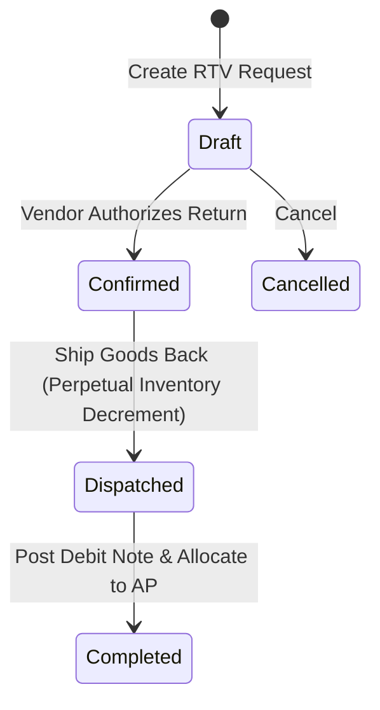

# Purchase Returns & Debit Notes

The **Purchase Returns & Debit Notes** module handles returning damaged, defective, or over-shipped goods to vendors (Return to Vendor - RTV), generating return documentation, emailing vendors, and recovering financial value via Debit Notes.

---

## Return to Vendor Lifecycle & Business Logic



### 1. Purchase Order State Reversion Trigger
When an outbound return shipment is marked **Dispatched**:
* The system deducts the returned quantity from the PO's cumulative `Quantity Received`.
* If net received quantity drops below the ordered quantity, the rules engine automatically executes **`auto-revert-to-partially-received-on-return`**, reopening the PO to `Partially Received` so replacement items can be received at the dock.

### 2. General Ledger Postings for Debit Notes
Posting a Debit Note reduces the Accounts Payable liability owed to the vendor:

```
Debit:  Accounts Payable Control Account    (Reduces total vendor liability)
Credit: Inventory Asset / Returns Clearing  (Decrements inventory asset balance)
Credit: Input Tax / GST Recoverable         (Reverses claimed input tax)
```

### 3. Allocation Against Open Supplier Invoices
Debit notes can be matched directly against outstanding supplier bills:

```
Supplier Bill Outstanding = Bill Gross Total - Allocated Payments - Allocated Debit Notes
Debit Note Unallocated Balance = Debit Note Gross Total - Sum(Allocated Invoice Amounts)
```

* **No Secondary GL Entry**: Allocation is an operational subledger action that decrements open balances on both documents simultaneously.
* **Cash Payout**: If the vendor remits a bank refund rather than offsetting future bills, a `supplier_refund` payment entry debits the Bank Account and credits Accounts Payable.

---

## Step-by-Step Workflows

### 1. Returning Goods to a Supplier
1. Go to **Purchasing** → **Purchase Returns** (`/purchase-orders/returns`).
2. Click **New Purchase Return** (`/purchase-orders/returns/new`) and select the originating **Purchase Order**.
3. Choose the items, return quantities, origin storage/quarantine bins, and select a **Reason Code**.
4. Click **Confirm Return**.
5. Click **Email Return Slip** to send the return docket to the supplier's RMA desk.
6. Warehouse staff pack and dispatch the items via **Inventory** → **Shipping** → **Supplier Returns** (`/shipments/returns`).
7. When the vendor authorizes credit, open **Purchasing** → **Debit Notes** (`/purchase-debit-notes`), click **Post Debit Note**, and allocate the balance to open bills.

---

## Field Reference

| Field | Description |
| :--- | :--- |
| **Return Number (RTV)** | Unique return authorization reference (e.g. `RTV-2026-00012`). |
| **Purchase Order** | Original PO for relational details like vendor and price history. |
| **Debit Note Number** | Legal debit adjustment identifier (e.g. `DBN-2026-00008`). |
| **Debit Amount** | Total gross deducted balance including tax. |
| **Unallocated Balance** | Remaining credit remaining on the vendor's AP ledger. |
| **Reason Code** | Classification for the return (Damaged, Over-shipped, Defective, Wrong Item). |
| **Status** | Stage (`Draft`, `Confirmed`, `Dispatched`, `Completed`). |

