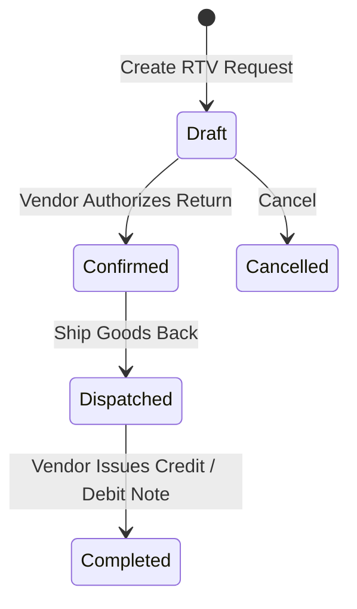

# Purchase Returns & Debit Notes

The **Purchase Returns & Debit Notes** module handles returning damaged, defective, or over-shipped goods to vendors (Return to Vendor - RTV) and recovering financial value via Debit Notes.

---

## Return to Vendor (RTV) Lifecycle

### 1. General Ledger Impact of Debit Notes
Posting a debit note reduces your liability to the supplier:
- **Debit**: Accounts Payable (Vendor balance decreases)
- **Credit**: Inventory Asset / Expense Account
- **Credit**: Input Tax / GST Recoverable (reversing input tax)

---

## Step-by-Step Workflows

### 1. Returning Goods to a Supplier
1. Go to **Purchasing** → **Purchase Returns** (`/purchase-orders/returns`).
2. Click **+ New Purchase Return** and select the **Purchase Order**.
3. Choose the items and quantities to return and select a **Reason Code**.
4. Click **Confirm Return**.
5. Warehouse staff pack and dispatch the items via **Inventory** → **Shipping** → **Supplier Returns**.
6. When the vendor issues credit or replaces items, post the **Debit Note** in **Purchasing** → **Debit Notes** (`/purchase-debit-notes`) to reduce Accounts Payable.

---

## Field Reference

| Field | Description |
| :--- | :--- |
| **Return Number (RTV)** | Return authorization reference. |
| **Purchase Order** | Original PO for relational details like supplier. |
| **Debit Note Number** | Legal debit adjustment identifier. |
| **Debit Amount** | Total deducted balance. |
| **Status** | Stage (`Draft`, `Confirmed`, `Dispatched`, `Completed`). |
