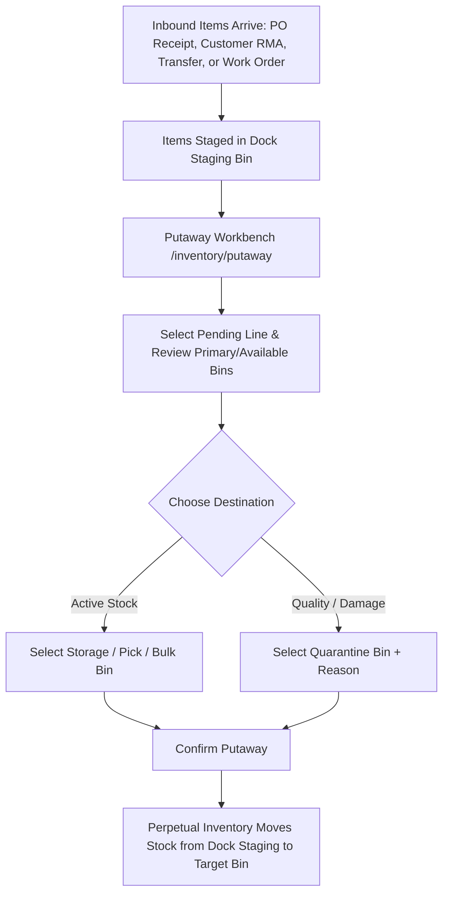

# Putaway Operations

The **Putaway** module guides warehouse operators in transporting newly received inventory from inbound dock staging areas into permanent storage, pick, bulk, or quarantine bins.

---

## Putaway Logic & Workflow

### 1. Inbound Stream Aggregation
The putaway queue aggregates pending items waiting in dock staging across all inbound operational streams:
* **Supplier Deliveries**: Goods received on Purchase Orders via Goods Receipt Notes (GRN).
* **Customer Returns**: Returned goods accepted through sales return authorizations (RMA).
* **Inter-Warehouse Transfers**: Inbound transfer shipments received at the dock.
* **Manufacturing Output**: Finished assemblies completed on production Work Orders.

### 2. Dock-to-Storage Stock Activation
* **Staging Phase**: While items reside in dock staging bins, they are counted in total physical **On Hand** stock but are marked non-pickable (`isPickableBin = false`), preventing premature picking before placement.
* **Putaway Completion**: Confirming putaway moves stock into an active `storage`, `pick`, or `bulk` bin, **immediately increasing Available Stock** for automated order allocation and picking queues.

---

## Step-by-Step Workflows

### 1. Completing a Putaway Task
1. Go to **Inventory** → **Putaway** (`/inventory/putaway`).
2. Select your **Warehouse Facility** (and optional Zone filter).
3. Select an open line item from the **Pending Putaway** list.
4. The detail panel displays the product details, pending quantity, current primary bin (if configured), and available bins in that facility.
5. Select the **Target Storage Bin** (or search by bin code).
6. (Optional) If relocating damaged goods for inspection, select a **Quarantine Bin** and enter the **Quarantine Reason**.
7. Click **Complete Putaway** to commit the stock relocation.

---

## Field Reference

| Field | Description |
| :--- | :--- |
| **Reference** | Inbound document reference (e.g. `GRN-...`, `RMA-...`, `TRN-...`, `WO-...`). |
| **Source Type** | Origin category (`goods_receipt`, `sales_return`, `transfer_receipt`, `work_order`). |
| **Product** | Item SKU number and description. |
| **Quantity** | Pending unit count to be moved from staging into permanent bins. |
| **Destination Bin** | Target storage bin coordinate (e.g. `A-02-B1`). |
| **Quarantine Reason** | Mandatory reason text required when routing items to a quarantine bin. |
