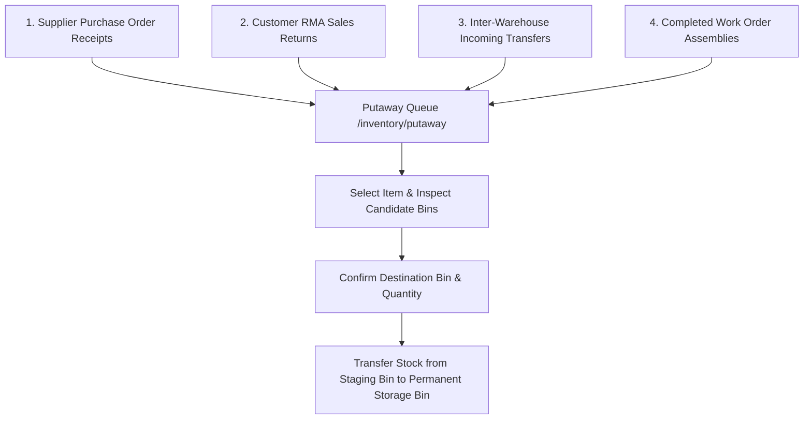

# Putaway Operations

The **Putaway** module manages moving inbound inventory from temporary dock staging into permanent warehouse storage locations.

---

## Multi-Stream Putaway Architecture

Items enter the Putaway Queue (`/inventory/putaway`) from four operational streams:

### 1. Multi-Stream Inbound Sources
1. **PO Receipts**: Supplier deliveries verified and accepted at dock receiving (`[PO RECEIPT]`).
2. **Customer Sales Returns**: Returned products inspected and cleared for restocking (`[SALES RETURN]`).
3. **Internal Transfers & Project Staging / Returns**: Stock arriving from another warehouse or returning from an operational project (`[TRANSFER]`):
   - **Project Staging Transfers**: Shows `Project: PRJ-XXXX` metadata. The candidate bin pre-selects the project's designated **Staging Bin** (`project.stagingBinId`).
   - **Project Return Transfers**: Restocks returned unused project materials to central warehouse storage. Confirming putaway automatically posts a compensating cost credit to the Project Subledger (`recordProjectReturnCredit`).
4. **Manufactured Assemblies**: Finished goods completed on manufacturing work orders (`[WORK ORDER]`).

### 2. Candidate Bin Selection & Smart Routing
When an operator processes a putaway item:
* **Project Staging Pre-selection**: If the transfer is staging materials for an active project, the system pre-selects the project's assigned staging bin.
* **Warehouse Storage Default**: For standard receipts and project returns, the primary storage bin configured for the product at that location is pre-selected.
* Operators can filter and select from active bins (`storage`, `pick`, `bulk`) where `is_unavailable = false`.
* Registering the putaway executes an atomic inventory movement: deducting units from the dock/staging bin and incrementing units in the selected destination storage bin.

---

## Step-by-Step Workflows

### 1. Executing a Putaway Task
1. Go to **Inventory** → **Putaway** (`/inventory/putaway`).
2. Review the list of items waiting in dock staging.
3. Click **Putaway** on a target line item.
4. Select the destination **Storage Bin** (or scan the bin barcode).
5. Confirm the **Putaway Quantity**.
6. Click **Confirm Putaway**. The stock is immediately available in the storage bin for order allocation and picking.

---

## Field Reference

| Field | Description |
| :--- | :--- |
| **Product** | Item SKU and description being moved. |
| **Source Stream** | Inbound origin (`Purchase Receipt`, `Sales Return`, `Transfer`, `Work Order`). |
| **Quantity Staged** | Physical units residing at dock staging. |
| **Target Bin** | Selected storage coordinate (`Aisle-Rack-Shelf`). |
