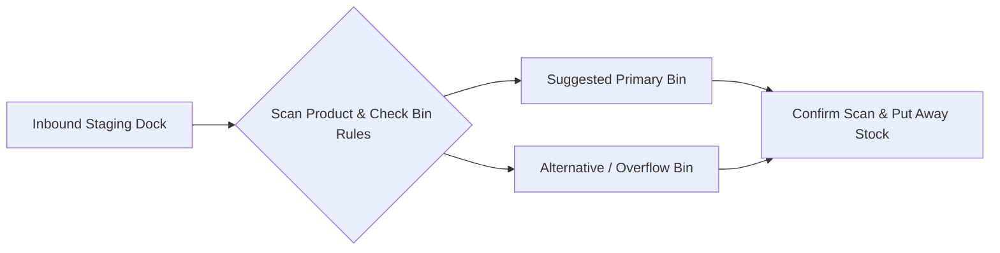

# Putaway Operations

The **Putaway** module guides warehouse operators in moving received inventory from the inbound staging dock to permanent bin storage.

---

## Putaway Logic & Rules

### 1. Suggested Bin Locations
The system automatically suggests destination bins based on:
- Previous storage bins for the same product.

### 2. Immediate Bin Availability
Once putaway is confirmed, items are immediately available at the specific bin coordinate for pickers to fulfill sales orders.

---

## Step-by-Step Workflows

### 1. Completing a Putaway Task
1. Go to **Inventory** → **Putaway** (`/inventory/putaway`).
2. Select an open putaway task from the queue.
3. Review the **Product**, **Quantity**, and **Suggested Bin**.
4. Transport the items to the physical shelf location.
5. Scan or select the **Destination Bin** to confirm placement.
6. Click **Complete Putaway**.

---

## Field Reference

| Field | Description |
| :--- | :--- |
| **Source Staging Bin** | Inbound dock holding area. |
| **Product** | Item being relocated. |
| **Putaway Quantity** | Count moved to the shelf. |
| **Destination Bin** | Final storage shelf/rack. |
