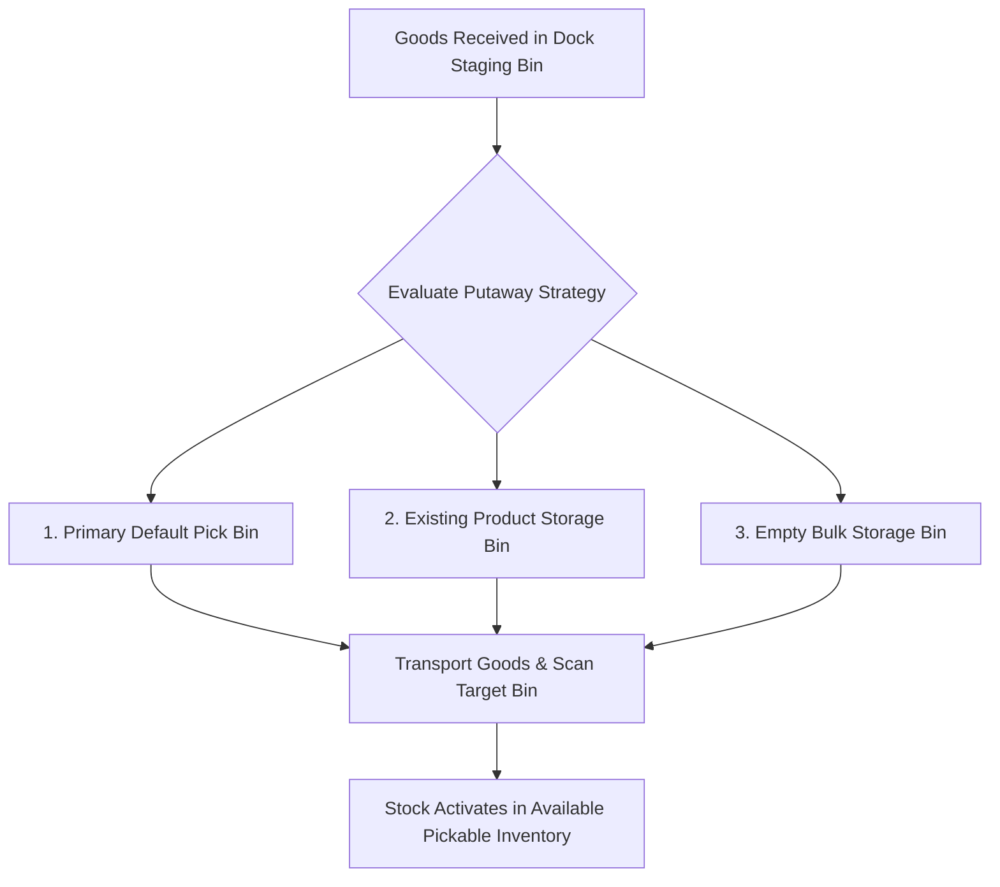

# Putaway Operations

The **Putaway** module guides warehouse operators in transporting newly received inventory from inbound dock staging areas into optimized storage and pick bins.

---

## Putaway Logic & Stock Availability

### 1. Bin Suggestion Algorithm
When generating putaway tasks, the system evaluates destination storage in priority order:
1. **Primary Pick Bin**: If configured on the product record, goods are routed to replenish forward pick locations.
2. **Co-Located Inventory**: Existing storage bins that already contain the same SKU to consolidate warehouse space.
3. **Empty Storage / Bulk Bins**: Available empty bins within the product's assigned storage zone.

### 2. Dock-to-Storage Stock Activation
* **Staging Phase**: While items reside in `dock` or `staging` bins, they are counted in total **On Hand** stock but are marked non-pickable (`isPickableBin = false`), preventing premature picking before placement.
* **Putaway Completion**: Confirming putaway transfers stock into an active `storage`, `pick`, or `bulk` bin, **immediately increasing Available Stock** for automated order allocation and picking queues.

---

## Step-by-Step Workflows

### 1. Completing a Putaway Task
1. Go to **Inventory** → **Putaway** (`/inventory/putaway`).
2. Select an open task from the staging queue.
3. Review the **Product**, **Quantity**, and system-suggested **Target Bin**.
4. Transport the physical items to the designated location.
5. Scan the destination **Bin Barcode** to verify correct placement (or select an alternate overflow bin if full).
6. Click **Complete Putaway** to commit the stock to active inventory.

---

## Field Reference

| Field | Description |
| :--- | :--- |
| **Source Staging Bin** | Inbound dock holding coordinate. |
| **Product** | Item SKU and description being moved. |
| **Putaway Quantity** | Physical count moved to the storage location. |
| **Destination Bin** | Verified storage bin coordinate (e.g. `B-02-C1`). |

