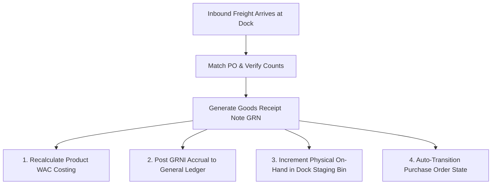

# Inbound Goods Receiving

The **Receiving** module manages inbound freight at the warehouse dock — processing supplier purchase orders, customer returns (RMA), and incoming stock transfers.

---

## Receiving Logic & Automated Financial Postings



### 1. General Ledger Accrual (GRNI Clearance Gate)
Confirming a Goods Receipt Note (GRN) immediately recognizes inventory assets in the General Ledger before vendor invoices are received:

```
Debit:  Inventory Asset Account               (Qty Received * Actual Unit Cost)
Credit: Goods Received Not Invoiced (GRNI)    (Qty Received * Actual Unit Cost)
```

* Under Standard Costing, inventory is debited at standard cost and any difference against PO cost is posted to Purchase Price Variance (PPV).

### 2. Moving WAC Recalculation Trigger
Every Goods Receipt automatically recalculates the product's **Moving Weighted Average Cost**:
```
New WAC = ((Current QOH * Current WAC) + (Qty Received * Actual Unit Cost)) / (Current QOH + Qty Received)
```
The new WAC is saved to 4 decimal places and becomes the active baseline for subsequent COGS dispatches.

### 3. Purchase Order Auto-Transitions
The system evaluates line-level receipt progress automatically:
* **Partial Delivery**: If `0 < Total Received < Total Ordered`, the PO transitions to `Partially Received`.
* **Full Delivery**: When `Total Received >= Total Ordered` across all lines, the PO transitions to `Received` (`auto-receive-when-fully-received` rule), enabling 3-way invoice matching.

### 4. Over-Receipt Guardrails & Quality Inspection
* **Over-Receipt Control**: Quantities exceeding the approved PO line must be explicitly acknowledged by a supervisor or rejected back to the carrier.
* **Damaged Goods**: Damaged units are received directly into a **Quarantine Bin**, preventing them from entering active stock while preserving the accurate GRNI accrual liability.

---

## Step-by-Step Workflows

### 1. Receiving a Supplier Purchase Order
1. Go to **Inventory** → **Receiving** → **Supplier Receipts** (`/receiving`).
2. Click **New Receipt** (`/receiving/new`) and select the **Purchase Order**.
3. Enter the supplier's **Delivery Note / Packing Slip Number**.
4. For each line item, enter the physical **Received Quantity** and assign to the dock staging bin.
5. If items fail inspection, route the damaged count to **Quarantine**.
6. Click **Confirm Receipt** to generate the official GRN, recalculate WAC, and post the GRNI GL accrual.

### 2. Receiving Customer Returns (RMA)
1. Go to **Inventory** → **Receiving** → **Customer Returns** (`/receiving/returns`).
2. Select the confirmed RMA number.
3. Verify returned item serials and condition, then click **Accept & Restock**.

---

## Field Reference

| Field | Description |
| :--- | :--- |
| **Receipt Number (GRN)** | Unique goods receipt identifier (e.g. `GRN-2026-00155`). |
| **Purchase Order** | Parent supplier purchase order reference. |
| **Supplier Slip Number** | External delivery docket reference from the carrier. |
| **Received Quantity** | Verified count received at the dock. |
| **Receipt Unit Cost** | Capitalized inventory cost per unit. |

