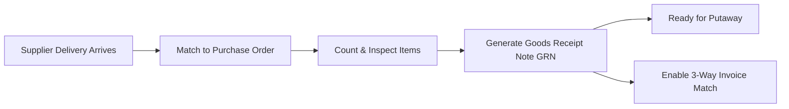

# Inbound Goods Receiving

The **Receiving** module handles all inbound freight at the warehouse dock — processing supplier purchase orders, customer returns (RMA), and incoming transfers.

---

## Receiving Rules & 3-Way Matching

### 1. Partial Receipts
Suppliers often deliver orders across multiple shipments. Staff can receive partial quantities; the Purchase Order remains open in `Receiving` status until all line items are fulfilled.

### 2. Immediate Stock Availability
Receiving goods immediately updates the physical **On Hand** inventory count, ready for warehouse putaway.

---

## Step-by-Step Workflows

### 1. Receiving a Supplier Purchase Order
1. Go to **Inventory** → **Receiving** → **Supplier Receipts** (`/receiving`).
2. Search for the **Purchase Order** or supplier name.
3. Enter the supplier's **Delivery Note / Packing Slip Number**.
4. For each line, enter the physical **Received Quantity**.
5. If items are damaged, enter the damaged count and route them to **Quarantine**.
6. Click **Confirm Receipt** to generate the official Goods Receipt Note (GRN) and update on-hand stock.

### 2. Receiving Customer Returns (RMA)
1. Go to **Inventory** → **Receiving** → **Customer Returns** (`/receiving/returns`).
2. Select the confirmed RMA number.
3. Verify returned item serials/quantities and click **Accept & Restock**.

---

## Field Reference

| Field | Description |
| :--- | :--- |
| **Receipt Number (GRN)** | Official goods receipt record. |
| **Purchase Order** | Parent supplier purchase order. |
| **Supplier Slip Number** | Delivery docket reference from the carrier. |
| **Received Quantity** | Verified count received. |
