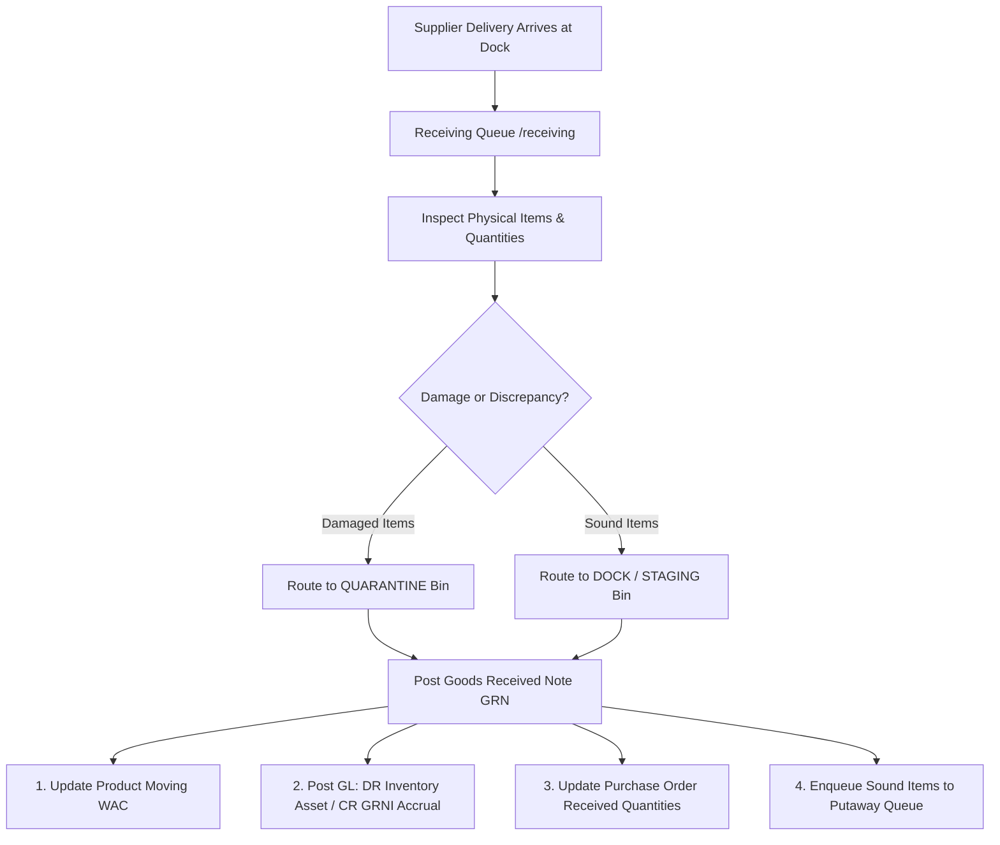

# Dock Receiving & GRNI Accruals

The **Receiving** module handles inbound shipments from suppliers at the warehouse dock. It creates Goods Received Notes (GRN), updates perpetual inventory balances, recalculates Moving Weighted Average Cost (WAC), and posts Goods Received Not Invoiced (GRNI) accounting accruals.

---

## Receiving & Costing Architecture



### 1. Moving Weighted Average Cost (WAC) Recalculation
Whenever stock is accepted at the dock at a known unit purchase cost:

```
New WAC = ((Current On-Hand * Current WAC) + (Received Units * Inbound Unit Cost)) / (Current On-Hand + Received Units)
```

The recalculated unit cost becomes the immediate valuation base for future sales orders and COGS dispatches.

### 2. General Ledger GRNI Accrual Entry
Receiving goods before receiving the supplier invoice triggers an automated accrual entry:

```
Debit:  Inventory Asset Account                    (Received Units * Unit Cost)
Credit: Goods Received Not Invoiced (GRNI) Accrual  (Received Units * Unit Cost)
```

When the supplier invoice arrives later, the AP matching process clears the GRNI account and posts to Accounts Payable.

### 3. Quarantine Routing for Damaged Items
If items arrive broken, defective, or fail inspection, the dock operator enters the count in the **Damaged Quantity** field. These units bypass active stock and are routed directly into the warehouse facility's `quarantine` bin, awaiting Return to Vendor (RTV) or credit note settlement.

---

## Step-by-Step Workflows

### 1. Receiving a Purchase Order Delivery
1. Go to **Receiving** (`/receiving`).
2. Select the purchase order from the expected delivery queue (or search by PO number).
3. Review order lines and verify physical carton counts.
4. Enter the **Received Quantity** for sound items.
5. If any items are damaged, enter the count in **Damaged Quantity**.
6. Click **Confirm Goods Receipt**.
7. The system posts the GRN, updates PO status, triggers the GRNI journal, and queues the items for Putaway.

---

## Field Reference

| Field | Description |
| :--- | :--- |
| **PO Number** | Supplier order identifier (`PO-...`). |
| **Supplier** | Vendor name delivering the goods. |
| **Ordered Quantity** | Original contracted line count. |
| **Received Quantity** | Verified count accepted into staging stock. |
| **Damaged Quantity** | Units routed immediately to quarantine. |
| **Unit Cost** | Valuation price used for WAC and GRNI accrual. |
