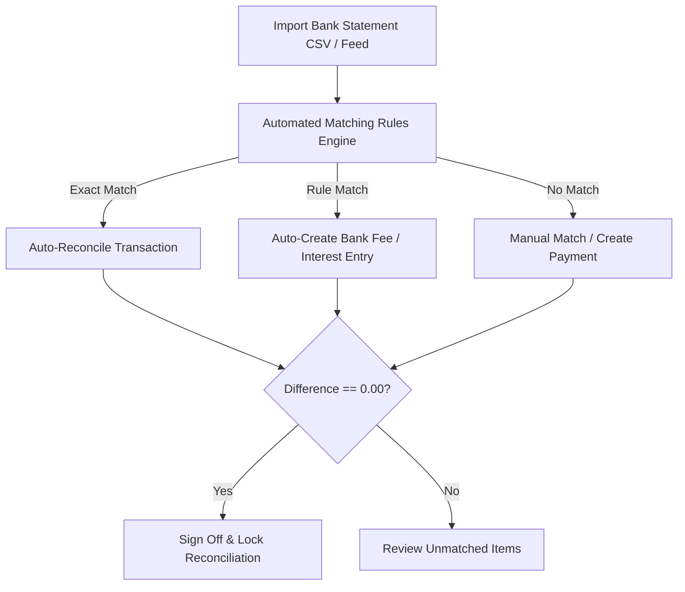

# Bank & Subledger Reconciliations

The **Reconciliations** module verifies that internal General Ledger account balances accurately reflect cash reality in bank accounts and transactional parity across operational subledgers (Accounts Receivable, Accounts Payable, and Inventory).

---

## Reconciliation Matching Rules

### 1. Automated Matching Rules
Configurable rules (`/reconciliations/rules`) automatically detect and classify:
- Recurring direct debits (utilities, software subscriptions, rent).
- Bank service fees, merchant surcharges, and interest charges.
- Customer deposits containing invoice reference numbers.

### 2. Subledger Parity Verification
Ensures subledgers reconcile to GL control accounts:
- AR control account balance matches the sum of all customer aged balances.
- AP control account balance matches the sum of all supplier aged balances.
- Inventory control account matches the perpetual inventory valuation ledger.

---

## Step-by-Step Workflows

### 1. Reconciling a Bank Statement
1. Go to **Finance** → **Bank Rec'n** → **Statements** (`/reconciliations`).
2. Click **Import Statement** (`/reconciliations/new`) and upload the bank CSV/OFX file.
3. Review the side-by-side matching screen:
   - Left side: Bank statement lines.
   - Right side: Unmatched GL payments and receipts.
4. Click **Auto-Match** to resolve identical amounts and references.
5. For remaining unmatched lines, select corresponding ledger entries or click **Create Entry** for ad-hoc bank charges.
6. Verify that the **Difference is 0.00**.
7. Click **Sign Off Reconciliation**.

---

## Field Reference

| Field | Description |
| :--- | :--- |
| **Bank Account** | Reconciled bank account. |
| **Statement Balance** | Official bank ending balance. |
| **Ledger Balance** | HeroBM General Ledger balance (computed dynamically). |
| **Variance** | Unreconciled difference (target 0.00, computed dynamically). |
