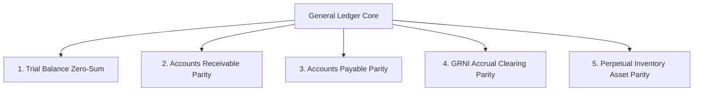
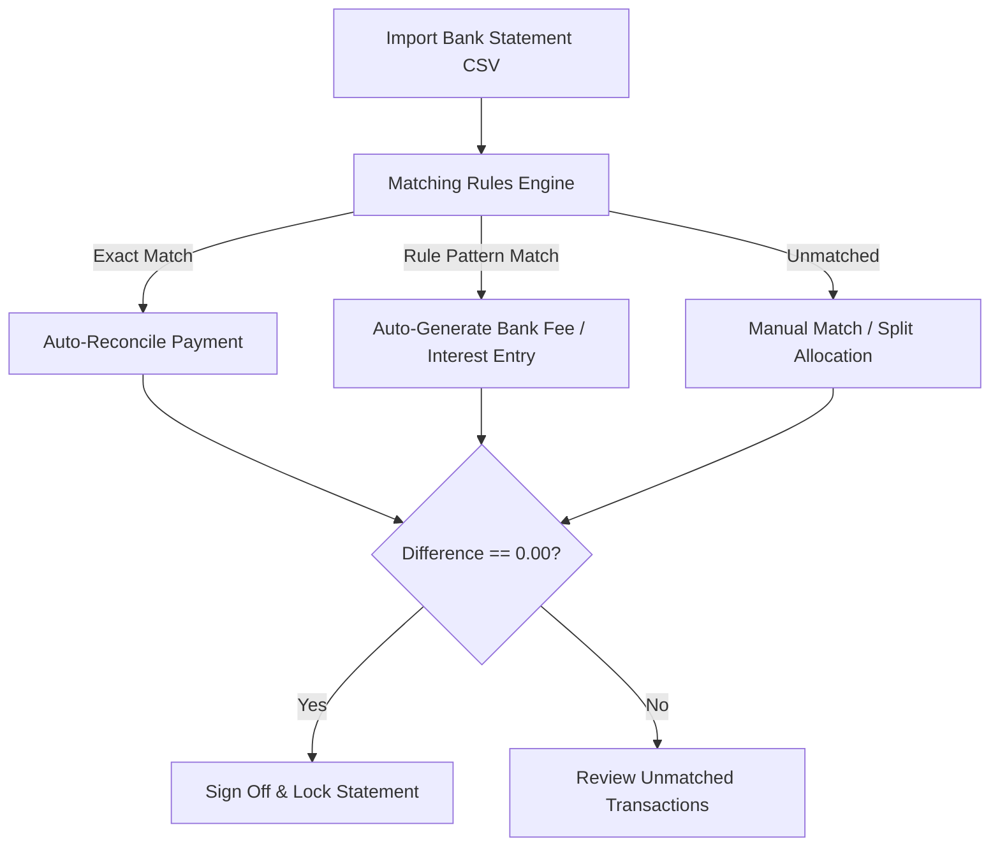

# Bank & Subledger Reconciliations

The **Reconciliations** module verifies that General Ledger account balances accurately reflect cash reality in bank accounts and continuously audits mathematical parity across operational subledgers.

---

## The 5 Continuous Subledger Parity Proofs

HeroBM runs 5 real-time parity checks across the financial subledgers to guarantee that operational documents (orders, shipments, receipts, bills) reconcile with the General Ledger:



### 1. Trial Balance Zero-Sum Proof
Ensures all posted journal lines are mathematically balanced:
```
Drift = abs(Sum(Debits) - Sum(Credits)) <= 0.005
```

### 2. Accounts Receivable (AR) Subledger Parity
Verifies the AR Control Account matches the sum of individual customer open balances:
```
Drift = abs(GL_AR_Control_Balance - Sum(Customer Open Invoices - Customer Unallocated Credits)) <= 0.005
```

### 3. Accounts Payable (AP) Subledger Parity
Verifies the AP Control Account matches the sum of individual supplier open liabilities:
```
Drift = abs(GL_AP_Control_Balance - Sum(Supplier Open Bills - Supplier Unallocated Debits)) <= 0.005
```

### 4. GRNI Clearing Accrual Parity
Audits the temporary clearing account for received items awaiting supplier invoices:
```
Drift = abs(GL_GRNI_Clearing_Balance - Sum(Received Unbilled PO Line Quantities * Receipt Unit Cost)) <= 0.005
```

### 5. Perpetual Inventory Valuation Parity
Ensures capitalized inventory assets match live warehouse bin quantities multiplied by unit moving WAC:
```
Drift = abs(GL_Inventory_Asset_Balance - Sum(Product Bin On-Hand * Product WAC Cost)) <= 0.005
```

---

## Bank Reconciliation Matching Engine



### 1. Automated Matching Rules
Configurable rule profiles (`/reconciliations/rules`) evaluate incoming feed lines:
* **Reference & Amount Match**: Automatically matches transactions where the bank reference contains the invoice number and amounts match exactly within date tolerance.
* **Recurring Bank Fees & Interest**: Automatically creates journal entries to designated expense accounts for banking charges without manual intervention.

### 2. Sign-Off & Audit Locking
When the statement ending balance matches the ledger balance (`Difference = 0.00`), clicking **Sign Off** permanently locks the reconciliation record and timestamps all matched ledger lines.

---

## Step-by-Step Workflows

### 1. Reconciling a Bank Statement
1. Go to **Finance** → **Bank Rec'n** → **Statements** (`/reconciliations`).
2. Click **Import Statement** (`/reconciliations/new`) and upload the bank CSV statement.
3. Review the side-by-side matching grid:
   - Left side: Imported bank statement feed lines.
   - Right side: Open GL payments, deposits, and receipts.
4. Click **Auto-Match** to process exact matches.
5. For remaining items, manually select matching ledger records or click **Create Entry** for ad-hoc charges.
6. Verify that the **Difference is 0.00**.
7. Click **Sign Off Reconciliation**.

---

## Field Reference

| Field | Description |
| :--- | :--- |
| **Bank Account** | Reconciled General Ledger bank account. |
| **Statement Ending Balance** | Closing balance from official bank statement. |
| **GL Ledger Balance** | Sum of all posted cash transactions in HeroBM. |
| **Variance / Difference** | Unreconciled gap (must reach `0.00` for sign-off). |
