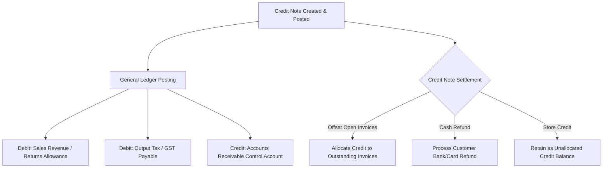

# Sales Credit Notes

The **Sales Credit Notes** module manages issuing financial credit adjustments to customers for product returns, commercial discounts, price corrections, and goodwill credits.

---

## Credit Note Accounting & Allocations



### 1. General Ledger Reversal Posting
Posting a Credit Note reduces revenue and customer AR debt:

```
Debit:  Sales Revenue / Returns Allowance  (Net Credit Amount)
Debit:  Output Tax / GST Payable           (Refunded Tax Total)
Credit: Accounts Receivable Control        (Total Gross Credit)
```

### 2. Credit Allocation vs. Cash Refunds
* **Invoice Allocation**: Credit notes can be matched and allocated directly against open customer invoices in the subledger without generating secondary GL entries.
* **Cash Refund**: If a customer requests cash return rather than store credit, a `customer_refund` payment entry debits Accounts Receivable and credits the Bank Account.

---

## Step-by-Step Workflows

### 1. Creating and Posting a Credit Note
1. Go to **Sales** → **Credit Notes** (`/sales-credit-notes`).
2. Click **Create Credit Note** to open the creation drawer slide-over.
3. Select the **Customer** and optional originating **Sales Invoice / Return**.
4. Add line items, reason codes, and credit values.
5. Click **Post Credit Note** to commit to the General Ledger.
6. In the allocation tab, apply the credit note across outstanding customer invoices or leave as an open unallocated credit.

---

## Field Reference

| Field | Description |
| :--- | :--- |
| **Credit Note Number** | Legal reference (`CRN-...`). |
| **Customer** | Debtor account receiving credit. |
| **Gross Total** | Total credit value including tax. |
| **Unallocated Balance** | Open credit balance remaining for future use. |
| **Reason Code** | Commercial cause (Return, Billing Error, Damaged in Transit, Goodwill). |
