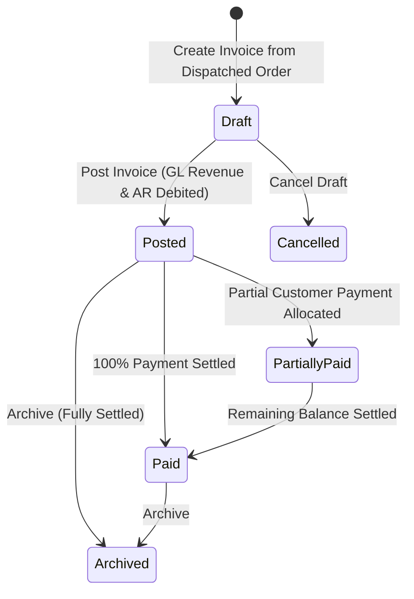

# Sales Invoices

The **Sales Invoices** module manages legal tax invoice billing, posting automated double-entry revenue journals to the General Ledger, emailing PDF invoices, and tracking payment settlements.

---

## Invoice Lifecycle & General Ledger Posting



### 1. General Ledger Revenue Postings
Clicking **Post Invoice** writes an immutable transaction to the General Ledger:

```
Debit:  Accounts Receivable Control Account  (Total Gross Amount including tax)
Credit: Sales Revenue Account               (Net Line Items Total)
Credit: Output Tax / GST Payable            (Statutory Sales Tax Total)
```

### 2. Payment Due Date & Trading Terms Computation
Upon invoice creation, the system automatically resolves the customer's effective trading terms (`Customer Record` → `Customer Group` → `System Default`) to calculate the legal **Payment Due Date**:

* **`Net (Days from Invoice)` (`net`)**:
  * `Due Date = Invoice Date + Days`
  * Example: An invoice issued on June 5 with `NET30` (30 days) is assigned a due date of July 5.
* **`End of Month (EOM)` (`end_of_month`)**:
  * `Due Date = Last Day of Invoice Month + Days`
  * Example: An invoice issued on June 5 with `EOM30` (30 days EOM) takes the end of June (June 30) plus 30 days -> Due Date is July 30.
* **`Cash on Delivery (COD)` (`cash_on_delivery`)**:
  * `Due Date = Invoice Date` (zero days credit; payment due immediately upon receipt).

Payment terms and early settlement discount windows (e.g. 2% within 10 days) are rendered automatically on official customer Typst PDF invoices.

### 3. Database Immutability & Reversals
* Once posted, a sales invoice cannot be edited or deleted due to database immutability triggers (`herobm_core.prevent_financial_deletion`).
* To correct or void a posted invoice, operators must issue a formal [Sales Credit Note](./sales_credit_notes.md).

---

## Step-by-Step Workflows

### 1. Invoicing Dispatched Sales Orders
1. Open the dispatched order in **Sales** → **Orders** (`/sales-orders/:id`).
2. Click **Create Invoice**. Dispatched quantities, customer pricing, and tax categories populate automatically.
3. Review lines, billing contact, and payment due date.
4. Click **Post Invoice** to commit to the General Ledger and Accounts Receivable.
5. In **Sales** → **Invoices** (`/sales-invoices`), locate the invoice and click **Email Invoice** to transmit the official branded Typst PDF invoice to the customer.

---

## Field Reference

| Field | Description |
| :--- | :--- |
| **Invoice Number** | Legal tax invoice identifier (`INV-...`). |
| **Customer** | Debtor account billed for the goods. |
| **Invoice Date** | Statutory tax point date. |
| **Due Date** | Settlement deadline based on customer trading terms. |
| **Gross Total** | Full payable amount including GST/VAT. |
| **Outstanding Amount** | Unpaid balance remaining on debtor ledger. |
| **Invoice Status** | Stage (`Draft`, `Posted`, `Partially Paid`, `Paid`, `Cancelled`, `Archived`). |
