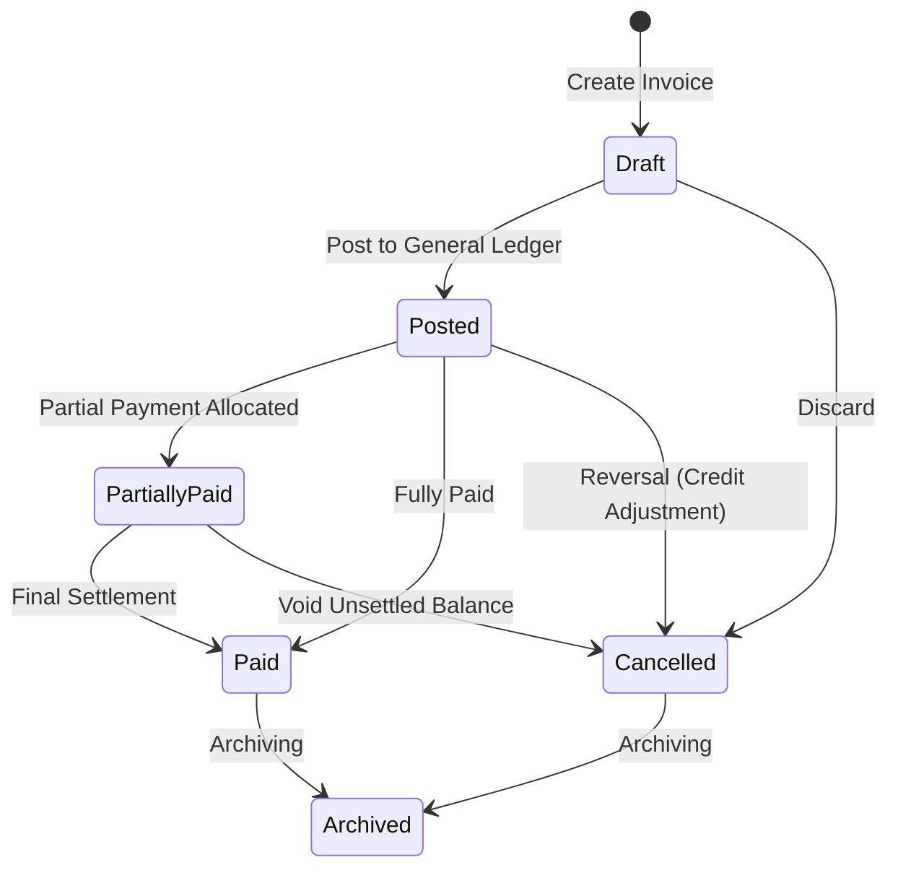

# Sales Invoices

The **Sales Invoices** module handles customer billing. Generating and posting an invoice records tax liabilities, posts Accounts Receivable to the General Ledger, and tracks payment settlement progress.

---

## Invoicing Rules & Accounting Integration

### 1. Generating Invoices from Orders
- Invoices can be generated directly from confirmed or shipped Sales Orders.
- **Partial Invoicing**: If an order is delivered in stages, multiple partial invoices can be raised against individual shipments.
- **Auto-Completion**: When 100% of an order's line items have been billed across invoices, the parent Sales Order automatically transitions to `invoiced`.

### 2. General Ledger Posting
Posting a sales invoice creates an automatic balanced journal entry in the General Ledger:
- **Debit**: Accounts Receivable Control Account (Customer balance increases)
- **Credit**: Sales Revenue (Product income accounts)
- **Credit**: Tax / GST Payable (Tax output liability)

### 3. Tax Compliance & Immutability Guarantees
- **No Hard Deletions**: Invoices, credit notes, and invoice line items are protected by database triggers (`herobm_core.prevent_financial_deletion`). Once created, they cannot be deleted or truncated.
- **Compensating Corrections**: Errors or cancellations must be handled via **Cancellation** (which posts an automatic reversing journal entry) or by issuing a **Sales Credit Note**.
- **Sequential Auditing**: Invoices follow chronological sequential numbering. An automated background verification engine runs scheduled audits to guarantee gapless continuity.

---

## Step-by-Step Workflows

### 1. Generating a Sales Invoice
1. Go to **Sales** → **Sales Invoices** (`/sales-invoices`).
2. Click **New Invoice**.
3. Select the **Sales Order** from the search list.
4. Review the billed quantities, unit prices, discounts, and tax rates.
5. Verify the **Invoice Date** and calculated **Due Date**.
6. Click **Post Invoice** to finalize the billing and update the General Ledger.
7. Click **PDF** or **Email** to send the official tax invoice to the customer.

---

## Field Reference

| Field | Description |
| :--- | :--- |
| **Invoice Number** | Legal tax invoice identifier (e.g. `INV-2026-00312`). |
| **Customer** | Billed customer account. |
| **Sales Order** | Originating sales order reference (`ORD-...`). |
| **Invoice Date** | Official billing date. |
| **Due Date** | Payment settlement deadline based on terms. |
| **Subtotal** | Net amount before tax. |
| **Tax Amount** | Calculated GST / VAT. |
| **Total Amount** | Gross payable amount in customer currency. |
| **Status** | Stage (`Draft`, `Posted`, `Partially Paid`, `Paid`, `Cancelled`, `Archived`). |
