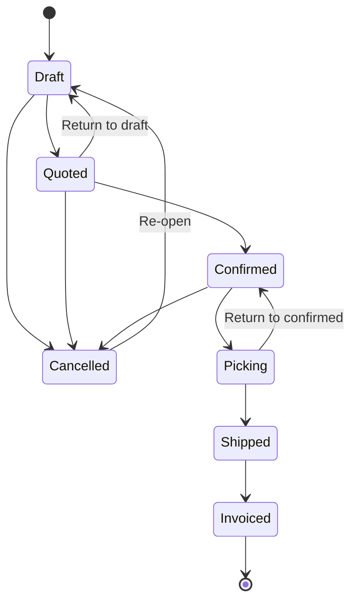
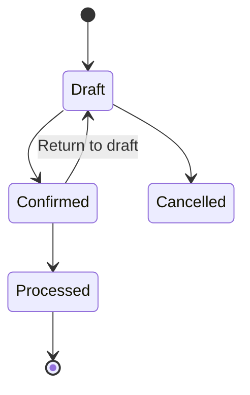

# Sales Order Management

This document describes how sales orders work in herobm, including the order lifecycle, pricing, currency, discounts, and tax.

---

## Order Lifecycle

Every sales order passes through a defined set of statuses. The system enforces which transitions are valid — you cannot skip stages or move backwards except where explicitly allowed.



### Status Definitions

| Status | Meaning | What can be changed? |
|--------|---------|---------------------|
| **Draft** | Order is being prepared. Not yet sent to the customer. | Everything — lines, quantities, prices, discounts, GST, header fields. |
| **Quoted** | A formal quotation has been issued to the customer. | Cannot edit. Can return to Draft if changes are needed, or move to Confirmed. |
| **Confirmed** | Customer has accepted. The order is committed. | Cannot edit. Can move to Picking or be cancelled. |
| **Picking** | Warehouse staff are picking stock for this order. | Cannot edit. Can return to Confirmed if there's a problem, or move to Shipped. |
| **Shipped** | Goods have been dispatched. | Cannot edit. Can only move to Invoiced. |
| **Invoiced** | Final state. The order has been invoiced. | Nothing — the order is closed. |
| **Cancelled** | Order was cancelled at any prior stage. | Can be re-opened as a new Draft. |

> [!IMPORTANT]
> **Only Draft orders can be edited.** Once an order moves to Quoted or beyond, all line items, prices, and discounts are locked. To make changes, return the order to Draft first.

### Copying Orders

Any order (including historical ABM orders) can be copied to create a new Draft with the same customer, lines, and pricing. The new order gets a fresh order number and today's date. GST categories are preserved from the original.

---

## Custom Lines

Users can add "Custom Lines" to orders for ad-hoc items that do not exist in the product catalogue. 

Under the hood, all Custom Lines are mapped to a reserved system product (`SYSTEM-CUSTOM-LINE` with UUID `00000000-0000-0000-0000-000000000000`). This ensures referential integrity in the database while allowing users to override the description freely. 

**Duplicate Validation Exemption:** Normally, the system prevents adding the exact same product twice to an order (users should increase the line quantity instead). However, Custom Lines are explicitly exempted from this rule; you can add as many Custom Lines to a single order as needed, representing different ad-hoc items.

---

## Pricing

### Price Levels

Products have up to four price levels, inherited from ABM:

| Level | Name | Typical use |
|-------|------|-------------|
| 1 | **List Price** | Retail / end-user price |
| 2 | **Trade Price** | Stockist / reseller price |
| 3 | Price Level 3 | Custom tier |
| 4 | Price Level 4 | Custom tier |

Each customer belongs to a **Customer Group** which has a **Price Scale** (1–4). The price scale determines which price level is used as the starting unit price when adding a product to an order.

### Line Amount Calculation

Each order line calculates its amounts as follows:

```
Amount (ex-tax) = Quantity × Unit Price × (1 − Discount% / 100)
Tax             = Amount × GST Rate / 100
Total (inc-tax) = Amount + Tax
```

**Example:** 10 units at EUR 50.00 each with a 5% discount and 9% GST:
- Amount = 10 × 50.00 × (1 − 5/100) = **EUR 475.00**
- Tax = 475.00 × 9/100 = **EUR 42.75**
- Total = 475.00 + 42.75 = **EUR 517.75**

---

## Currency

### Home Currency

The company's **home currency** is **EUR** (Euro). All product prices in the database are stored in EUR. This is the default currency for all new orders.

### Customer Currency

Each customer has an assigned currency, sourced from ABM. Currently:

| Currency | Customers | Description |
|----------|-----------|-------------|
| **EUR** | 14 | European / export customers (default) |
| **SGD** | 3 | Singapore-based customers |

The system uses standard **ISO 4217** currency codes (EUR, SGD, USD, AUD, etc.), mapped automatically from ABM's internal country codes.

### How currency is applied

When a new order is created, the customer's currency is **snapshotted** onto the order header. This currency is displayed alongside all monetary amounts on the order — unit prices, line amounts, and totals.

> [!NOTE]
> Currency is informational at this stage — the system does not perform exchange rate conversions. All prices are entered and stored as-is in the order's currency.

> [!IMPORTANT]
> **Data integrity rule:** Currency must always be resolved dynamically from the customer's account record at order creation time. Currency codes, symbols, and formatting must never be hardcoded in service or UI code — always use the shared currency configuration (`lib/currency.ts`) and the database column (`accounts.currencyCode`).

---

## Discounts

Discounts are percentage-based and applied per line. There are two levels of default discount that can be inherited:

### 1. Group Discount

Set on the **Customer Group**. All customers in the group receive this discount percentage unless overridden.

### 2. Customer Discount

Set on the individual **Customer** record. Overrides the group discount if present.

### How discounts are applied

When a new order is created:
1. The customer's discount percentage is **snapshotted** onto the order header at creation time.
2. Each line item inherits this discount as its default.
3. Lines can be adjusted individually — changing the discount on one line does not affect others.

> [!NOTE]
> Discounts are snapshotted at order creation. If a customer's discount changes later, existing orders are not affected — only new orders will pick up the new rate.

---

## GST (Tax)

### Overview

Tax is handled through **GST Categories** — named classifications that determine how tax is calculated on each order line. The GST rate on a line is determined by the **intersection** of the customer's tax status and the product's GST category from ABM.

### GST Categories

The system has three predefined GST categories:

| Code | Title | Type | Rate | When to use |
|------|-------|------|------|-------------|
| **GST** | 9% GST | GST Applies | 9% | Standard taxable goods and services |
| **EXE** | Exempt Customer | Exempt | 0% | Customer is GST-exempt (e.g., export, government) |
| **ZR** | Zero Rated Products | Zero Rated | 0% | Products that are zero-rated for GST purposes |

### How GST is resolved per line

When a line is added to an order (via `create`, `addLine`), the system resolves the GST category using this priority:

| Priority | Condition | Result |
|----------|-----------|--------|
| **1. Explicit override** | A `gstCategoryId` is provided on the line | Use the specified category (manual escape hatch) |
| **2. Customer exempt** | The customer's GST position is `exempt` | **EXE** (0%) — regardless of product |
| **3. Product category** | Map the product's ABM `gst_category` to our code | See mapping table below |
| **4. System default** | None of the above matched | System default GST (currently **9% GST**) |

#### Product GST category mapping (ABM → herobm)

| ABM `gst_category` value | herobm code | Rate |
|---------------------------|------------|------|
| `9% GST` | **GST** | 9% |
| `Zero Rated Products` | **ZR** | 0% |
| `Exempt Customer` | **EXE** | 0% |

#### Customer × Product intersection matrix

| | **Product: 9% GST** | **Product: Zero Rated** |
|---|---|---|
| **Customer: Taxable** | ✅ 9% GST | ❌ 0% (ZR) |
| **Customer: Exempt** | ❌ 0% (EXE) | ❌ 0% (EXE) |

> [!IMPORTANT]
> **Customer exempt overrides everything.** If the customer is exempt, all lines receive 0% GST regardless of the product's tax category.

### Order-level GST

Each order carries a GST category on its header. This is resolved from the **first product** on the order at creation time. It serves as a display default — each line independently resolves its own GST via the priority system above.

### Per-line override

Individual lines can have their GST category manually overridden by providing a `gstCategoryId`. This is the highest-priority rule and acts as an escape hatch for edge cases.

### Tax calculation

Tax is **automatically calculated** — users never enter a tax amount directly. When any pricing field changes (quantity, unit price, discount, or GST category), the tax is recalculated immediately:

```
Tax = Amount (ex-tax) × GST Rate / 100
```

### Order Totals

The order totals section shows three figures:

- **Subtotal** — sum of all line amounts (ex-tax)
- **Tax** — sum of all line tax amounts, with the effective tax percentage shown
- **Total** — grand total including tax

> [!NOTE]
> If the system default GST rate changes (e.g. from 9% to 10%), it only affects **new orders**. Existing orders retain the GST category and rate they were created with.

---

## Data Sources

Orders in the system come from two sources:

| Source | Description | Editable? |
|--------|-------------|-----------|
| **App** | Created in the Sales Portal | Yes (when in Draft) |
| **ABM** | Historical orders imported from the legacy ABM system | No (read-only) |

ABM orders appear in the order list alongside app orders and can be viewed in full detail. They can be copied to create new app drafts, but the originals cannot be modified.

---

## Inventory Visibility

Stock information is sourced from the `herobm_core.inventory_levels` view (the single source of truth for all stock data). Product-level tables do not carry stock fields.

### Product Search

When adding a product to an order, the search dropdown shows stock badges alongside each result:

- **OH** (On Hand) — total physical stock across all warehouse locations
- **Avail** (Available) — stock available for new orders (on hand minus committed)

Badges are colour-coded: **green** when stock exists, **amber/red** when zero.

### Availability Tab

The order detail line items card has two tabs:

| Tab | Content |
|-----|---------|
| **Line Items** | The standard editable order lines table |
| **📦 Availability** | Per-line inventory breakdown with fulfilment status |

The availability table shows each order line expanded by warehouse location:

| Column | Description |
|--------|-------------|
| Ordered | Quantity on this order line |
| Location | Warehouse location name |
| On Hand | Physical stock at this location |
| Committed | Stock allocated to confirmed orders |
| Reserved | Stock held for internal purposes |
| Available | On Hand − Committed − Reserved |
| Status | ✓ if total available ≥ ordered qty, ✗ if not |

Data is fetched lazily when the availability tab is selected, via `GET /api/inventory/by-products`.

> [!NOTE]
> Stock data reflects the last ELT pipeline run. It is not real-time — run `make elt` to refresh from ABM.

---

## Returns

A return records goods sent back by a customer against a previously **invoiced** order. Returns can be full (entire order) or partial (specific lines and quantities). Multiple partial returns can be raised against the same order.

### Return Lifecycle

Returns have their own state machine, independent of the parent order:



| Status | Meaning | What can be changed? |
|--------|---------|---------------------|
| **Draft** | Return is being prepared. | Lines, quantities, reasons, fees — everything. |
| **Confirmed** | Return has been accepted and goods are expected. | Cannot edit. Can return to Draft or move to Processed. |
| **Processed** | Goods have been received and restocked. | Nothing — the return is closed. Triggers outbox event for credit note. |
| **Cancelled** | Return was cancelled. | Nothing. |

> [!IMPORTANT]
> **"Processed" is purely operational.** It means the returned goods have been received. The financial credit note is generated via the General Ledger or asynchronously synced via the outbox, not by the operational order system.

### Validation Rules

- Returns can **only** be created against orders in `invoiced` state.
- Each return line references an original order line. The `quantity_returned` must be ≤ the original quantity minus any already-returned quantity (from other non-cancelled returns).
- Return lines can only be edited when the return is in `draft` state.

### Return Fees

Each return line can carry an optional **return fee** — an absolute amount in the order's currency (e.g. restocking fee, handling charge). The fee defaults to 0.

The UI provides a convenience toggle to enter the fee as a percentage of the original line amount, but **the database stores the resolved absolute value only**.

### Data Model

Returns are stored as two tables in `herobm_core`:

- **`sales_order_returns`** — return header (linked to `sales_orders`)
- **`sales_order_return_lines`** — per-line return quantities, reason, and fee (linked to `sales_order_lines`)

### Events

All return mutations emit audit events and outbox records:

| Event | When |
|-------|------|
| `return_created` | A new return is created |
| `return_updated` | Return header is updated |
| `return_status_changed` | Return state transitions |
| `return_processed` | Return reaches `processed` state (triggers credit note via outbox) |
| `return_line_added/updated/removed` | Return line changes |
