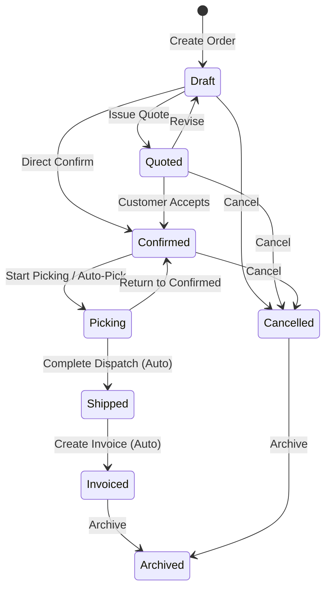
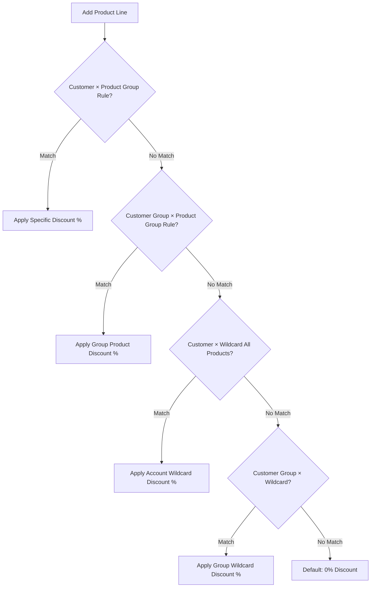

# Sales Orders

The Sales Orders module covers quotes through to cash. Create orders as quotes, view credit standing and inventory availability, email documents directly to clients, follow dispatch, and generate billing.

---

## Order Lifecycle & Automations



### State Definitions & Trigger Matrix

| State | Meaning | Modifiable Fields | Automatic Transition Trigger |
| :--- | :--- | :--- | :--- |
| **Draft** | Order is being prepared. | **All fields** (lines, prices, discounts, addresses). | None (Manual). |
| **Quoted** | Price proposal locked and sent to client. | Read-only (Return to Draft to modify). | None (Manual confirmation or revision). |
| **Confirmed** | Customer agreed. Inventory allocated. | Locked (Post-confirmation lines allowed). | Moves to `Picking` on first warehouse scan. |
| **Picking** | Warehouse is actively fulfilling items. | Locked. | Moves to `Shipped` once all lines are fully dispatched. |
| **Shipped** | Goods have left the warehouse facility. | Locked. | Moves to `Invoiced` once all line items are billed. |
| **Invoiced** | All items fully billed on Sales Invoices. | Closed / Read-only. | Automatic when total invoiced quantity matches order. |
| **Cancelled** | Order terminated before fulfillment. | Closed (Reservations released). | Manual action. |
| **Archived** | Historic record preserved for audits. | Immutable. | Manual archiving. |

---

## Business Logic & Calculations

### 1. Pricing & Discount Matrix Waterfall
When a product line is added, the system resolves pricing and discounts through a 5-step waterfall cascade:



* **Price Scale (1 to 4)**: The base unit price is extracted from the product catalogue based on the customer group's scale:
  1. `List Price` (Retail)
  2. `Trade Price` (Standard wholesale/trade)
  3. `Tier 3` (Volume trade)
  4. `Tier 4` (Distributor/contract)

### 2. Line Item & Order Total Formulas
All pricing calculations execute half-up rounding to 2 decimal places to maintain mathematical consistency across portal displays, invoices, and ledger lines:

```
Line Net Amount = round2(Quantity * Unit Price * (1 - Discount% / 100))
Line Tax Amount = round2(Line Net Amount * (Tax Rate% / 100))
Line Total Gross = Line Net Amount + Line Tax Amount

Order Subtotal = Sum(Line Net Amounts)
Order Total Tax = Sum(Line Tax Amounts)
Order Grand Total = Order Subtotal + Order Total Tax
```

* **Discount Bounds**: All discount percentages must strictly stay between `0.00%` and `100.00%`.
* **Tax Exemption**: If a customer is flagged as tax-exempt (or attached to an export tax position), `Tax Rate% = 0.00%` on all lines.

### 3. Credit Assessment & Overrides
Before advancing an order to **Quoted** or **Confirmed**, the system evaluates:
```
Total Financial Exposure = Total Outstanding AR Invoices + Value of Open Orders (Confirmed + Picking + Shipped Unbilled)
```
* **Block Trigger**: Order confirmation is strictly blocked if:
  1. `Total Exposure + Current Order Total > Customer Credit Limit` (under `hard` credit limit mode).
  2. Customer has overdue unpaid invoices exceeding payment terms.
  3. `Customer is on Credit Hold` OR `Customer Group is on Credit Hold`.
* **Override Authorization**: Authorized supervisors can apply a **Credit Hold Override** with an expiry timestamp and mandatory audit reason.

### 4. Stock Allocation & Inventory Demands
* **Immediate Allocation**: Confirming an order converts free available stock into committed stock across storage and pick bins.
* **Shortage Handling**: If insufficient available stock exists, available units are allocated immediately and open backorder demands are generated for Purchasing or Work Orders.

---

## Step-by-Step Workflows

### 1. Creating and Confirming an Order
1. Go to **Sales** → **Sales Orders** (`/sales-orders`).
2. Click **New Order** (`/sales-orders/new`).
3. Select the **Customer**. Currency, terms, addresses, and price scale fill automatically.
4. (Optional) Enter the customer's **PO Number**, select **Analysis Codes**, and enter order notes.
5. In the **Line Items** section, add products. The system auto-populates price scales and matrix discounts.
6. Check the **📦 Availability** tab to verify warehouse stock levels.
7. Click **Save as Draft** or click **Confirm Order** to commit inventory.

### 2. Quoting and Direct Document Emailing
1. Open a Draft order.
2. Click **Issue Quote** to lock pricing and advance to `Quoted`.
3. Click **Email** to open the document modal, preview the dynamic Typst PDF, and send directly to the customer's billing contact.

### 3. Picking, Shipping and Billing
1. Fulfill items via **Inventory** → **Picking Queue** (`/inventory/picking`). The order moves to `Picking` on first item scan.
2. If additional charges are required after confirmation, click **Add Post-Confirmation Line**.
3. Dispatch parcels via **Sales** → **Shipments**. The order switches to `Shipped` upon 100% dispatch.
4. Create the final bill via **Sales** → **Sales Invoices** (`/sales-invoices`). The order automatically transitions to `Invoiced`.

### 4. Over-The-Counter (OTC) Trade Sales
For walk-in customers and immediate trade counter collections, navigate to **Sales** → **Counter Sales** (`/sales-orders/counter`) or click the **Counter Sale** button on the Sales Orders header. This executes order creation, pickable bin stock deduction, tax invoicing, and cash/card payment receipting in a single atomic transaction.

---

## Field Reference

| Field | Description |
| :--- | :--- |
| **Customer** | Customer account determining currency, terms, delivery address, and price tier. |
| **Order Number** | Unique order identifier (e.g. `SO-2026-00124`). |
| **Customer PO** | Customer-provided purchase order reference number. |
| **Fulfillment Location** | Warehouse facility where stock is allocated and picked. |
| **Status** | Stage (`Draft`, `Quoted`, `Confirmed`, `Picking`, `Shipped`, `Invoiced`, `Cancelled`, `Archived`). |
| **Currency & FX Rate** | Transaction currency and exchange rate snapshotted from customer account. |
| **Unit Price** | Base selling price per unit, pre-filled from customer's price scale (1–4). |
| **Discount %** | Line percentage discount resolved via the 5-tier discount matrix cascade. |
| **Tax Category** | Tax rate classification (e.g. 10% GST, Zero-Rated, Exempt). |
| **Analysis Codes** | Standardized tags for financial reporting and ledger dimensions. |
| **Post-Confirmation** | Ad-hoc charge line added after confirmation for freight or handling. |
| **Credit Override** | Expiry date, approving user, and audit reason for bypassed credit holds. |
