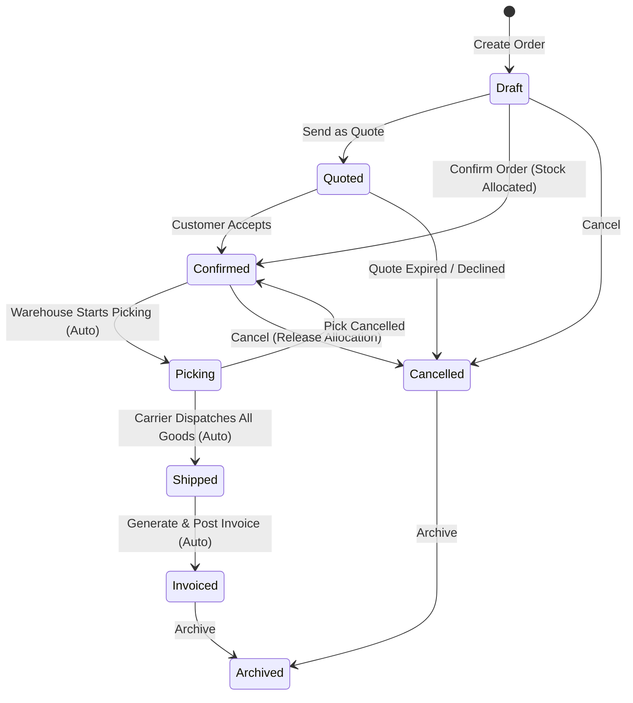

# Sales Orders

The **Sales Orders** module orchestrates customer order fulfillment, from initial draft creation to automated inventory reservation, warehouse picking triggers, document emailing, and final invoice generation.

---

## Sales Order Lifecycle & Automated Rules

### Automated State Transition Rules Engine

The order engine continuously monitors warehouse events to advance order states without manual intervention:

| Rule Name | Event Trigger | Evaluation Condition | Target State |
| :--- | :--- | :--- | :--- |
| **`auto-advance-to-picking-on-first-pick`** | First Pick Recorded | Order is in `Confirmed` state and at least one item is picked | **`Picking`** |
| **`auto-ship-when-all-lines-dispatched`** | Outbound Shipment Dispatched | All order lines have `Quantity Shipped >= Ordered Quantity` | **`Shipped`** |
| **`auto-invoice-when-fully-invoiced`** | Sales Invoice Posted | All order lines are fully invoiced against posted AR invoices | **`Invoiced`** |

---

## Business Logic & Sourcing Controls

### 1. Stock Allocation vs. Backorders
* When an order is **Confirmed**, available stock in the designated fulfillment warehouse is immediately allocated, preventing other orders from claiming those units.
* If available stock is insufficient to fulfill the entire order, the system prompts the operator to **Generate Backorders**, routing the shortage quantity directly to the [Purchase Demands](./purchase_demands.md) queue.

### 2. Credit Limits & Customer Holds
* If the customer's total exposure exceeds their credit limit, or if the customer account is marked **On Credit Hold**, the system warns operators during order entry and blocks confirmation until approved by a credit manager.

### 3. Multi-Currency Order Pricing
* Orders lock in the customer's trading currency and the active exchange rate to the system base currency upon creation.
* Invoices, line totals, and taxes are calculated in the customer's currency, with base currency equivalents tracked for financial reporting.

### 4. CRM Opportunity Linkage & Deal Conversion
* Sales orders can be linked directly to a CRM **Opportunity** (`opportunityId`).
* When converting a winning deal directly from the CRM Opportunity pipeline, the link is established automatically.
* The order details card features a direct navigation link to the associated opportunity, and the order's booked value feeds the live deal revenue metric in the CRM module.

---

## Step-by-Step Workflows

### 1. Creating and Confirming an Order
1. Go to **Sales** → **Orders** (`/sales-orders`).
2. Click **New Sales Order** (`/sales-orders/new`).
3. Select the **Customer**. Price scale, currency, and tax positions load automatically.
4. Set the **Required Delivery Date** and **Fulfillment Warehouse**.
5. (Optional) Select or link an active **CRM Opportunity** to attribute booked revenue to a sales deal.
6. Add items, quantities, and line discounts.
7. Click **Confirm Order**. The system allocates inventory and queues the order for picking.
8. Click **Email Order Confirmation** to send the branded Typst PDF confirmation.

---

## Field Reference

| Field | Description |
| :--- | :--- |
| **Customer** | Debtor account purchasing goods. |
| **Order Number** | Unique order reference (`ORD-...`). |
| **Required Date** | Promised delivery date. |
| **Fulfillment Location** | Dispatch warehouse facility. |
| **Opportunity** | CRM sales deal associated with the order. |
| **Order Status** | Stage (`Draft`, `Quoted`, `Confirmed`, `Picking`, `Shipped`, `Invoiced`, `Cancelled`, `Archived`). |
| **Gross Margin %** | Calculated margin based on current WAC. |
| **Credit Hold** | Indicator showing if customer has an active credit block. |
