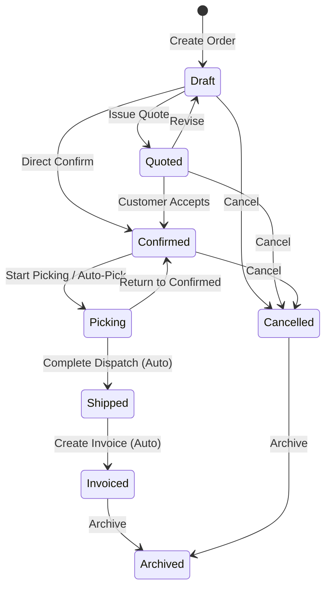

# Sales Orders

The Sales Orders module covers quotes through to cash. Create orders as quotes, view credit standing and inventory availability, email documents directly to clients, follow dispatch, and generate billing.

---

## Order Lifecycle & Rules

Orders move through different states:

### State Summary

| State | What it means | What can be changed? |
| :--- | :--- | :--- |
| **Draft** | Order is being prepared. | **Everything.** Add, edit, or remove lines, prices, discounts, and addresses. |
| **Quoted** | A quote has been sent to the customer. | Locked. Can return to Draft to make changes, or move to Confirmed. |
| **Confirmed** | Customer accepted the order. Stock is reserved. | Locked. Can move to Picking or be cancelled. Post-confirmation lines can be added if needed. |
| **Picking** | Warehouse is picking items from stock. | Locked. Automatically set when the first pick scan is recorded. |
| **Shipped** | Goods have been dispatched. | Locked. Automatically set when all shipments are dispatched. |
| **Invoiced** | Order has been billed. | Closed. Automatically set when all line items are fully invoiced. |
| **Cancelled** | Order was cancelled. | Closed. Stock reservations and backorders are released. |
| **Archived** | Historic order filed away. | Read-only. |

> [!NOTE]
> **Automatic State Changes:**
> - **Picking**: Moves from Confirmed to Picking as soon as warehouse staff scan or pick the first item.
> - **Shipped**: Moves from Picking to Shipped as soon as all items have been dispatched.
> - **Invoiced**: Moves from Shipped to Invoiced once invoices are created for all ordered quantities.

---

## Important Rules & Logic

### 1. Credit Checks & Overrides
When moving an order to **Quoted** or **Confirmed**, the system checks the customer's account:
- **Credit Limit**: Total unpaid invoices plus open orders cannot exceed the customer's credit limit.
- **Overdue Invoices**: Customer must not have overdue unpaid invoices.
- **Credit Hold**: Customer must not be marked on credit hold.

If a customer fails these checks, the order is blocked. Authorized users can apply a **Credit Hold Override** with a mandatory reason to let the order proceed.

### 2. Pricing, Discounts & Price Scales
- Each customer belongs to a **Customer Group** with an assigned **Price Scale (1 to 4)**:
  1. **List Price** (Retail)
  2. **Trade Price** (Standard wholesale/trade)
  3. **Tier 3** (Volume trade)
  4. **Tier 4** (Distributor/contract)
- **Discount Percentage Bounds**: All discount percentages must strictly stay between $0\%$ and $100\%$ ($0 \le \text{discount} \le 100$). Values outside this boundary are rejected by validation.
- **Custom Lines**: You can add ad-hoc custom lines for non-catalogue items, delivery fees, or special charges.

### 3. Structured Analysis Codes
- Orders can be tagged with standardized **Analysis Codes** (e.g. Sales Territory, Campaign ID, Project Stream) configured in **Admin** → **Settings** → **System**.
- Analysis codes pass through to sales reporting and financial ledger lines.

### 4. Direct Document Emailing
- Operators can email Sales Orders, Quotations, and Order Confirmations directly to customers via the **Email Document** dialog.
- Supports dynamic Typst PDF rendering, custom message bodies, and live PDF preview.

### 5. Multi-Currency
- Orders use the currency set on the customer account (e.g. `EUR`, `SGD`, `USD`).
- When creating an order, the current exchange rate is snapshotted to the header. Line prices and totals are entered and shown in the customer's currency.

### 6. Tax (GST / VAT)
Tax is calculated automatically per line:
- **Exempt Customers**: If a customer is tax-exempt, all lines receive 0% tax.
- **Taxable Customers**: Tax is calculated using the product's tax category (or the system default rate, e.g. 9% GST).
- **Manual Override**: You can select a specific tax category on any line if needed.

**Formulas:**
- `Line Amount = Quantity × Unit Price × (1 − Discount% / 100)`
- `Tax Amount = Line Amount × (Tax Rate% / 100)`
- `Total Amount = Line Amount + Tax Amount`

### 7. Kits & Bundles
- Adding a kit product adds a parent line with the bundle price and automatically lists the component parts below it.
- Stock is reserved and picked for the physical component parts. Changing the kit quantity adjusts component quantities automatically.

### 8. Stock Checks & Backorders
When confirming an order, the system checks available warehouse stock:
- If all items are in stock, the order is confirmed immediately.
- If items are out of stock, an **Inventory Gap** dialog appears:
  - **Generate Backorders**: Automatically creates demand entries in Purchasing for missing stock.
  - **Acknowledge Discrepancy**: Confirms the order anyway to allocate available stock now and handle shortages manually.

---

## Step-by-Step Workflows

### 1. Creating a New Sales Order
1. Go to **Sales** → **Sales Orders** (`/sales-orders`).
2. Click **New Order** (`/sales-orders/new`).
3. Select the **Customer**. Currency, terms, addresses, and price scale fill automatically.
4. (Optional) Enter the customer's **PO Number**, select **Analysis Codes**, and enter order notes.
5. In the **Line Items** section, search for products to add. Enter the quantity, price, and discount ($0-100\%$).
6. Check the **📦 Availability** tab to see stock levels across warehouses.
7. Click **Save as Draft**.

### 2. Quoting, Emailing & Confirming
1. Open the Draft order.
2. Click **Issue Quote** to lock the pricing and generate a quote.
3. Click **Email** to open the document dialog, review the PDF preview, and send to the customer's primary billing contact.
4. When the customer confirms, click **Confirm Order**.
5. If items are out of stock, choose whether to generate backorders or acknowledge the gap.

### 3. Picking & Dispatch
1. Open the **Picking Queue** (`/inventory/picking`) to pick ordered items.
2. The order switches to **Picking** when picking starts.
3. If extra freight or items need to be added, click **Add Post-Confirmation Line**.
4. Go to **Sales** → **Shipments** to dispatch the parcel. The order switches to **Shipped** once fully dispatched.

### 4. Invoicing
1. Go to **Sales** → **Sales Invoices** (`/sales-invoices`).
2. Click **New Invoice**, select the sales order, and review line quantities and totals.
3. Post the invoice to record accounts receivable. Once all lines are invoiced, the order moves to **Invoiced**.

### 5. Customer Returns (RMA)
1. Open an invoiced sales order and click **Create Return**.
2. Select the items and quantities returned, choose a reason, and enter any restocking fees.
3. Confirm the return. The warehouse can receive the goods in **Receiving**, and a Credit Note is generated.

---

## Field Reference

| Field | Description |
| :--- | :--- |
| **Customer** | The customer account. Determines currency, payment terms, delivery address, and price tier. |
| **Order Number** | Unique order identifier (e.g. `SO-2026-00124`). |
| **Customer PO** | Optional reference number provided by the customer. |
| **Fulfillment Location** | The warehouse facility fulfilling the stock. |
| **Status** | Current stage of the order (`Draft`, `Quoted`, `Confirmed`, `Picking`, `Shipped`, `Invoiced`, `Cancelled`). |
| **Currency & FX Rate** | The transaction currency and exchange rate to base currency (EUR). |
| **Delivery Address Line/City/Postcode** | Destination address broken down into line, city, and postcode. |
| **Unit Price** | Selling price per unit, pre-filled from customer's price scale (1–4). |
| **Discount %** | Percentage discount applied to the line ($0 \le \text{discount} \le 100$). |
| **Tax Category** | Tax rate classification (e.g. 9% GST, Exempt). |
| **Analysis Codes** | Structured custom classification tags for business reporting. |
| **Post-Confirmation** | Special line added after confirmation for additional freight or packaging. |
| **Credit Override Details** | Reason, approving user, and timestamp recorded when an authorized user overrides a credit hold. |
