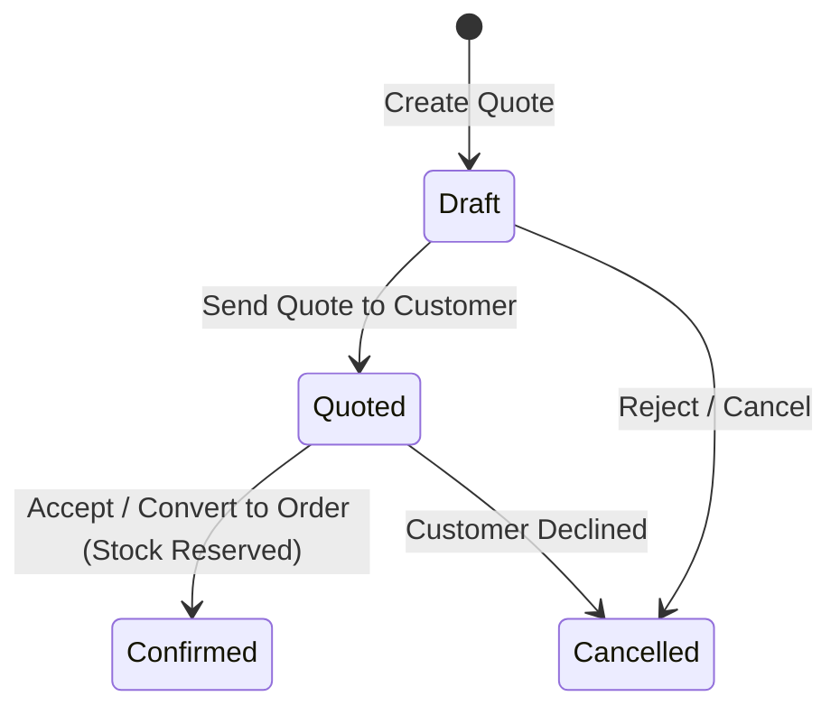

# Sales Quotes

The **Sales Quotes** module manages the commercial quotation process. Sales representatives can prepare price proposals, evaluate gross profit margins, check customer credit limits, and seamlessly convert winning proposals into confirmed sales orders.

---

## Quote Lifecycle & Architecture

In HeroBM, quotes and sales orders share a unified underlying entity (`sales_orders` table). A quote is simply an order residing in the `Draft` or `Quoted` lifecycle state:

### 1. Unified Entity Pipeline
* Creating a quote generates a standard order record in `Draft` or `Quoted` state.
* Converting a quote executes the `confirm` action, advancing the status to `Confirmed`. No duplicate records or messy data migrations occur.

### 2. Live Margin & Credit Verification
* **Real-Time Margin Tracking**: As products and discounts are entered, each line calculates real-time gross margin based on the product's active Moving Weighted Average Cost (WAC).
* **Credit Limit Verification**: The system evaluates total customer exposure (Open Invoices + Unbilled Confirmed Orders + This Quote) against their pre-configured credit limit.

---

## Step-by-Step Workflows

### 1. Creating and Emailing a Quote
1. Go to **Sales** → **Quotes** (`/sales-quotes`).
2. Click **New Quote** (`/sales-quotes/new`).
3. Select the **Customer**. Price scale, currency, and tax positions load automatically.
4. Set the **Expiry Date** (`valid_until`).
5. Add items, enter negotiated prices or line discounts.
6. Click **Save as Quote** (sets status to `Quoted`).
7. Click **Email** to send the branded Typst PDF quotation directly to the customer.

### 2. Converting a Quote to a Confirmed Order
1. Open the winning quote.
2. Click **Convert to Order** (or **Confirm Order**).
3. The order advances to `Confirmed`, reserving available stock and queuing lines for warehouse picking.

---

## Field Reference

| Field | Description |
| :--- | :--- |
| **Customer** | Account receiving the quotation. |
| **Quote Number** | Unique identifier (`ORD-...`). |
| **Expiry Date** | Commercial validity cut-off date. |
| **Gross Margin %** | Calculated profitability metric (`(Price - WAC) / Price`). |
| **Status** | Stage (`Draft`, `Quoted`, `Confirmed`, `Cancelled`). |
