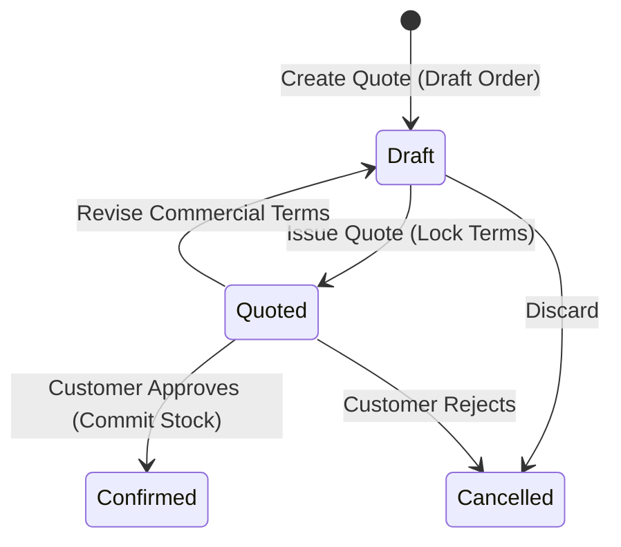

# Sales Quotes

The **Sales Quotes** module allows sales representatives to prepare formal price proposals, inspect live warehouse stock availability, and issue branded PDF quotations. 

Sales Quotes are implemented directly as filtered views of Sales Orders in the `Draft` or `Quoted` state.

---

## Quote Lifecycle & Business Logic

### 1. Underlying Architecture & Commercial Locking
* **Single Entity Pipeline**: A quote is a Sales Order in `Draft` or `Quoted` state. There is no duplicate record creation when converting to an order.
* **Pricing Freeze**: Moving to `Quoted` locks the price scale, line discount percentages, exchange rates, and tax categories to preserve the exact commercial agreement offered to the client.
* **Revision Workflow**: To modify quantities or pricing on a locked quote, click **Revise Quote** to return the record to `Draft`.

### 2. Stock Allocation vs. Availability Visibility
* **Draft & Quoted Visibility**: The quote screen displays live On Hand (OH) and Available (Avail) stock across all storage bins, but **does not reserve physical stock**.
* **Stock Commitment at Confirmation**: Physical inventory is strictly committed when an operator clicks **Confirm Order** (transitioning the record to `Confirmed`).
* **Inventory Gap Resolution**: If available stock is insufficient at the moment of confirmation:
  * **Generate Backorders**: Automatically creates demand entries in Purchasing pegged directly to the order.
  * **Acknowledge Discrepancy**: Confirms the order to allocate available stock immediately and manage shortages manually.

---

## Step-by-Step Workflows

### 1. Creating and Sending a Quotation
1. Go to **Sales** → **Sales Quotes** (`/sales-quotes`).
2. Click **New Quote** (creates a new order in `Draft`).
3. Select the **Customer**. Price scale, currency, and addresses fill automatically.
4. Add line items, quantities, unit prices, and discounts.
5. Click **Save as Draft**.
6. Click **Issue Quote** to lock terms, then click **PDF** or **Email** to transmit the quote to the customer.

### 2. Converting an Accepted Quote
1. Open the accepted quote from `/sales-quotes`.
2. Click **Confirm Order**.
3. The system performs real-time credit checks and stock reservation, transitioning the document into a live confirmed Sales Order for fulfillment.

---

## Field Reference

| Field | Description |
| :--- | :--- |
| **Customer** | Customer account receiving the quotation. |
| **Quote Number** | Unique quote identifier (matches Sales Order number). |
| **Currency** | Transaction currency for all quoted prices and totals. |
| **Price Scale** | Default pricing scale (1–4) used for product list prices. |
| **Total Amount** | Grand total including calculated taxes. |

