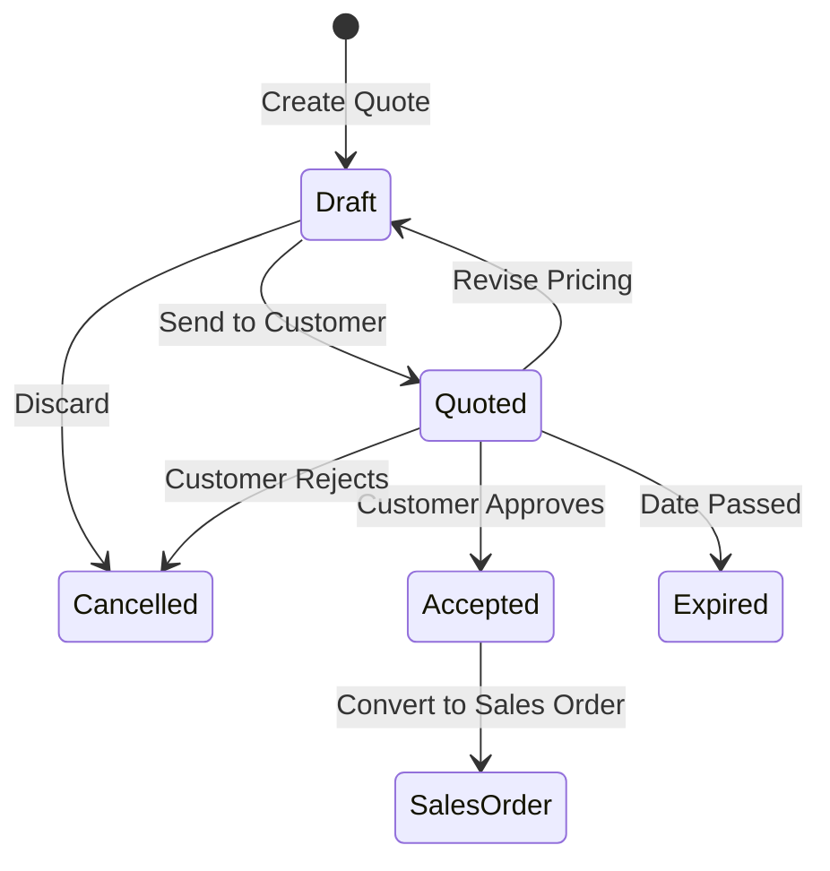

# Sales Quotes

The **Sales Quotes** module allows sales representatives to prepare formal price proposals, check stock availability, generate branded PDF quotes, and convert approved quotes into Sales Orders with one click.

---

## Quote Lifecycle & Rules

### Key Rules
1. **Editable in Draft**: Line items, quantities, discounts, and prices can be freely adjusted while in `Draft`.
2. **Pricing Lock**: Advancing to `Quoted` locks the price breakdown to preserve the exact commercial terms offered to the customer.
3. **Conversion**: When accepted, clicking **Convert to Order** generates a confirmed or draft Sales Order, carrying over all line items, customer details, and special prices without re-entry.

---

## Step-by-Step Workflows

### 1. Creating and Sending a Quote
1. Go to **Sales** → **Sales Quotes** (`/sales-quotes`).
2. Click **+ New Quote**.
3. Select the **Customer**. Price scale, currency, and addresses fill automatically.
4. Set the **Valid Until Date**.
5. Add line items, quantities, unit prices, and discounts.
6. Click **Save as Draft**.
7. Click **Issue Quote** to lock terms, then click **PDF** or **Email** to send the quotation to the customer.

### 2. Converting an Accepted Quote
1. Open the accepted quote.
2. Click **Convert to Sales Order**.
3. The system creates a new Sales Order (`SO-xxxx`) with identical lines, prices, and customer terms.

---

## Field Reference

| Field | Description |
| :--- | :--- |
| **Customer** | The customer account receiving the quotation. |
| **Quote Number** | Unique quote identifier. |
| **Valid Until** | Quote expiry date. |
| **Currency** | Currency for all quoted prices and totals. |
| **Price Scale** | Default pricing scale (1–4) used for product list prices. |
| **Total Amount** | Grand total including estimated tax. |
