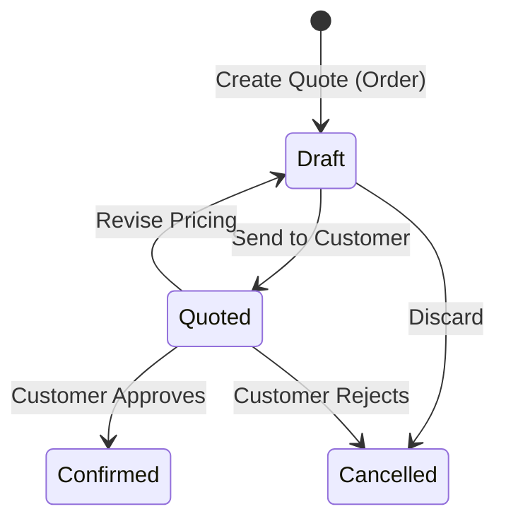

# Sales Quotes

The **Sales Quotes** module allows sales representatives to prepare formal price proposals, check stock availability, and generate branded PDF quotes. Sales quotes are implemented merely as a filtered view of Sales Orders where the state is `draft` or `quoted`.

---

## Quote Lifecycle & Rules

### Key Rules
1. **Part of Sales Orders**: Quotes are simply Sales Orders in the `Draft` or `Quoted` state. There is no separate conversion step.
2. **Editable in Draft**: Line items, quantities, discounts, and prices can be freely adjusted while in `Draft`.
3. **Pricing Lock**: Advancing to `Quoted` locks the price breakdown to preserve the exact commercial terms offered to the customer.
4. **Confirmation**: When accepted, advancing the order to `Confirmed` reserves stock and proceeds to fulfillment.

---

## Step-by-Step Workflows

### 1. Creating and Sending a Quote
1. Go to **Sales** → **Sales Quotes** (`/sales-quotes`), which shows orders in draft/quoted states.
2. Click **New Quote** (this creates a new Sales Order).
3. Select the **Customer**. Price scale, currency, and addresses fill automatically.
4. Add line items, quantities, unit prices, and discounts.
5. Click **Save as Draft**.
6. Click **Issue Quote** to lock terms, then click **PDF** or **Email** to send the quotation to the customer.

### 2. Confirming an Accepted Quote
1. Open the accepted quote.
2. Click **Confirm Order** to transition it into a confirmed Sales Order, reserving inventory.

---

## Field Reference

| Field | Description |
| :--- | :--- |
| **Customer** | The customer account receiving the quotation. |
| **Quote Number** | Unique quote identifier (uses Order Number). |
| **Currency** | Currency for all quoted prices and totals. |
| **Price Scale** | Default pricing scale (1–4) used for product list prices. |
| **Total Amount** | Grand total including estimated tax. |
