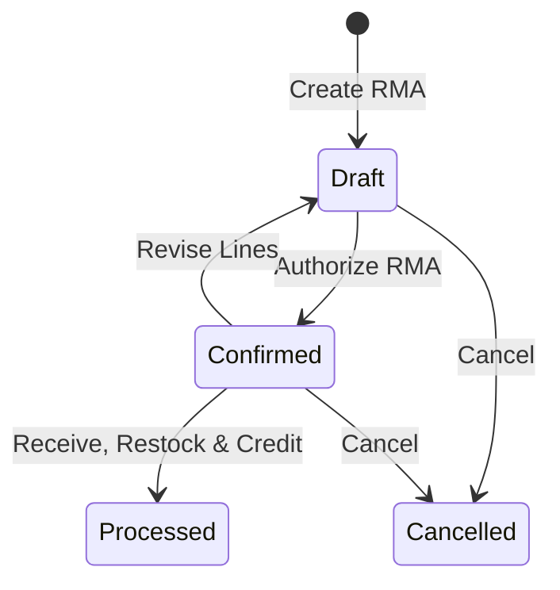

# Sales Returns & RMA

The **Sales Returns** module manages Return Merchandise Authorizations (RMA). It coordinates returning goods back to warehouse stock, inspecting item condition, and issuing financial credit adjustments.

---

## Return Lifecycle & Business Logic



### 1. Invoicing Invariant & Quantity Validation
* **Invoiced Precondition**: Returns can only be initiated against Sales Orders in `Invoiced` state.
* **Return Ceiling**: For each order line:
  ```
  Maximum Returnable Quantity = Invoiced Quantity - Previously Processed Return Quantities
  ```
  Attempting to authorize quantities above this boundary is strictly rejected.

### 2. Credit Calculation & Restocking Fees
The system calculates aggregate return credit using line-level pricing from the original sales order:

```
Net Credit = Subtotal + Total Tax - Total Restocking Fees
```

* **Line Pricing**: Calculated via original line unit price, original line discount %, and current tax rate:
  ```
  Line Net Amount = round2(Returned Quantity * Original Unit Price * (1 - Original Discount% / 100))
  Line Tax Amount = round2(Line Net Amount * (Tax Rate% / 100))
  ```
* **Resolution Differences**:
  * **Refund**: Line contributes to `Subtotal` and `Total Tax`, generating a linked **Sales Credit Note**.
  * **Replacement**: Generates 0.00 financial credit; triggers a replacement dispatch workflow.
* **Restocking Fees**: Deducted directly from gross credit (`Total Credit = Subtotal + Tax - Restocking Fees`).

### 3. Physical Restocking & GL Postings
When warehouse staff mark an RMA as **Processed**:
1. **Physical Stock**:
   * *Good Condition*: Restocked into active pick/storage bins, increasing On Hand (OH) and Available stock.
   * *Damaged / Defective*: Routed into a **Quarantine Bin** for inspection or vendor claim.
2. **General Ledger Journal Postings**:
   * *Financial Credit*: `Debit: Sales Returns / Revenue`, `Debit: Tax Liability`, `Credit: Accounts Receivable`.
   * *Inventory Restock*: `Debit: Inventory Asset`, `Credit: Cost of Goods Sold (COGS)`.

---

## Step-by-Step Workflows

### 1. Authorizing a Return (RMA)
1. Go to **Sales** → **Sales Returns** (`/sales-returns`).
2. Click **New Return** and select the original **Sales Order**.
3. Select line items and specify the **Returned Quantity** (must be `<= Invoiced Quantity`).
4. Select the **Return Reason** and set the **Resolution** (`Refund` or `Replacement`).
5. (Optional) Enter a **Restocking Fee**.
6. Click **Confirm Return** to generate the official RMA document for the customer.

### 2. Receiving and Processing Goods
1. When physical items arrive at the dock, open **Receiving** → **Customer Returns**.
2. Inspect item condition and assign destination storage bins (or Quarantine bin if damaged).
3. Click **Process Return** to update perpetual inventory counts and automatically post the Credit Note.

---

## Field Reference

| Field | Description |
| :--- | :--- |
| **Return Number** | Unique RMA identifier (e.g. `RMA-2026-00018`). |
| **Sales Order** | Originating invoiced sales order reference. |
| **Customer** | Account returning the merchandise. |
| **Returned Quantity** | Authorized unit count (must be `<= unreturned invoiced quantity`). |
| **Resolution** | Action type: `Refund` (financial credit) or `Replacement`. |
| **Return Reason** | Quality or commercial reason code. |
| **Restocking Fee** | Deducted administrative or return handling charge. |
| **Status** | Stage (`Draft`, `Confirmed`, `Processed`, `Cancelled`). |

