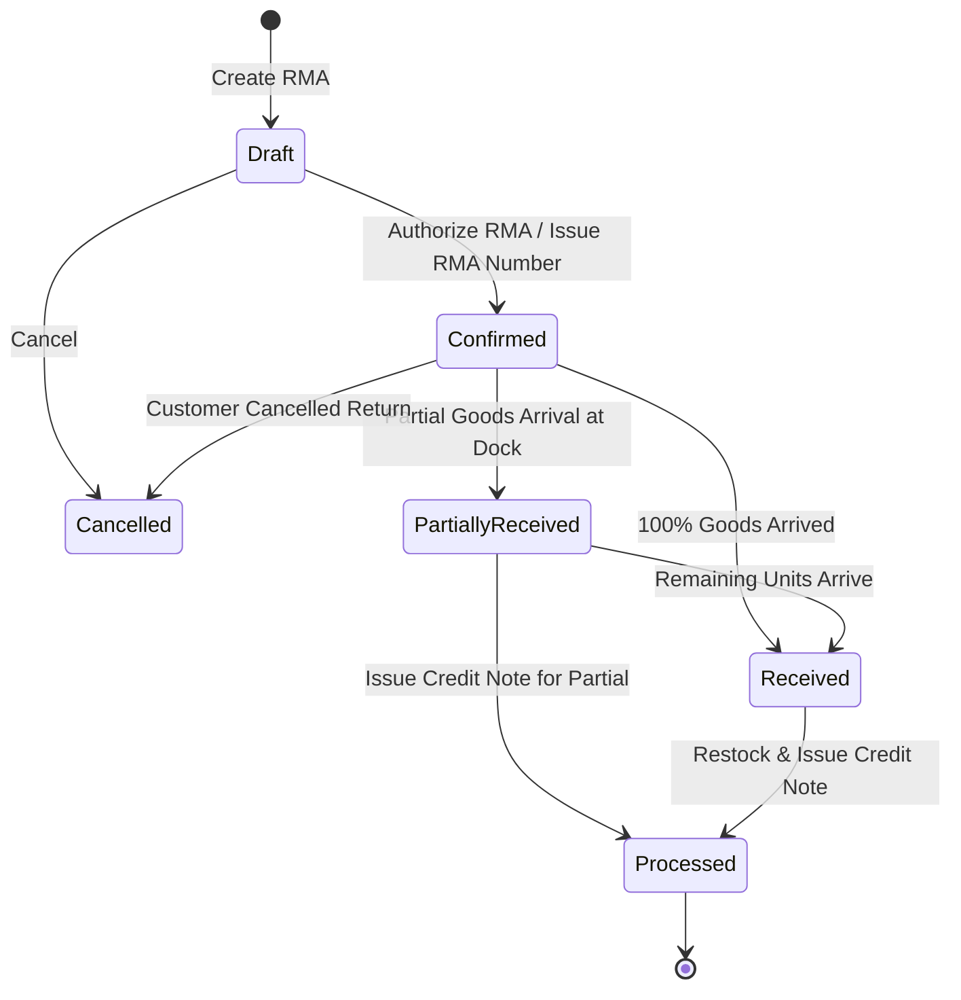

# Sales Returns & RMA

The **Sales Returns** module manages customer returns, warranty claims, dock receipts for returned goods, quality inspections, and credit note issuance.

---

## RMA Lifecycle & Business Logic

### 1. RMA States & Progression
* **`Draft`**: Return request created with customer and proposed items.
* **`Confirmed`**: Return authorized and official RMA document sent to customer.
* **`Partially Received` / `Received`**: Customer packages arrive at the warehouse dock and are verified against the RMA.
* **`Processed`**: Goods inspected, restocked/quarantined, and compensating Credit Note issued.
* **`Cancelled`**: Return aborted.

### 2. Dock Disposition & Restocking
When receiving returned items:
* **Sound Items**: Accepted back into inventory and routed to the Putaway queue to return to active storage bins.
* **Damaged / Faulty Items**: Routed directly into a `quarantine` bin for manufacturer warranty inspection or scrap write-off.
* **Credit Note Generation**: Clicking **Generate Credit Note** creates a linked draft Credit Note matching the accepted returned quantities and pricing.

---

## Step-by-Step Workflows

### 1. Authorizing a Customer Return (RMA)
1. Go to **Sales** → **Returns** (`/sales-returns`).
2. Click **New Return** (`/sales-returns/new`).
3. Select the originating **Sales Order** and **Customer**.
4. Choose the return lines, quantities, and return reason (e.g. Defective, Wrong Size, Customer Changed Mind).
5. Click **Confirm Return** to generate the official RMA document and email it to the customer.

### 2. Receiving and Crediting the Return
1. When the package arrives at the dock, open the RMA record.
2. Click **Receive Items** and enter verified counts.
3. Select the disposition: **Restock to Inventory** or **Move to Quarantine**.
4. Click **Generate Credit Note** to issue the Accounts Receivable credit note to the customer.

---

## Field Reference

| Field | Description |
| :--- | :--- |
| **Return Number (RMA)** | System authorization identifier (`RMA-...`). |
| **Sales Order** | Originating sales order reference (`ORD-...`). |
| **Customer** | Account returning merchandise. |
| **Return Status** | Stage (`Draft`, `Confirmed`, `Partially Received`, `Received`, `Processed`, `Cancelled`). |
| **Return Reason** | Commercial cause (Defective, Damaged, Transit Loss, Unwanted). |
