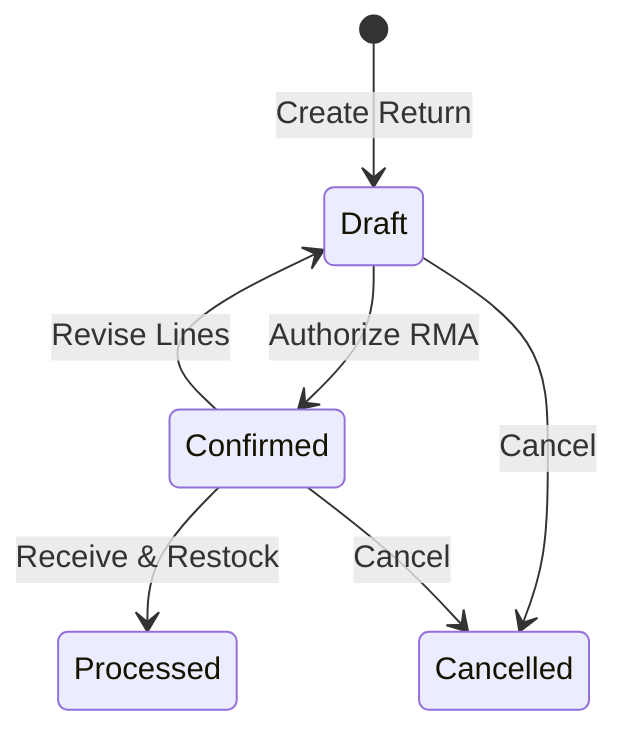

# Sales Returns & RMA

The **Sales Returns** module manages Return Merchandise Authorizations (RMA). It coordinates returning goods back to warehouse stock, inspecting item condition, and issuing financial credit adjustments.

---

## Return Lifecycle & Rules

### Key Rules
1. **Invoiced Orders Only**: Returns can only be created against sales orders in the `Invoiced` state.
2. **Quantity Caps**: You cannot return more units than were originally invoiced minus any previously processed returns.
3. **Operational vs Financial**:
   - Marking a return as **Processed** confirms warehouse staff have inspected and received the physical items.
   - Processing automatically raises an event to generate a corresponding **Credit Note** for customer ledger adjustment.

---

## Step-by-Step Workflows

### 1. Creating a Sales Return
1. Go to **Sales** → **Sales Returns** (`/sales-returns`).
2. Click **New Return** and select the original **Sales Order**.
3. Select which line items are being returned and enter the **Quantity Returned**.
4. Select a **Return Reason** for each item.
5. (Optional) Enter a **Restocking Fee** if applicable.
6. Click **Confirm Return** to generate the official RMA document for the customer.
7. Once goods arrive at the warehouse, receive them via **Receiving** → **Customer Returns** and click **Process Return** to restock items and generate a Credit Note.

---

## Field Reference

| Field | Description |
| :--- | :--- |
| **Return Number** | Unique RMA identifier. |
| **Sales Order** | Invoiced order reference. |
| **Customer** | Customer requesting return. |
| **Quantity Returned** | Units authorized for return (must be ≤ invoiced quantity). |
| **Return Reason** | Quality/commercial justification code (Line-level). |
| **Restocking Fee** | Deducted handling fee (Line-level). |
| **Status** | Stage (`Draft`, `Confirmed`, `Processed`, `Cancelled`). |
