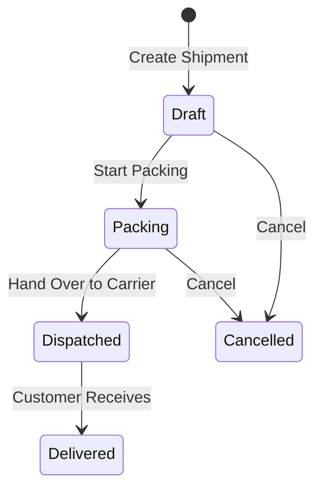

# Shipments & Delivery

The **Shipments** module tracks the physical packaging and dispatch of goods to customers. It links warehouse picking to carrier tracking numbers, generates shipping labels and delivery dockets, supports customer emailing, and automatically updates sales order fulfillment states.

---

## Shipment Lifecycle & Rules

### Key Rules
1. **Partial Shipments Supported**: Multiple shipments can be created against a single sales order when fulfilling in batches.
2. **Auto-Transition to Shipped**: When all line items on a sales order have been 100% dispatched across shipments, the sales order automatically updates from `picking` to `shipped`.
3. **Fast-Track Barcode Dispatch**: For high-volume warehouse fulfillment, operators can bypass manual shipment entry by using the [Scan-to-Dispatch](./shipping.md) station (`/inventory/shipping/scan-to-dispatch`) to automatically create and dispatch shipments upon scanning.
4. **Reverting Shipments**: If a shipment is cancelled before delivery, the committed quantities are released back to the warehouse, and if the order is no longer 100% shipped, its status reverts to `picking`.

---

## Document Generation & Customer Emailing

- **Print Shipping Label**: Generates a standardized Typst carrier dispatch label formatted with customer address, barcode, package counts, and carrier routing info.
- **Print Shipping Docket**: Generates a packing docket itemizing dispatched SKUs, quantities, and serials for inclusion inside the parcel.
- **Email Shipping Docket**: Opens the document email dialog to send the dispatch notification and PDF docket directly to the customer's delivery contact.

---

## Step-by-Step Workflows

### 1. Creating and Dispatching a Shipment (Manual Workbench)
1. Go to **Sales** → **Shipments** (`/shipments`).
2. Click **New Shipment** and select the **Sales Order**.
3. Verify the delivery address and packed line quantities.
4. Select the **Carrier** and enter the **Tracking Number**.
5. Click **Print Shipping Label** to affix to cartons.
6. Click **Print Shipping Docket** or **Email Docket** to send confirmation to the client.
7. Click **Mark as Dispatched**.

### 2. Fast-Track Barcode Dispatch
- Use the **Scan-to-Dispatch** terminal (`/inventory/shipping/scan-to-dispatch`) to scan Zebra pick labels directly, create shipments automatically, and mark them `Dispatched` in real time.

---

## Field Reference

| Field | Description |
| :--- | :--- |
| **Shipment Number** | Unique shipment tracking identifier. |
| **Sales Order** | The parent sales order being fulfilled. |
| **Tracking Number** | Waybill / tracking number for online tracking. |
| **Status** | Stage in dispatch workflow (`Draft`, `Packing`, `Dispatched`, `Delivered`). |
| **Delivery Address** | Destination physical address for delivery. |
| **Shipping Notes** | Special instructions for the delivery driver. |
