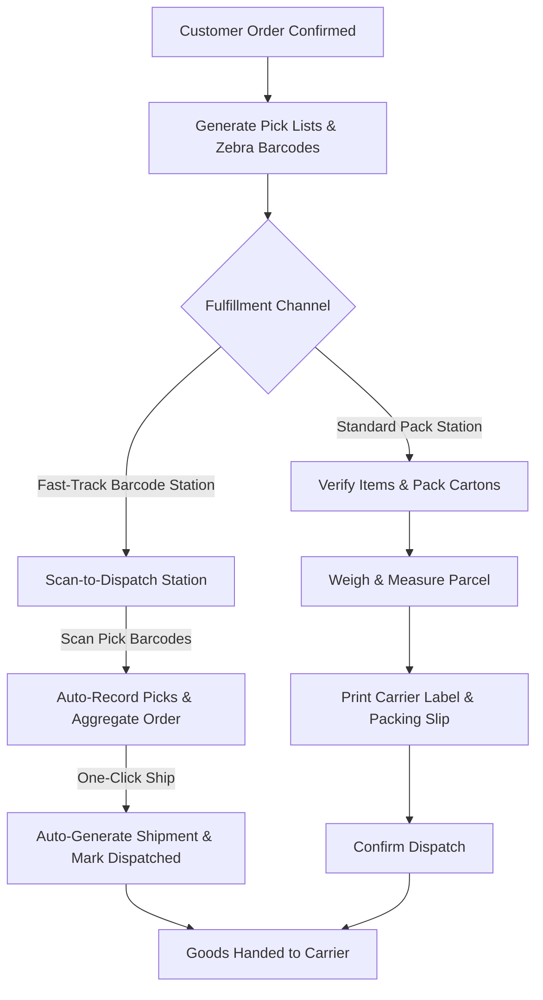

# Shipping & Outbound Logistics

The **Shipping** desk is the final checkpoint before goods leave the facility. Operators pack picked orders into shipping cartons, execute rapid scan-to-dispatch workflows, print carrier labels, generate delivery dockets, and confirm final dispatch.

---

## Outbound Logistics Workflows



### 1. Customer Shipments vs Scan-to-Dispatch vs Supplier Returns (RTV)
- **Customer Shipments (`/inventory/shipping`)**: Standard packing workbench to inspect picked lines, enter parcel weights, select carriers, and create outbound shipments.
- **Scan-to-Dispatch (`/inventory/shipping/scan-to-dispatch`)**: High-velocity barcode fulfillment station designed for rapid pick-and-pack operations with handheld barcode scanners.
- **Supplier Returns (RTV) (`/shipments/returns`)**: Defective or rejected supplier stock is packed and returned to vendors.

---

## Scan to Dispatch (Fast-Track Barcode Fulfillment)

The **Scan-to-Dispatch** interface (`/inventory/shipping/scan-to-dispatch`) streamlines high-volume warehouse fulfillment by combining line picking confirmation and shipment dispatch into a single scan-driven station.

### 1. Hardware Scanner Integration
- **Hands-Free Autofocus**: The scanner input field maintains continuous focus automatically, even when clicking elsewhere on the page, eliminating the need to use a mouse or keyboard.
- **Auditory Feedback**:
  - **Success Chime (880 Hz)**: Confirms valid barcode scans, line pick registrations, and successful order dispatches.
  - **Error Tone (220 Hz)**: Alerts the operator immediately if an invalid barcode, unallocated line, or system error occurs.

### 2. Barcode Format Specification
The scanner processes standard Zebra pick label barcodes formatted according to the HeroBM canonical pick payload:

```text
PICK:{orderId}:{lineId}:{binId}:{quantity}
```

- **`orderId`**: UUID of the sales order being fulfilled.
- **`lineId`**: UUID of the specific sales order line item.
- **`binId`**: UUID of the warehouse bin location where the stock was picked.
- **`quantity`**: Picked unit count (defaults to `1` if omitted).

*(Shorthand format `{orderId}:{lineId}:{binId}:{quantity}` is also supported).*

### 3. Real-Time Order Cards & Aggregation
As barcodes are scanned:
- Scans are automatically grouped into distinct **Order Cards** in the active session list, sorted by most recent activity.
- The interface displays real-time progress indicators:
  - **Fully Picked**: All physical line items on the order have been scanned.
  - **Partially Picked (X / Y lines)**: Indicates remaining unpicked lines.
- Expanding an order card displays the full list of order lines, bin allocations, picked counts, and individual pick cancellation buttons to correct accidental scans.

### 4. One-Click Automated Dispatch
- **Ship Order**: Enabled when all lines (or all available physical lines) have been picked. In a single automated action, HeroBM queries the shipping context, creates the shipment record, transitions the shipment state to `DISPATCHED`, and clears the order from the active queue.
- **Ship Partial**: Available when an order is partially picked and remaining unpicked lines are out of stock, allowing backorder splits without stalling available shipments.

---

## Step-by-Step Workflows

### 1. High-Velocity Scan-to-Dispatch Fulfillment
1. Navigate to **Inventory** → **Shipping** → **Scan to Dispatch** (`/inventory/shipping/scan-to-dispatch`).
2. Point your USB, Bluetooth, or Zebra hardware barcode scanner at the printed pick list or item barcode.
3. Scan each item's pick label. Listen for the high-pitched confirmation chime.
4. Review the aggregated order card. Verify that line quantities match the physical parcel.
5. Click **Ship Order** (or **Ship Partial** if shipping an available subset).
6. The system creates the shipment, transitions its state to `DISPATCHED`, displays the generated shipment number, and clears the completed card.

### 2. Standard Packing and Dispatching Customer Goods
1. Go to **Inventory** → **Shipping** → **Customer Shipments** (`/inventory/shipping`).
2. Select an order ready from the picking stage.
3. Verify line items packed into the carton.
4. Enter the **Package Weight** and select the **Carrier**.
5. Print the **Packing Slip** and affix the shipping label.
6. Click **Confirm Dispatch**.

### 3. Processing Supplier Returns (RTV)
1. Go to **Inventory** → **Shipping** → **Supplier Returns** (`/shipments/returns`).
2. Select the approved return debit note or purchase return record.
3. Verify the vendor destination address and return items.
4. Print the RTV dispatch documentation and confirm shipment to the vendor.

---

## Field Reference

| Field | Description |
| :--- | :--- |
| **Scanner Input** | Auto-focused listener receiving scanned barcode strings from hardware scanners. |
| **Barcode Payload** | Canonical scan-to-pick string (`PICK:{orderId}:{lineId}:{binId}:{quantity}`). |
| **Shipping Notes** | Special delivery instructions (e.g. Tailgate required, Gate code). |
| **Shipment Status** | Outbound shipment state (`Draft`, `Packing`, `Dispatched`, `Delivered`). |
| **Active Orders Queue** | Real-time session list of orders currently being scanned and packed. |
