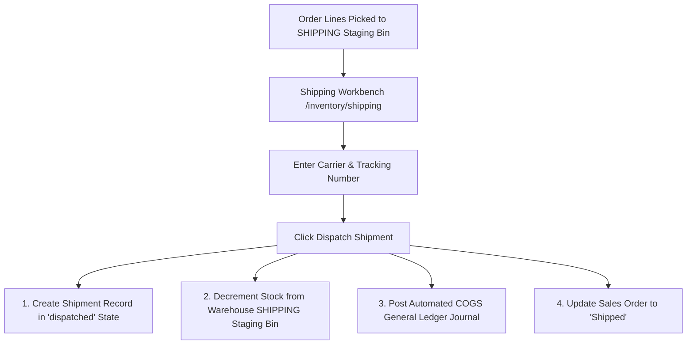

# Outbound Shipping & Dispatch

The **Shipping** module manages packing, carrier tracking assignment, outbound consignment dispatch, and automated Cost of Goods Sold (COGS) accounting integration.

---

## Outbound Dispatch Lifecycle & Accounting



### 1. Shipment States & Progression
* **`Draft`**: Packing list is created and lines are verified at the packing bench.
* **`Dispatched`**: The carrier collects the parcel. Stock is permanently cleared from the location's `SHIPPING` staging bin, and the order advances to `Shipped`.
* **`Partially Received` / `Received`**: Used for transfer shipments arriving at destination facilities.
* **`Cancelled`**: Voided shipment before dispatch.

### 2. General Ledger COGS Posting
Dispatching an outbound customer shipment immediately triggers an automated double-entry GL journal:

```
Debit:  Cost of Goods Sold (COGS)  (Total dispatched units * moving WAC unit cost)
Credit: Inventory Asset Account     (Total dispatched units * moving WAC unit cost)
```

### 3. Scan-to-Dispatch High-Velocity Station
For distribution centers with dedicated packing conveyors, the **Scan-to-Dispatch Station** (`/inventory/shipping/scan-to-dispatch`) provides barcode-driven packing and instant dispatch:
* Operator scans the order or line barcode.
* System verifies that items have been picked into staging.
* Operator inputs tracking number and dispatches with a single scan, printing the Packing Slip PDF and Delivery Docket automatically.

---

## Step-by-Step Workflows

### 1. Dispatching a Shipment via Shipping Workbench
1. Go to **Inventory** → **Shipping** (`/inventory/shipping`).
2. Locate the order with picked lines in the dispatch queue.
3. Click **Create Shipment**.
4. Select the **Carrier** and enter the **Tracking Number** and **Special Delivery Instructions**.
5. Confirm the dispatch quantities for each picked line.
6. Click **Dispatch Shipment**.
7. Print the generated **Delivery Docket / Packing Slip** and apply to the carton.

### 2. High-Speed Fulfillment via Scan-to-Dispatch
1. Go to **Inventory** → **Shipping** → **Scan to Dispatch** (`/inventory/shipping/scan-to-dispatch`).
2. Scan the barcode on the pick sheet (`PICK:...`).
3. Enter or scan the carrier consignment barcode into the **Tracking Number** field.
4. Press Enter or click **Dispatch**.

---

## Field Reference

| Field | Description |
| :--- | :--- |
| **Shipment Number** | System consignment reference (`SHP-...`). |
| **Sales Order** | Linked customer order number (`ORD-...`). |
| **Carrier** | Assigned freight or courier company. |
| **Tracking Number** | Carrier consignment or package tracking code. |
| **Shipment Date** | Exact date and timestamp of outbound carrier handoff. |
| **Shipment Status** | Stage (`Draft`, `Dispatched`, `Partially Received`, `Received`, `Cancelled`). |
