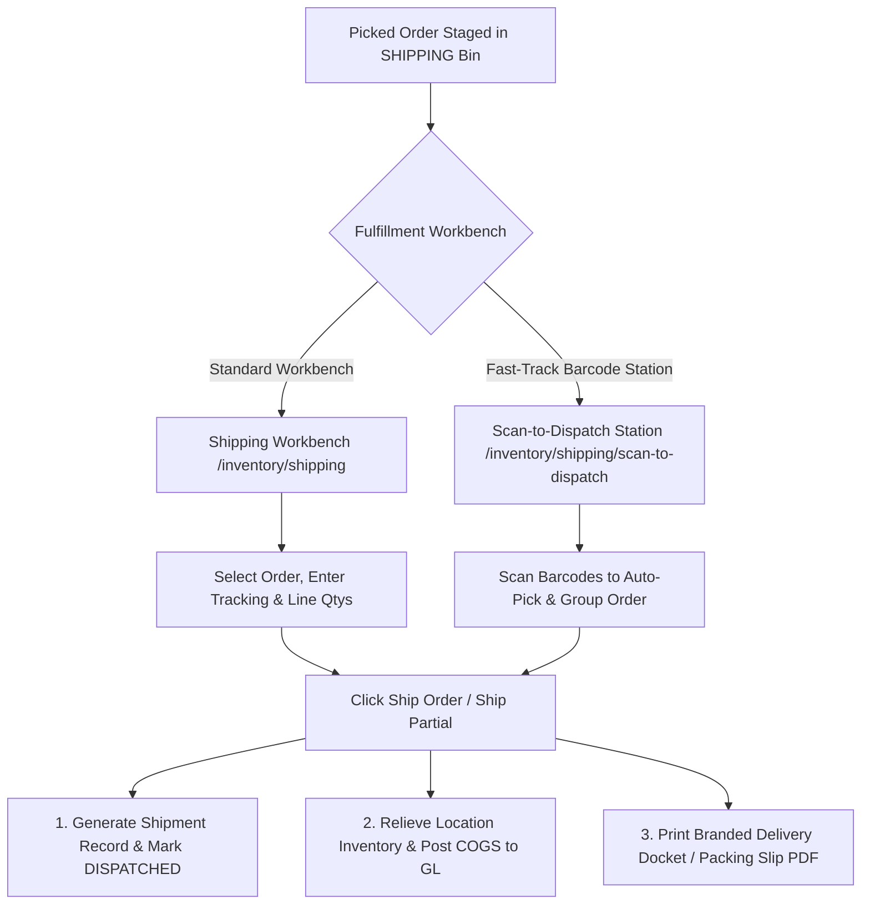

# Shipping & Outbound Logistics

The **Shipping** desk is the final checkpoint before goods leave the facility. Operators review picked items staged in the shipping area, record carrier tracking numbers and driver instructions, print delivery packing slips, and confirm outbound dispatch.

---

## Outbound Logistics Workflows



### 1. Shipment Channels

- **Shipping Workbench (`/inventory/shipping`)**: Visual dispatch interface to review open orders ready for shipping, enter carrier tracking details, adjust line quantities for partial shipments, and generate outbound consignments.
- **Scan-to-Dispatch (`/inventory/shipping/scan-to-dispatch`)**: High-velocity barcode fulfillment station designed for rapid pick-and-pack operations with handheld wireless or USB barcode scanners.
- **Supplier Returns Dispatch (`/shipments/returns`)**: Staged vendor return lines are reviewed, packed, and marked shipped to decrement inventory and notify procurement.

---

## Scan to Dispatch (Fast-Track Barcode Fulfillment)

The **Scan-to-Dispatch** interface (`/inventory/shipping/scan-to-dispatch`) combines line pick registration and shipment dispatch into a single scan-driven workflow.

### 1. Hardware Scanner Integration
- **Hands-Free Autofocus**: The scanner input field maintains continuous focus automatically, eliminating the need to use a mouse or keyboard between scans.
- **Auditory Feedback**:
  - **Success Chime (880 Hz)**: Confirms valid barcode scans, line pick registrations, and successful order dispatches.
  - **Error Tone (220 Hz)**: Alerts the operator immediately if an invalid barcode, unallocated line, or system error occurs.

### 2. Barcode Format Specification
The scanner processes standard Zebra pick label barcodes formatted according to the HeroBM canonical pick payload:

```text
PICK:{orderId}:{lineId}:{binId}:{quantity}
```

- **`orderId`**: UUID of the sales order being fulfilled.
- **`lineId`**: UUID of the specific sales order line item.
- **`binId`**: UUID of the warehouse bin location where the stock was picked.
- **`quantity`**: Picked unit count (defaults to `1` if omitted).

### 3. Real-Time Order Cards & Aggregation
As barcodes are scanned:
- Scans are automatically aggregated into distinct **Order Cards** in the active session list, sorted by most recent activity.
- The interface displays real-time progress indicators:
  - **Fully Picked**: All physical line items on the order have been scanned.
  - **Partially Picked (X / Y lines)**: Indicates remaining unpicked lines.
- Expanding an order card displays the full list of order lines, bin allocations, picked counts, and individual pick cancellation buttons.

### 4. One-Click Automated Dispatch
- **Ship Order**: Enabled when all lines (or all available physical lines) have been picked. In a single automated action, the system queries the shipping context, creates the shipment record, transitions the shipment state to `DISPATCHED`, posts COGS, and clears the order from the active queue.
- **Ship Partial**: Available when an order is partially picked and remaining lines are on backorder, allowing dispatch of available goods without stalling the customer.

---

## Step-by-Step Workflows

### 1. Dispatching from the Shipping Workbench
1. Go to **Inventory** → **Shipping** (`/inventory/shipping`).
2. Select an order from the **Ready to Ship** or **Partially Picked** tabs.
3. Review the customer address and picked quantities.
4. (Optional) Enter the carrier's **Tracking Number** and any special **Driver Instructions**.
5. Click **Ship Order** (or **Ship Partial** if shipping only a subset of picked lines).
6. The shipment record is created in `DISPATCHED` state and the packing slip PDF is ready to print.

---

## Field Reference

| Field | Description |
| :--- | :--- |
| **Order Number** | Linked Sales Order number (`ORD-...`). |
| **Customer** | Name of the recipient account. |
| **Tracking Number** | Carrier consignment tracking code for freight lookup. |
| **Driver Notes** | Special freight instructions printed on the delivery docket. |
| **Shipment Status** | Stage of the shipment (`Draft`, `Dispatched`, `Partially Received`, `Received`, `Cancelled`). |
| **Available to Ship** | Picked physical units currently staged in the `SHIPPING` bin ready for dispatch. |
