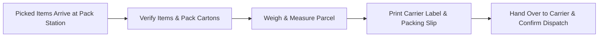

# Shipping & Outbound Logistics

The **Shipping** desk is the final checkpoint before goods leave the facility. Operators pack picked orders into shipping cartons, print carrier labels, generate delivery dockets, and confirm final dispatch.

---

## Outbound Logistics Workflows

### 1. Customer Shipments vs Supplier Returns (RTV)
- **Customer Shipments**: Outbound customer orders fulfill sales demand.
- **Supplier Returns (RTV)**: Defective or rejected supplier stock is packed and returned to vendors via the **Supplier Returns** queue (`/shipments/returns`).

---

## Step-by-Step Workflows

### 1. Packing and Dispatching Customer Goods
1. Go to **Inventory** → **Shipping** → **Customer Shipments** (`/inventory/shipping`).
2. Select an order ready from the picking stage.
3. Verify line items packed into the carton.
4. Enter the **Package Weight** and select the **Carrier**.
5. Print the **Packing Slip** and affix the shipping label.
6. Click **Confirm Dispatch**.

---

## Field Reference

| Field | Description |
| :--- | :--- |
| **Carrier** | Assigned transport service. |
| **Gross Weight** | Total shipment weight in kg/lbs. |
| **Tracking Number** | Waybill tracking reference. |
| **Shipping Notes** | Special delivery instructions. |
