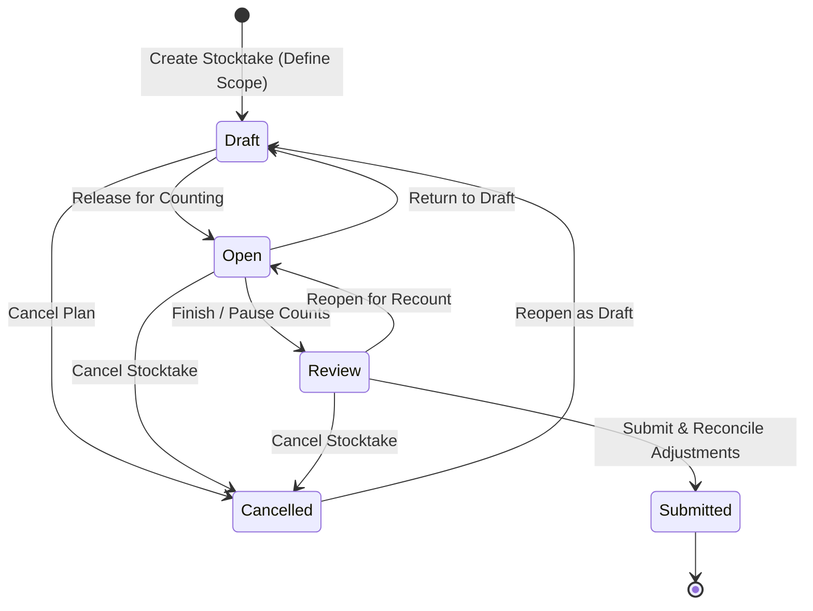

# Physical Stocktakes & Cycle Counts

The **Physical Stocktakes & Cycle Counts** module enables warehouse teams to verify physical inventory against system records. It supports full wall-to-wall audits, targeted zone checks, and rolling bin cycle counts using mobile-friendly barcode scanning, blind count controls, and automated General Ledger reconciliation.

---

## Stocktake Lifecycle & State Machine

Every stocktake transitions through structured lifecycle states to ensure counting integrity and audit compliance.

### State Overview
* **`draft` (Draft)**: The stocktake plan is configured with location, scope, and blind count settings. Inventory lines and expected quantities are snapshotted.
* **`open` (Open / Counting)**: Active counting in progress. Warehouse operators scan barcodes, navigate bins, and record physical quantities in the counting terminal.
* **`review` (In Review)**: Counting is paused or completed. Supervisors analyze variances (matches, shortages, surpluses, and unlisted items) and decide whether to recount specific bins or approve adjustments.
* **`submitted` (Submitted / Reconciled)**: Final reconciliation. The system automatically creates inventory adjustment entries in the perpetual inventory ledger and posts balancing journal entries to the General Ledger.
* **`cancelled` (Cancelled)**: Aborted without adjusting inventory levels.

---

## Count Scopes & Cycle Counting

HeroBM supports flexible counting scopes to accommodate both periodic full stocktakes and continuous cycle counts without disrupting daily fulfillment operations:

1. **Full Warehouse (`full`)**: Audits all active storage, pick, and bulk bins in the facility.
2. **Specific Zone (`zone`)**: Limits the stocktake to a designated warehouse zone (e.g. Zone A, Cold Storage, High-Value Cage).
3. **Bin Pattern Prefix (`bin_pattern`)**: Filters bins matching a prefix pattern (e.g. `A01-`, `RACK-2`), ideal for rolling aisle cycle counts.
4. **Manual Selection (`manual`)**: Allows granular ad-hoc selection of specific bins or products.

---

## Blind Count vs. Standard Count

> [!TIP]
> **Blind Count (`is_blind_count: true`)** hides expected on-hand system quantities from operators in the counting terminal. This eliminates operator confirmation bias and ensures rigorous physical verification.

* **Standard Count**: Expected quantities are visible to counters for immediate side-by-side comparison.
* **Blind Count**: Counters see only the product details and bin address. Expected quantities and variance badges remain concealed until the stocktake transitions to the **In Review** stage or is viewed by authorized supervisors.

---

## Step-by-Step Workflows

### 1. Creating a New Stocktake
1. Navigate to **Inventory** → **Stocktakes** (`/inventory/stocktakes`).
2. Click **Create Stocktake** in the top header.
3. In the slide-over form, configure the stocktake:
   * Enter a descriptive **Stocktake Name** (e.g. `2026-Q3 Cycle Count - Zone B`).
   * Select the **Fulfillment Location**.
   * Choose the **Count Scope** (`Full Warehouse`, `Specific Zone`, `Bin Pattern`, or `Manual`).
   * Specify **Zone Filter** or **Bin Prefix Pattern** if applicable.
   * Toggle **Blind Count** if you want to hide expected balances from counters.
   * Add optional **Notes / Instructions** for the warehouse team.
4. Click **Create Stocktake**. The stocktake is created in `draft` status and opens the detail view.

### 2. Conducting the Count (Terminal & Barcode Scanning)
1. Open the stocktake and ensure its status is set to **Open**.
2. Click **Start Counting** to open the touch- and scanner-optimized counting terminal (`/inventory/stocktakes/:id/count`).
3. Select a bin from the **Bin Navigator** or scan a bin barcode label.
4. Record item quantities using any of the following methods:
   * **Barcode Scanner**: Scan the product barcode using a hardware USB/Bluetooth scanner or the built-in device camera scanner.
   * **Increment Mode**: Each barcode scan increments the physical count by 1 unit (with audio/haptic chime feedback).
   * **Set Quantity Mode**: Click or tap the count field to enter the exact quantity directly.
   * **Add Unlisted Product**: If physical stock is found in a bin but was not expected by the system, click **Add Unlisted Item**, search the catalog, and enter the physical count.
   * **Confirm Empty / Zero Remaining**: If a bin has no physical stock, click **Confirm Empty** or **Zero Remaining** to quickly set all uncounted lines in the bin to 0.
5. Click **Done & Next Bin** to advance through the warehouse systematically.

> [!NOTE]
> The terminal automatically saves in-progress count drafts locally in the browser, preventing data loss during network interruptions or unexpected device reboots.

### 3. Reviewing Variances & Recounting
1. Once counting is finished, switch the stocktake status to **In Review** or click **Review & Reconcile**.
2. Filter the lines table to inspect discrepancies:
   * **Match**: Physical count exactly equals the expected balance.
   * **Shortage**: Physical count is lower than expected (inventory shrinkage/loss).
   * **Surplus**: Physical count exceeds expected balance (found inventory).
   * **Unlisted**: Unexpected item recorded in the bin.
   * **Uncounted**: Line was never counted.
3. If a variance requires physical re-verification, transition the stocktake back to **Open** and instruct counters to perform a recount of the disputed bin.

### 4. Submitting Final Reconciliation & Ledger Posting
1. In the **In Review** view, click **Submit & Reconcile Adjustments**.
2. Enter a mandatory **Adjustment Reason / Audit Memo** (e.g. `Annual Physical Stocktake 2026 - Main DC`).
3. Click **Submit & Reconcile**.
4. The system executes an atomic transaction that:
   * Adjusts on-hand bin quantities to match the verified physical counts.
   * Writes detailed movement entries to the **Perpetual Inventory Ledger** (`inventory_ledger`).
   * Automatically posts double-entry balancing entries to the **General Ledger** (debiting/crediting the Inventory Asset account and the Inventory Shrinkage/Variance expense account).
   * Marks the stocktake as **Submitted** and records full audit metadata (`submittedBy`, `submittedOn`).

---

## Field Reference

| Field | Description |
| :--- | :--- |
| **Stocktake #** | System-generated tracking code (e.g. `STK-20260911-0001`). |
| **Name** | Descriptive campaign title. |
| **Location** | Facility where physical count takes place. |
| **Status** | Lifecycle state: `draft`, `open`, `review`, `submitted`, `cancelled`. |
| **Scope** | Scope type (`full`, `zone`, `bin_pattern`, `manual`). |
| **Blind Count** | Flag indicating whether recorded quantities are concealed from counters. |
| **Progress** | Percentage and ratio of counted lines vs total lines in scope. |
| **Discrepancies** | Number of lines with variance between expected and counted stock. |
| **Expected Qty** | Snapshot on-hand quantity in system records. |
| **Counted Qty** | Actual physical quantity counted in the bin. |
| **Variance** | Delta quantity (`Counted - Expected`). |
| **Audit Memo** | Reason logged on reconciliation and attached to ledger entries. |
