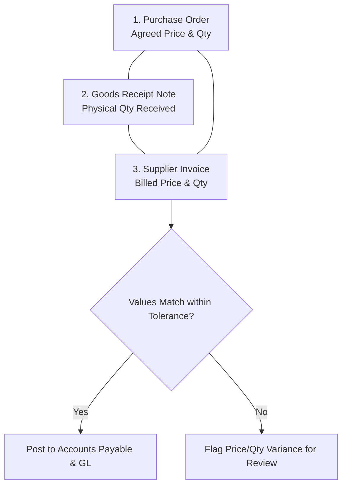

# Supplier Invoices & 3-Way Matching

The **Supplier Invoices** module verifies vendor bills against purchase orders and warehouse receipts before posting liabilities to Accounts Payable.

---

## The 3-Way Matching Rule

To ensure financial integrity and prevent over-billing, the system performs a **3-Way Match**:

### General Ledger Postings
Posting a supplier invoice creates a balanced journal entry:
- **Debit**: Inventory Asset / Expense Account
- **Debit**: Input Tax / GST Recoverable
- **Credit**: Accounts Payable (Vendor balance increases)

---

## Step-by-Step Workflows

### 1. Recording and Matching a Supplier Bill
1. Go to **Purchasing** → **Supplier Invoices** (`/supplier-invoices`).
2. Click **New Supplier Invoice**.
3. Select the **Supplier** and the linked **Purchase Order**.
4. Enter the vendor's official **Supplier Invoice Number** and **Bill Date**.
5. The system pulls lines from the associated Goods Receipt Notes (GRN).
6. Verify line prices and quantities against the vendor's paper/PDF bill.
7. Click **Post Invoice** to record the payable balance in the General Ledger.

---

## Field Reference

| Field | Description |
| :--- | :--- |
| **Supplier Bill Number** | Vendor's invoice reference. |
| **Vendor** | Payee vendor account. |
| **Purchase Order** | Originating procurement order. |
| **Due Date** | Settlement deadline. |
| **Subtotal** | Net bill amount. |
| **Input Tax** | GST / VAT recoverable on purchase. |
| **Total Amount** | Gross payable amount in supplier currency. |
