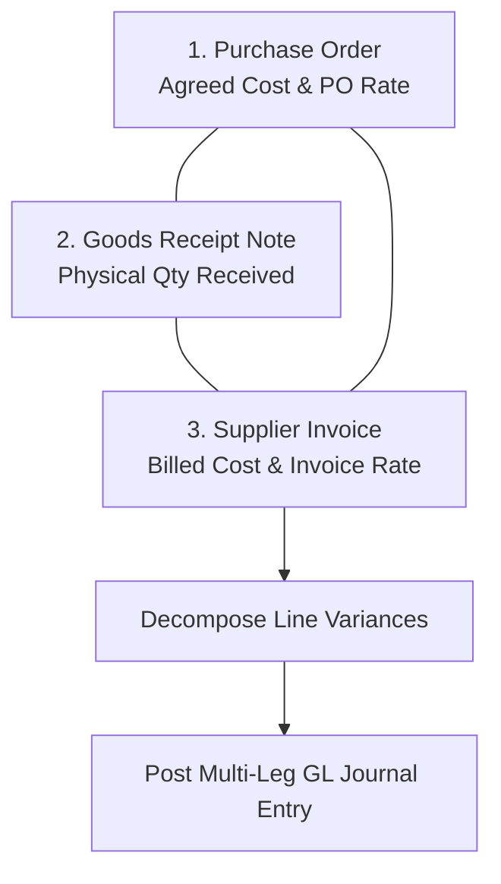

# Supplier Invoices & 3-Way Matching

The **Supplier Invoices** module verifies external vendor bills against purchase orders and warehouse dock receipts (GRN) before posting financial liabilities to Accounts Payable.

---

## 3-Way Matching Logic & Variance Decomposition

To ensure financial integrity, prevent duplicate billing, and isolate currency fluctuations from commercial price changes, the system performs a continuous **3-Way Match**:



### 1. Multi-Currency Variance Decomposition
When matching an AP invoice against goods receipts, the system calculates two distinct variance components:

```
Receipt Base Cost = Quantity Billed * Receipt Unit Cost (GRN)
Foreign Cost = Receipt Base Cost / PO Exchange Rate
Trade Price Variance (PPV Base) = Invoice Base Amount - (Foreign Cost * Invoice Exchange Rate)
FX Rate Variance = (Foreign Cost * Invoice Exchange Rate) - Receipt Base Cost
```

* **Trade Price Variance (Purchase Price Variance / PPV)**: Measures commercial price differences negotiated vs billed in constant currency.
* **FX Rate Variance**: Isolates currency exchange movement between the date the purchase order was placed and the date the supplier invoice was received.

### 2. General Ledger Automated Postings
Posting a matched supplier invoice creates a multi-leg journal entry that clears the temporary goods receipt accrual and establishes the Accounts Payable liability:

```
Debit:  Goods Received Not Invoiced (GRNI)  (Receipt Base Cost - Clears goods receipt accrual)
Debit/Credit: Purchase Price Variance (PPV) (Trade price variance)
Debit/Credit: Foreign Exchange (FX) Variance(Currency exchange variance)
Debit:  Input Tax / GST Recoverable         (Tax Amount Base)
Credit: Accounts Payable Control Account    (Total Invoice Amount Base)
```

* **Unmatched Expense Invoices**: If an invoice line is not linked to a Purchase Order (e.g. utility bills, freight fees), the operator must explicitly assign an active GL Expense Account, Cost Center, and Activity before posting.

---

## Step-by-Step Workflows

### 1. Recording and Matching a Supplier Bill
1. Go to **Purchasing** → **Supplier Invoices** (`/supplier-invoices`).
2. Click **New Supplier Invoice**.
3. Select the **Supplier** and linked **Purchase Order**.
4. Enter the vendor's official **Supplier Invoice Number** and **Bill Date**.
5. The system automatically loads associated unbilled Goods Receipt Notes (GRN).
6. Verify billed quantities, unit prices, and tax categories against the vendor's physical/PDF bill.
7. Click **Post Invoice** to record the payable liability in Accounts Payable, clear GRNI accruals, and update the General Ledger.

---

## Field Reference

| Field | Description |
| :--- | :--- |
| **Supplier Bill Number** | Official vendor invoice reference (e.g. `INV-98214`). |
| **Vendor** | Payee vendor account credited in Accounts Payable. |
| **Purchase Order** | Parent procurement order matched to this bill. |
| **Bill Date** | Effective transaction date for fiscal period posting. |
| **Due Date** | Payment deadline computed from vendor trading terms. |
| **Subtotal** | Net invoice amount before tax in vendor currency. |
| **Input Tax** | GST / VAT recoverable on business purchases. |
| **Total Amount** | Gross payable liability in vendor currency. |
| **Exchange Rate** | FX spot rate used to translate invoice totals to base currency (`EUR`). |

