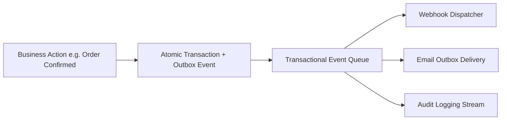
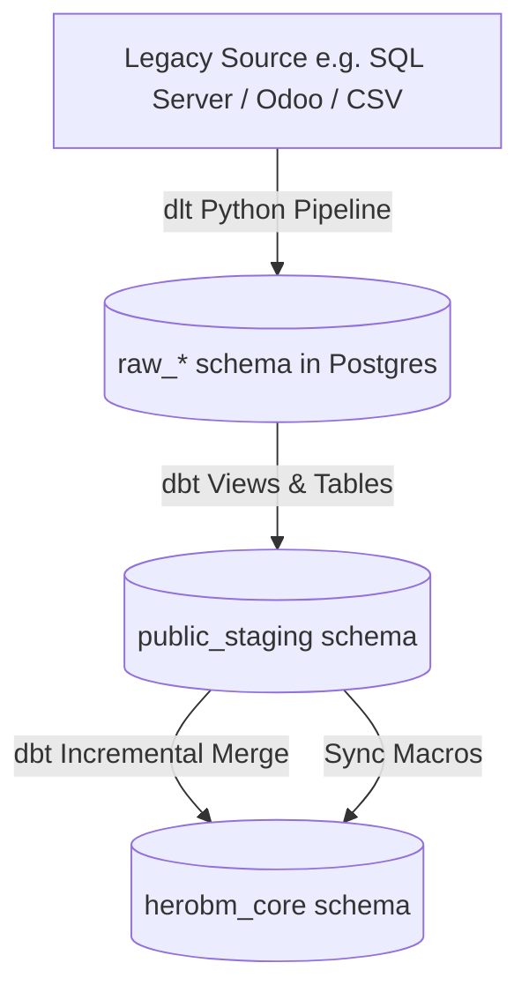

# Developers, Outbox & System Health

The **Technical** section provides enterprise tools for developer API key management, real-time Webhook event streaming, rate limit controls, outbound email delivery queues, database migrations, data import pipelines, and live system diagnostics.

---

## Technical Architecture & Outbox Queue



### 1. Developer Hub Components (`/admin/developers`)
- **API Keys & RBAC Roles**: Issue cryptographically secure API keys assigned to specific roles (`admin`, `agent`, `viewer`) for automated external access.
- **Rate Limit Configuration**: Configure requests-per-minute thresholds per IP and API key to protect services from runaway integrations.
- **Webhook Subscriptions**: Register HTTPS endpoints to receive real-time JSON event notifications (`sales_order.created`, `shipment.dispatched`, `stock.adjusted`).
- **Secret Modal**: High-security, single-view dialog to securely display generated secrets upon creation.

### 2. Email Outbox & SMTP Management
- **Email Outbox** (`/admin/email/outbox`): Monitor outbound email delivery statuses, view error logs for bounced messages, and trigger manual retries.
- **SMTP Settings** (`/admin/email/settings`): Configure custom host, port, TLS security, authentication, and verify connections via test emails.

### 3. Data Imports & System Diagnostics
- **Data Import Workbench** (`/admin/import`): High-throughput migration pipelines for CSV master records, legacy ABM SQL Server databases, and Odoo databases.
- **Transactional Event Queue** (`/admin/event-queue`): Inspect Redis BullMQ outbox jobs and audit event throughput.
- **System Logs & Build Version** (`/admin/system-logs`, `/admin/version`): Search server logs and inspect active commit hashes and deployment timestamps.

---

## Building Data Import Pipelines (ELT Framework)

HeroBM employs a modern **Extract-Load-Transform (ELT)** architecture designed to ingest high-volume legacy database tables into clean, validated, relational PostgreSQL schemas.

### 1. ELT Pipeline Architecture



The pipeline operates across three decoupled tiers:

1. **Extraction Layer (`pipelines/<source>_extract/`)**:
   - Implemented in Python using [`dlt`](https://dlthub.com) (data load tool) and database drivers (ODBC, `pymssql`, `psycopg2`).
   - Extracts source tables as raw structured records directly into an isolated raw PostgreSQL schema (e.g. `raw_abm`, `raw_odoo`).
   - Supports `--dry-run` to validate connection parameters and discovery without writing data.
   - Command: `make extract` or `python pipelines/abm_extract/pipeline.py`.

2. **Staging Layer (`pipelines/<source>_transform/models/staging/`)**:
   - Materializes as clean views (or materialized tables for high-volume Z-tables) in the `public_staging` schema.
   - **Rename**: Converts source PascalCase/raw columns into standard `snake_case`.
   - **Clean**: Strips whitespace with `trim()` and sets sensible fallbacks with `coalesce()`.
   - **Cast**: Fixes type anomalies (e.g., converting comma-separated numeric strings into numbers using `safe_cast_numeric`).
   - *Rule*: Staging models do **not** join tables or apply business domain rules.

3. **Import / Core Layer (`pipelines/<source>_transform/models/import/`)**:
   - Incremental `dbt` models using the `merge` strategy targeting Drizzle-managed application tables in `herobm_core`.
   - Normalizes legacy entities into Microsoft CDM and Schema.org conventions.
   - Preserves UUID primary keys and resolves business IDs into relational foreign keys.
   - Sync macros (`run-operation`) handle dependent line items (e.g., `sync_sales_order_lines`).
   - Commands: `make transform` and `make import-legacy`.

---

### 2. How to Build a New Import Pipeline Model

#### Step A: Declare the Staging Source
In `pipelines/<source>_transform/models/staging/_staging.yml`, declare the raw source table:
```yaml
version: 2
sources:
  - name: raw_abm
    schema: raw_abm
    tables:
      - name: customers
      - name: products
```

#### Step B: Create the Staging Model
Create `models/staging/stg_<entity>.sql` following the Common Table Expression (CTE) pattern:
```sql
with source as (
    select * from {{ source('raw_abm', 'customers') }}
),
renamed as (
    select
        unique_id::text                       as source_id,
        trim(coalesce(customer_title, ''))    as customer_name,
        trim(coalesce(account_code, ''))      as account_number,
        {{ safe_cast_numeric('credit_limit') }} as credit_limit,
        is_active::boolean                    as is_active
    from source
)
select * from renamed
```

#### Step C: Create the Incremental Core Import Model
Create `models/import/import_<entity>.sql` targeting the Drizzle-managed table:
```sql
{{
    config(
        materialized='incremental',
        unique_key='source_id',
        alias='accounts'
    )
}}

with staging_data as (
    select * from {{ ref('stg_customers') }}
)
select
    -- 1. Preserve existing UUID or generate new random UUID
    coalesce(dest.account_id, gen_random_uuid()) as account_id,
    s.source_id,
    s.customer_name as name,
    s.account_number,
    s.credit_limit,
    s.is_active,
    -- 2. Supply typed NULLs for unmapped target columns
    null::text as external_id,
    null::jsonb as custom_fields,
    now() as created_at,
    now() as updated_at
from staging_data s
left join herobm_core.accounts dest on dest.source_id = s.source_id
```

---

### 3. Pipeline Development Guidance & Critical Gotchas

> [!WARNING]
> **1. NEVER Use `--full-refresh` on Aliased Import Models**
> When `dbt` runs with `--full-refresh` on an aliased model, it renames the target table to `<table>__dbt_backup`. This instantly breaks foreign key constraints across other Drizzle tables in `herobm_core`. Always use standard incremental merge runs.

> [!IMPORTANT]
> **2. The dbt Merge Column Contract**
> dbt's SQL merge generates an `UPDATE SET col = source.col` statement for **every single column** present in the target Drizzle table.
> If the source `SELECT` query omits even one destination column, the merge will fail with:
> `column dbt_internal_source.<column_name> does not exist`
> **Fix**: Explicitly output every destination column in your `SELECT` statement. For columns without source equivalents, provide typed NULLs (e.g. `null::text as external_id`, `null::jsonb as custom_fields`).

> [!IMPORTANT]
> **3. UUID Primary Key Preservation Pattern**
> Application tables generate UUID primary keys via `gen_random_uuid()`. When re-running incremental imports, you must **preserve existing UUIDs** so dependent foreign keys are not broken:
> ```sql
> coalesce(dest.<entity>_id, gen_random_uuid()) as <entity>_id
> ```
> Always `LEFT JOIN` the target `herobm_core` table on `dest.source_id = s.source_id` to retrieve the existing ID.

> [!TIP]
> **4. Foreign Key (FK) Topological Order**
> Foreign key constraints are strictly enforced in PostgreSQL. Ingestion must follow dependency order:
> 1. **Dimension Masters**: `accounts`, `products`, `suppliers`, `bins`
> 2. **Junction Links**: `product_suppliers`
> 3. **Document Headers**: `sales_orders`, `purchase_orders`
> 4. **Document Lines**: Sync macros (`sync_sales_order_lines`, `sync_purchase_order_lines`)
> 5. **Subledgers & Stock**: `inventory_entries`, `inventory_ledger`, `bin_contents`, `invoices`

> [!NOTE]
> **5. Deduplication of Staging Natural Keys**
> Legacy databases often contain duplicate key pairs (e.g. multiple product-vendor links with conflicting attributes). Use `DISTINCT ON` with an explicit `ORDER BY` to deterministically choose the canonical record:
> ```sql
> select distinct on (p.product_id, s.vendor_id) ...
> order by p.product_id, s.vendor_id, rps.is_preferred desc nulls last
> ```

> [!NOTE]
> **6. Safe Numeric Casting for Z-Tables**
> Denormalized report tables (Z-tables) frequently store numbers as `varchar` strings containing commas, trailing spaces, and blank values (e.g. `" 3,516.53 "`). Direct `::numeric` casts will crash the pipeline. Always use the `safe_cast_numeric` macro:
> ```sql
> {{ safe_cast_numeric('_qty_ordered') }} as qty_ordered
> ```

---

## Step-by-Step Workflows

### 1. Generating an API Key
1. Go to **Technical** → **Developers** (`/admin/developers`).
2. In the **API Keys** section, click **Generate API Key**.
3. Enter a **Key Name** and select the assigned **Role** (e.g. `agent`).
4. Click **Create Key**. Copy the generated secret key immediately from the **Secret Modal** (it cannot be retrieved again).

### 2. Registering a Webhook Subscription
1. In **Developers** (`/admin/developers`), scroll to the **Webhooks** card.
2. Click **Add Webhook**.
3. Enter the destination **Endpoint URL** (must be HTTPS) and select the subscribed **Event Topics**.
4. Save the subscription. The system will begin streaming JSON payloads immediately upon event emission.

---

## Field Reference

| Field | Description |
| :--- | :--- |
| **API Key Name** | Label identifying external integration. |
| **Assigned Role** | Casbin RBAC role governing endpoint permissions. |
| **Rate Limit** | Maximum allowed API requests per minute. |
| **Target URL** | Destination HTTPS URL receiving event webhooks. |
| **Outbox Status** | Delivery state (`Pending`, `Sent`, `Failed`). |
| **Event Name** | Specific system event topic. |
| **Import Pipeline** | Three-tier ELT data ingestion framework (`dlt` → `dbt` staging → `dbt` incremental merge into `herobm_core`). |
| **System Version** | Active Git commit hash and release build date. |
