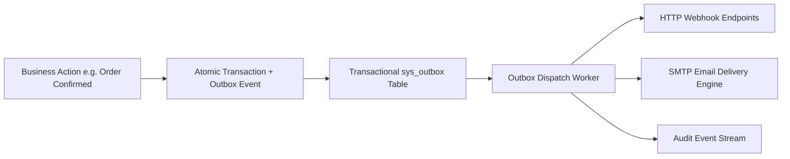

# Developers, Outbox & System Health

The **Technical** section provides enterprise tools for developer API key management, real-time Webhook event streaming, rate limit controls, outbound email delivery queues, database migrations, data import pipelines, and live system diagnostics.

---

## Technical Architecture & Outbox Worker

### 1. API Security & Key Hashing Architecture
* **Cryptographic Token Generation**: API keys are generated using 32 bytes of cryptographically secure random entropy.
* **One-Time Secret Presentation**: The plaintext token (`hbm_live_...`) is presented to the user **exactly once** in the secure Secret Modal.
* **Zero Plaintext Storage**: The database stores only the **SHA-256 hash** (`key_hash`) and a 10-character identification prefix (`prefix`). Incoming requests hash the bearer token on-the-fly and match against `key_hash`.

### 2. Rate Limiting & Sliding Window Controls
* **Default Throughput**: Configured with a default limit of **120 requests per minute** per API key or IP address.
* **Sliding Window Algorithm**: Tracks request velocity in rolling 60-second intervals.
* **429 Response Guardrail**: When an integration exceeds its quota, the API rejects requests with HTTP `429 Too Many Requests` and supplies a `Retry-After: <seconds>` response header.

### 3. Outbox Dispatch & SMTP Queue
* **Transactional Guarantee**: Outbound notifications and emails are written directly to database outbox tables (`sys_outbox`, `sys_email_outbox`) in the same database transaction as business mutations.
* **Continuous Background Polling**: Background workers poll pending records with concurrency locks, ensuring at-least-once delivery with exponential retry backoff.

---

## Step-by-Step Workflows

### 1. Generating an API Key
1. Go to **Technical** → **Developers** (`/admin/developers`).
2. In the **API Keys** section, click **Generate API Key**.
3. Enter a **Key Name** and select the assigned **Role** (e.g. `agent` or `admin`).
4. Click **Create Key**. Copy the generated secret key immediately from the **Secret Modal** (it cannot be retrieved again).

### 2. Registering a Webhook Subscription
1. In **Developers** (`/admin/developers`), scroll to the **Webhooks** card.
2. Click **Add Webhook**.
3. Enter the destination **Endpoint URL** (must be HTTPS) and select the subscribed **Event Topics**.
4. Save the subscription. The system begins streaming JSON payloads immediately upon event emission.

---

## Field Reference

| Field | Description |
| :--- | :--- |
| **API Key Name** | Descriptive label identifying the external application or system. |
| **API Key Prefix** | Public 10-character identifier (e.g. `hbm_live_a1b2`). |
| **Assigned Role** | Casbin RBAC role governing API endpoint authorizations. |
| **Rate Limit** | Maximum allowed requests per 60-second sliding window. |
| **Target URL** | Destination HTTPS endpoint receiving webhook payloads. |
| **Outbox Status** | Delivery state (`Pending`, `Sent`, `Failed`). |
| **System Version** | Active Git commit hash and release deployment timestamp. |

