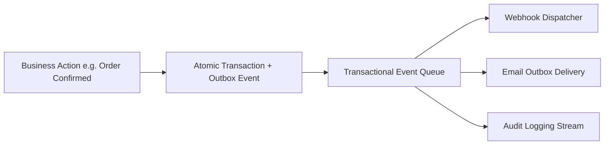

# Developers, Outbox & System Health

The **Technical** section manages external API connectivity, real-time Webhook subscriptions, email delivery outboxes, legacy database imports, and system diagnostic health.

---

## Technical Architecture & Outbox Queue

### 1. Developer APIs & Webhooks
- **REST API Reference** (`/admin/developers/api-reference`): Complete interactive OpenAPI / Swagger documentation for programmatic integration.
- **Webhooks API** (`/admin/developers/webhooks-api`): Subscribe external services to real-time events (`order_created`, `shipment_dispatched`, `stock_adjusted`).

### 2. Email Outbox & SMTP
- **Outbox** (`/admin/email/outbox`): Queue of all system-generated emails (Quotes, Invoices, Statements) with delivery retry tracking.
- **SMTP Settings** (`/admin/email/settings`): Configure custom mail servers (Host, Port, TLS, Authentication).

### 3. Data Imports & System Health
- **Data Import** (`/admin/import`): High-throughput migration tools for CSV master data, legacy ABM databases, and Odoo databases.
- **System Health & Logs** (`/admin/event-queue`, `/admin/system-logs`): Real-time queue monitoring, diagnostic server logs, and version build metadata.

---

## Step-by-Step Workflows

### 1. Generating an API Key
1. Go to **Technical** → **Developers** (`/admin/developers`).
2. Click **Generate API Key**.
3. Enter a descriptive **Key Name** and set an expiration window.
4. Copy the generated secret key (it will not be shown again).

### 2. Monitoring the Event Queue
1. Go to **Technical** → **System Health** → **Event Queue** (`/admin/event-queue`).
2. View pending, processed, and failed event dispatches.
3. If an external endpoint was down, click **Retry Failed Events** to re-process payloads.

---

## Field Reference

| Field | Description |
| :--- | :--- |
| **API Key Name** | Label identifying external integration. |
| **Target URL** | Destination URL receiving POST event webhooks. |
| **Outbox Status** | Delivery state (`Pending`, `Sent`, `Failed`). |
| **Event Name** | Specific system event code. |
| **System Version** | Active Git commit and release build version. |
