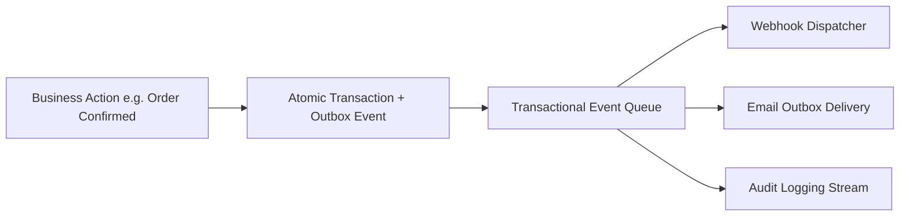

# Developers, Outbox & System Health

The **Technical** section provides enterprise tools for developer API key management, real-time Webhook event streaming, rate limit controls, outbound email delivery queues, database migrations, data import pipelines, and live system diagnostics.

---

## Technical Architecture & Outbox Queue

### 1. Developer Hub Components (`/admin/developers`)
- **API Keys & RBAC Roles**: Issue cryptographically secure API keys assigned to specific roles (`admin`, `agent`, `viewer`) for automated external access.
- **Rate Limit Configuration**: Configure requests-per-minute thresholds per IP and API key to protect services from runaway integrations.
- **Webhook Subscriptions**: Register HTTPS endpoints to receive real-time JSON event notifications (`sales_order.created`, `shipment.dispatched`, `stock.adjusted`).
- **Secret Modal**: High-security, single-view dialog to securely display generated secrets upon creation.

### 2. Email Outbox & SMTP Management
- **Email Outbox** (`/admin/email/outbox`): Monitor outbound email delivery statuses, view error logs for bounced messages, and trigger manual retries.
- **SMTP Settings** (`/admin/email/settings`): Configure custom host, port, TLS security, authentication, and verify connections via test emails.

### 3. Data Imports & System Diagnostics
- **Data Import Workbench** (`/admin/import`): High-throughput migration pipelines for CSV master records, legacy ABM SQL Server databases, and Odoo databases.
  > [!NOTE]
  > For an in-depth guide on how to build, test, and maintain ETL/ELT pipelines, see the [Data Import Pipelines Guide](./import_pipelines.md).
- **Transactional Event Queue** (`/admin/event-queue`): Inspect Redis BullMQ outbox jobs and audit event throughput.
- **System Logs & Build Version** (`/admin/system-logs`, `/admin/version`): Search server logs and inspect active commit hashes and deployment timestamps.

---

## Step-by-Step Workflows

### 1. Generating an API Key
1. Go to **Technical** → **Developers** (`/admin/developers`).
2. In the **API Keys** section, click **Generate API Key**.
3. Enter a **Key Name** and select the assigned **Role** (e.g. `agent`).
4. Click **Create Key**. Copy the generated secret key immediately from the **Secret Modal** (it cannot be retrieved again).

### 2. Registering a Webhook Subscription
1. In **Developers** (`/admin/developers`), scroll to the **Webhooks** card.
2. Click **Add Webhook**.
3. Enter the destination **Endpoint URL** (must be HTTPS) and select the subscribed **Event Topics**.
4. Save the subscription. The system will begin streaming JSON payloads immediately upon event emission.

---

## Field Reference

| Field | Description |
| :--- | :--- |
| **API Key Name** | Label identifying external integration. |
| **Assigned Role** | Casbin RBAC role governing endpoint permissions. |
| **Rate Limit** | Maximum allowed API requests per minute. |
| **Target URL** | Destination HTTPS URL receiving event webhooks. |
| **Outbox Status** | Delivery state (`Pending`, `Sent`, `Failed`). |
| **Event Name** | Specific system event topic. |
| **System Version** | Active Git commit hash and release build date. |
