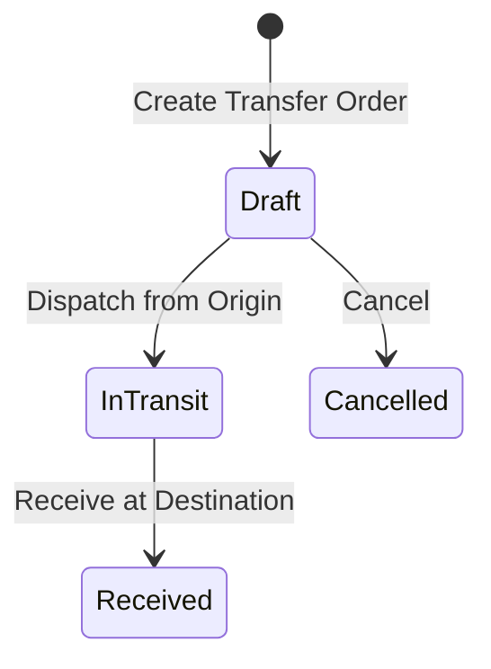

# Stock Transfers & Quarantine

The **Transfers & Quarantine** module manages stock relocation between warehouse facilities and controls quality inspection holds on damaged or suspect goods.

---

## Transfer Lifecycle & Quarantine Rules

### 1. Inter-Warehouse Transfers
- **Dispatching**: Stock leaves the origin warehouse and moves into an **In-Transit** virtual location.
- **Receiving**: Destination staff verify item counts and complete the transfer, moving stock into active bins.

### 2. Quarantine Management
- Items placed in **Quarantine** are excluded from available stock calculations to prevent accidental sale or shipment.
- After quality inspection, staff can **Release** items to standard bins or **Write Off** damaged stock.

---

## Step-by-Step Workflows

### 1. Creating an Inter-Warehouse Transfer
1. Go to **Inventory** → **Transfers** (`/inventory/transfers`).
2. Click **New Transfer**.
3. Select the **Source Warehouse** and **Destination Warehouse**.
4. Add line items and transfer quantities.
5. Click **Dispatch Transfer** when goods leave the origin facility.
6. When the shipment arrives at the destination, go to **Receiving** → **Incoming Transfers** and click **Receive Stock**.

### 2. Placing Items in Quarantine
1. Go to **Inventory** → **Quarantine** (`/inventory/quarantine`).
2. Click **Move to Quarantine**.
3. Select the product, quantity, origin bin, and **Quarantine Reason**.
4. Once inspected, click **Release from Quarantine** to return items to an active storage bin.

---

## Field Reference

| Field | Description |
| :--- | :--- |
| **Transfer Number** | Unique transfer order reference. |
| **Source Location** | Origin warehouse/bin. |
| **Destination Location** | Target warehouse/bin. |
| **Status** | Stage (`Draft`, `In-Transit`, `Received`, `Cancelled`). |
