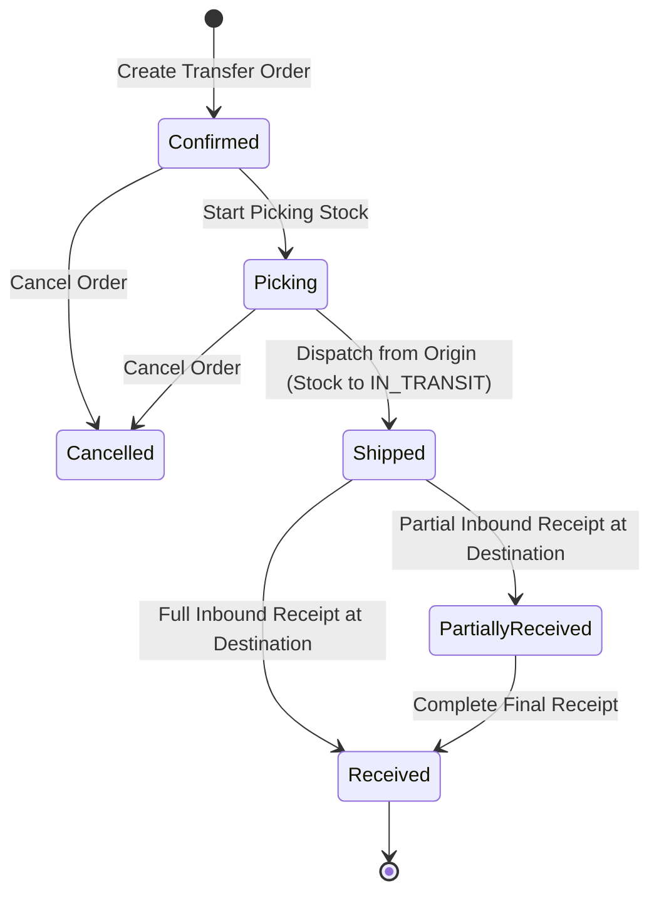

# Stock Transfers & Quarantine Control

The **Transfers & Quarantine** module manages moving inventory between warehouse facilities and isolating non-conforming or damaged products.

---

## Inter-Warehouse Transfers Lifecycle

### 1. In-Transit Accounting & Ledger Movements
* **Dispatch from Origin**: Stock is deducted from the source warehouse bin and moved into an `in_transit` virtual location. Financial valuation remains on the company inventory asset balance.
* **Receipt at Destination**: Arriving units are received into destination dock staging (`staging` bin) and queued for putaway into local storage.

### 2. Quarantine Disposition Workflows
Stock placed into a `quarantine` bin is completely quarantined from available inventory calculations. Operators resolve quarantined goods via three paths:
1. **Release to Active Stock**: After inspection or repackaging, units are transferred to storage bins.
2. **Scrap / Write-off**: Units are permanently scrapped, debiting Inventory Shrinkage/Loss expense.
3. **Return to Vendor (RTV)**: Units are routed to a Purchase Return and shipped back to the supplier for credit.

---

## Step-by-Step Workflows

### 1. Creating and Dispatching an Inter-Warehouse Transfer
1. Go to **Inventory** → **Transfers** (`/inventory/transfers`).
2. Click **New Transfer** (`/inventory/transfers/new`).
3. Select the **Source Warehouse** and **Destination Warehouse**.
4. Add items and transfer quantities.
5. Click **Create Transfer Order** (order is created in `Confirmed` status).
6. Warehouse operators pick the items (`Picking`), then dispatch to generate an outbound in-transit shipment (`Shipped`).
7. At the receiving warehouse, locate the incoming shipment under `/inventory/transfers` or `/receiving/transfers` and click **Receive Transfer** (`Partially Received` or `Received`).

---

## Field Reference

| Field | Description |
| :--- | :--- |
| **Transfer Number** | Unique movement reference (`TRF-...`). |
| **Source Warehouse** | Origin dispatch facility. |
| **Destination Warehouse** | Destination receiving facility. |
| **Status** | Stage (`Confirmed`, `Picking`, `Shipped`, `Partially Received`, `Received`, `Cancelled`). |
| **Quarantine Bin** | Isolated location holding defective or uninspected goods. |
