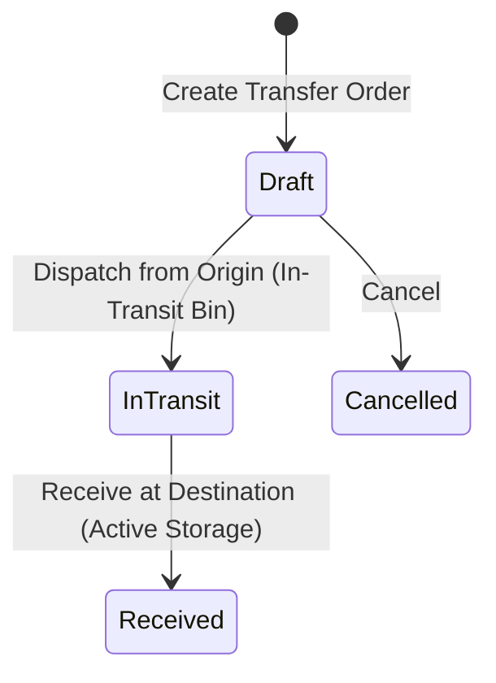

# Stock Transfers & Quarantine

The **Transfers & Quarantine** module manages stock relocation between warehouse facilities and controls quality inspection holds on damaged or suspect goods.

---

## Transfer Lifecycle & Quarantine Logic



### 1. Inter-Warehouse Virtual Bin Accounting
To ensure perpetual inventory balances remain accurate while goods are moving between physical sites:
* **Dispatching from Origin**: Picking and dispatching items moves them out of the origin facility's pickable storage bins and into a virtual **`in_transit`** location. Physical on-hand at the origin is decremented immediately, but destination available stock does not increase prematurely.
* **Receiving at Destination**: When the vehicle arrives at the target facility, dock staff receive the goods, transferring units from `in_transit` into destination storage or dock bins.

### 2. Quarantine Management & Availability Isolation
* **Isolation Rule**: Any inventory residing in a bin with `bin_type = quarantine` is strictly excluded from `Available Stock` calculations (`isPickableBin = false`). It cannot be reserved by new sales orders or allocated to pick waves.
* **Three Quarantine Resolution Paths**:
  1. **Release to Active Stock**: Quality inspection passes; stock is moved from the Quarantine bin into standard `storage` or `pick` bins, immediately restoring Available Stock.
  2. **Scrap / Write-off**: Items are condemned as unrecoverable waste. The stock count is adjusted to zero and the system posts:
     ```
     Debit:  Inventory Scrap / Shrinkage Expense
     Credit: Inventory Asset Account
     ```
  3. **Return to Vendor (RTV)**: If supplier defect is identified, the system initiates a linked **Purchase Return** to ship goods back for vendor credit.

---

## Step-by-Step Workflows

### 1. Executing an Inter-Warehouse Stock Transfer
1. Go to **Inventory** → **Transfers** (`/inventory/transfers`).
2. Click **New Transfer**.
3. Select the **Source Warehouse** and **Destination Warehouse**.
4. Add products and transfer quantities.
5. Click **Dispatch Transfer**. Stock moves to `in_transit`.
6. At the receiving warehouse, go to **Receiving** → **Incoming Transfers** and click **Receive Stock** to move items into destination storage bins.

### 2. Quarantining and Resolving Stock
1. Go to **Inventory** → **Quarantine** (`/inventory/quarantine`).
2. Click **Move to Quarantine**.
3. Select the product, quantity, origin bin, and **Quarantine Reason**.
4. After inspection, choose an action:
   - Click **Release from Quarantine** to return units to pickable stock.
   - Click **Write Off / Scrap** to recognize an inventory loss in the General Ledger.

---

## Field Reference

| Field | Description |
| :--- | :--- |
| **Transfer Number** | Unique transfer order reference (e.g. `TRN-2026-00034`). |
| **Source Warehouse** | Originating facility and bin. |
| **Destination Warehouse** | Receiving facility and target storage bin. |
| **Quarantine Reason** | Quality, damage, or audit reason code for held inventory. |
| **Status** | Stage (`Draft`, `In-Transit`, `Received`, `Cancelled`). |

