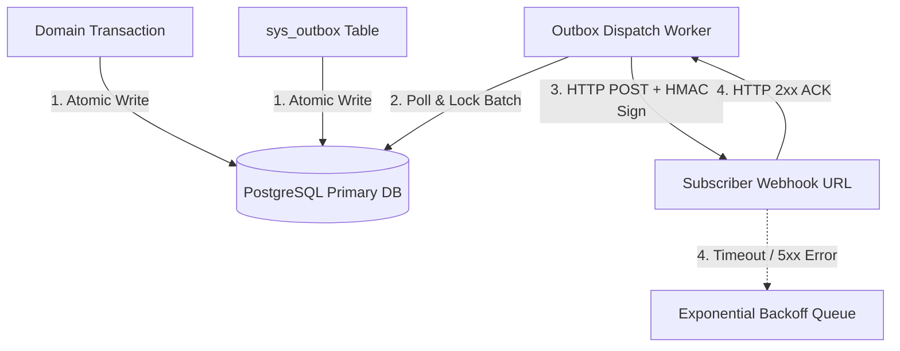

# Webhooks API Reference

Webhooks allow external applications to receive real-time HTTP POST notifications when state changes or operational events occur in HeroBM.

---

## Configuration & Subscription

To create and manage webhook endpoints:
1. Navigate to **Technical** → **Developers** (`/admin/developers`).
2. Scroll to the **Webhooks** section.
3. Click **+ Add Webhook**.
4. Enter your destination **Target URL** (e.g. `https://api.yourdomain.com/webhooks/herobm`).
5. Select the event types to subscribe to (e.g. `sales_order.*`, `payment.allocated`, or `*` for all events).
6. Copy and store the generated **Secret Key** (`whsec_...`) for HMAC signature validation.

---

## Payload Format & Envelope

Every webhook notification is delivered as an HTTP `POST` request with a JSON envelope:

```json
{
  "eventId": "9b1deb4d-3b7d-4bad-9bdd-2b0d7b3dcb6d",
  "eventType": "sales_order.status_changed",
  "entityId": "a1b2c3d4-e5f6-7a8b-9c0d-1e2f3a4b5c6d",
  "entityType": "sales_order",
  "timestamp": "2026-08-19T12:00:00.000Z",
  "payload": {
    "orderNumber": "SO-2026-00124",
    "previousState": "draft",
    "newState": "confirmed",
    "customerId": "f8586ef0-bbc3-4af8-9c00-7b40dc25bbae",
    "totalAmount": 12450.00,
    "currencyCode": "EUR"
  }
}
```

### Payload Envelope Fields

| Field | Type | Description |
| :--- | :--- | :--- |
| **`eventId`** | UUID v4 | Unique identifier for the specific event occurrence (for deduplication). |
| **`eventType`** | String | Event identifier in `entity.action` format (e.g. `sales_order.created`). |
| **`entityId`** | UUID v4 | Primary key ID of the affected domain object. |
| **`entityType`** | String | Domain object classification (e.g. `sales_order`, `payment`). |
| **`timestamp`** | ISO 8601 | UTC timestamp when the event was recorded. |
| **`payload`** | Object | Structured business data relevant to the event. |

---

## Security & Signature Verification

Each webhook request includes an `X-HeroBM-Signature-256` HTTP header. You should verify this signature using your webhook secret to confirm the request originated from HeroBM:

```typescript
import * as crypto from 'crypto';

function verifyWebhookSignature(
  rawBody: string,
  signatureHeader: string,
  secretKey: string
): boolean {
  const expectedSignature = crypto
    .createHmac('sha256', secretKey)
    .update(rawBody, 'utf-8')
    .digest('hex');

  return crypto.timingSafeEqual(
    Buffer.from(signatureHeader),
    Buffer.from(expectedSignature)
  );
}
```

---

## Supported Events Matrix

The following 181 event types are actively supported across 50 domain entity types:

| Entity Type | Supported Event Actions |
|-------------|--------------------------|
| `activity` | `created`, `deleted`, `updated` |
| `actor` | `created`, `deleted`, `updated` |
| `api_key` | `created`, `deleted` |
| `app_settings` | `updated` |
| `bank_statement_line` | `created`, `deleted`, `updated` |
| `bin` | `created`, `deleted`, `updated` |
| `business_report` | `created`, `deleted`, `updated` |
| `contact` | `created`, `deleted`, `updated` |
| `cost_center` | `created`, `deleted`, `updated` |
| `csv_mapping_profile` | `created`, `deleted`, `updated` |
| `customer` | `archived`, `created`, `status_changed`, `unarchived`, `updated` |
| `customer_group` | `created`, `deleted`, `updated` |
| `email` | `dismissed`, `queued` |
| `exchange_rate` | `created`, `deleted`, `updated` |
| `fiscal_period` | `created`, `status_changed`, `updated` |
| `general_ledger` | `entry_posted` |
| `gl_account` | `created`, `updated` |
| `gl_match_group` | `created`, `deleted` |
| `gl_reconciliation` | `created`, `deleted`, `updated` |
| `gl_settings` | `updated` |
| `integration` | `updated` |
| `inventory_ledger` | `entry_posted` |
| `location` | `created`, `deleted`, `updated` |
| `macro` | `created`, `deleted`, `updated` |
| `payment` | `created`, `payment_allocated`, `payment_cancelled`, `status_changed`, `updated` |
| `product` | `archived`, `created`, `status_changed`, `unarchived`, `uom_added`, `uom_removed`, `updated` |
| `product_group` | `created`, `deleted`, `updated` |
| `product_supplier` | `linked`, `unlinked` |
| `project` | `created`, `deleted`, `updated` |
| `purchase_invoice` | `status_changed`, `updated` |
| `purchase_order` | `archived`, `created`, `debit_note_created`, `debit_note_posted`, `demand_allocated`, `demand_unallocated`, `invoice_matched`, `invoice_unmatched`, `return_created`, `status_changed`, `unarchived`, `updated` |
| `purchase_return` | `created`, `status_changed` |
| `reconciliation_rule` | `created`, `deleted`, `updated` |
| `sales_invoice` | `credit_note_posted`, `status_changed` |
| `sales_order` | `archived`, `auto_status_changed`, `backorders_allocated`, `created`, `credit_note_posted`, `demand_allocated`, `demand_reallocated`, `demand_unallocated`, `post_confirmation_line_added`, `return_created`, `return_line_added`, `return_line_removed`, `return_line_updated`, `return_updated`, `sales_invoiced`, `status_changed`, `tax_calculated`, `unarchived`, `updated` |
| `sales_return` | `created`, `status_changed`, `updated` |
| `shipment` | `shipment_created`, `shipment_line_added`, `shipment_line_removed`, `shipment_line_updated`, `shipment_updated` |
| `supplier` | `added_expiry`, `archived`, `created`, `debit_note_posted`, `deleted_expiry`, `status_changed`, `unarchived`, `updated`, `updated_expiry` |
| `supplier_group` | `created`, `deleted`, `updated` |
| `system` | `receipt_matched`, `receipt_unmatched`, `updated` |
| `tax_category` | `created`, `deleted`, `updated` |
| `tax_position` | `created`, `deleted`, `updated` |
| `tax_position_mapping` | `created`, `deleted` |
| `transfer_order` | `created`, `status_changed`, `stock_dispatched`, `updated` |
| `user` | `created`, `deleted`, `status_changed`, `updated` |
| `warehouse` | `pick_cancelled`, `pick_created`, `putaway_completed`, `receipt_created`, `receipt_status_changed`, `shipment_dispatched`, `shipment_status_changed`, `stock_moved`, `updated` |
| `webhook` | `created`, `deleted`, `updated` |
| `work_order` | `created`, `demand_allocated`, `status_changed`, `updated` |
| `work_order_pick` | `created`, `pick_cancelled`, `status_changed` |
| `zone` | `created`, `deleted`, `updated` |

---

## Transactional Outbox Architecture & Delivery Guarantees

HeroBM implements the **Transactional Outbox Pattern** to ensure strict data consistency between database mutations and external event notifications:



### 1. Zero Lost Events (At-Least-Once Delivery)
* When any database entity is modified (e.g. Sales Order confirmed, Payment posted), the resulting domain event is written to the `sys_outbox` table **inside the exact same SQL transaction**.
* If the database transaction rolls back, no webhook event is ever published. If the transaction commits, the event is guaranteed to exist.

### 2. Retry Schedule & Exponential Backoff
If the subscriber endpoint times out (> 10s) or returns an HTTP status outside `200–299`:

| Attempt | Delay / Backoff | Description |
| :--- | :--- | :--- |
| **Immediate** | 0s | First delivery attempt upon worker poll. |
| **Attempt 1** | +1 second | Rapid transient network recovery. |
| **Attempt 2** | +5 seconds | Short application warm-up window. |
| **Attempt 3** | +30 seconds | Infrastructure auto-scaling window. |
| **Attempt 4** | +5 minutes | Minor deployment outage recovery. |
| **Attempt 5** | +30 minutes | Extended outage retry before Dead Letter. |

### 3. Dead Letter Queue (DLQ) & Manual Replay
* After 5 failed attempts, the event delivery transitions to **`failed`** (Dead Letter Queue).
* Operators can inspect the full error stack, payload, and response code under **Technical** → **Developers** (`/admin/developers`) or **Event Queue** (`/admin/event-queue`), and click **Replay Webhook** to redeliver without losing state.

### 4. Subscriber Idempotency Rule
Because network timeouts can occur after the subscriber processes an event but before the HTTP 200 reaches HeroBM, webhooks are delivered with **at-least-once semantics**. Subscribers must use the **`eventId`** (UUID v4) as a unique idempotency key to prevent duplicate processing.

