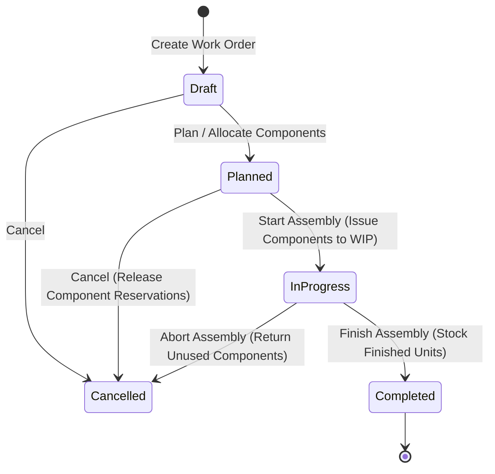

# Work Orders & Assemblies

The **Work Orders & Assemblies** module manages light assembly, kit building, and manufacturing. It decomposes multi-component Bills of Materials (BOM), allocates raw material parts, tracks work-in-progress (WIP), and calculates finished goods unit costs.

---

## Work Order Lifecycle & Costing



### 1. Work Order States & Progression
* **`Draft`**: Production job created, target assembly selected, and component requirements calculated from BOM.
* **`Planned`**: Components checked and reserved from warehouse storage bins. Shortages enter the Purchase Demands queue.
* **`In-Progress`**: Production underway. Component stock is physically issued from bins to Work-In-Progress (`wip` bin).
* **`Completed`**: Finished goods verified, unit cost calculated, finished items moved to Putaway staging, and work order closed.
* **`Cancelled`**: Job cancelled; reserved or issued components returned to storage.

### 2. Live Assembly Costing & Valuation
When completing a build (`completeBuild`), the system calculates total job costs and finished inventory valuation:

```
Component Materials Cost = Sum(Component Expected Quantity * Component Unit Cost)
Total Assembly Labor Cost = Assembly Cost Per Unit * Target Quantity
Total Work Order Cost = Component Materials Cost + Total Assembly Labor Cost + Additional Cost
Finished Product Unit Cost = Total Work Order Cost / Target Quantity
```

* **Component Materials Cost**: Calculated from the snapshotted Bill of Materials components (`work_order_components`) based on expected quantities and their unit cost / Moving WAC.
* **Assembly Cost Per Unit (`assemblyCostPerUnit`)**: Variable direct labor or machine running cost entered per finished unit.
* **Additional Cost (`additionalCost`)**: Fixed lump-sum overhead, machine setup fee, or subcontracting charge for the overall build.
* **Inventory Capitalization**: Completing the build capitalizes the finished products into warehouse inventory at the new `Finished Product Unit Cost`, while crediting the consumed raw materials.

---

## Step-by-Step Workflows

### 1. Creating and Executing a Work Order
1. Go to **Manufacturing** → **Work Orders** (`/manufacturing/work-orders`).
2. Click **New Work Order** (`/manufacturing/work-orders/new`).
3. Select the **Assembly Product** and enter the **Target Build Quantity**.
4. The system snapshots component requirements from the active Bill of Materials into `work_order_components`.
5. Enter any **Unit Assembly Cost** (labor per unit) and **Additional Cost** (setup/overhead).
6. Click **Plan Work Order** to verify and reserve component stock.
7. When assembly begins, click **Start Assembly** to issue components to WIP.
8. Upon completion, verify output quantities and click **Complete Work Order**.

---

## Field Reference

| Field | Description |
| :--- | :--- |
| **Work Order Number** | Production identifier (`WO-...`). |
| **Assembly Product** | Finished item being manufactured. |
| **Target Build Quantity** | Planned assembly count. |
| **Components** | List of raw materials and sub-assemblies required with unit costs. |
| **Assembly Cost / Unit** | Direct variable labor and machine cost per assembled unit (`assemblyCostPerUnit`). |
| **Additional Cost** | Fixed lump-sum setup or overhead fee (`additionalCost`). |
| **Total Cost** | Total build cost (`components + assembly labor + additional cost`). |
| **Status** | Stage (`Draft`, `Planned`, `In-Progress`, `Completed`, `Cancelled`). |
