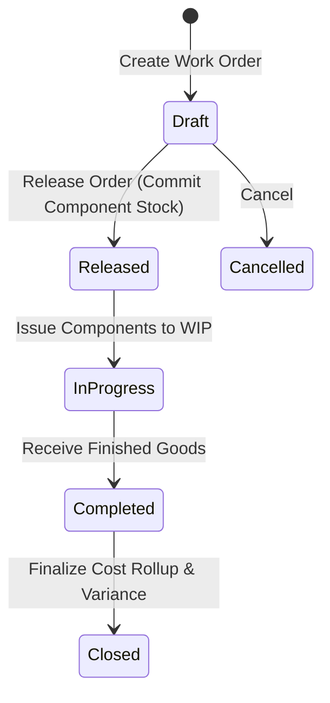

# Manufacturing & Work Orders

The **Work Orders** module coordinates assembly and manufacturing processes. It consumes raw component stock based on Bill of Materials (BOM) formulas, tracks Work-in-Progress (WIP), and receives capitalized finished goods into inventory.

---

## Manufacturing Lifecycle & Cost Rollup Logic



### 1. Bill of Materials (BOM) Component Requirements
When a work order is released, required component quantities are computed from the multi-level BOM:

```
Required Component Quantity = Target Quantity * BOM Component Ratio * (1 + Scrap Allowance% / 100)
```

* **Stock Commitment**: Advancing to `Released` commits raw materials in storage bins, preventing other sales orders or work orders from claiming those parts.
* **Component Issue**: Advancing to `In-Progress` physically decrements component counts from storage bins and moves stock value into Work-in-Progress (WIP).

### 2. Finished Good Valuation & Cost Rollup
When assembly is finalized, the unit cost of the finished product is calculated dynamically:

```
Total Manufacturing Cost = Sum(Actual Component Qty Consumed * Component WAC) + Labor & Overhead
Finished Good Unit Cost = Total Manufacturing Cost / Completed Quantity
```

The resulting unit cost becomes the initial Moving WAC for newly manufactured stock batches.

### 3. General Ledger Manufacturing Postings

```
1. Component Consumption (Issue to Floor):
   Debit:  Work in Progress (WIP) Asset Account
   Credit: Raw Materials Inventory Asset Account

2. Finished Goods Completion:
   Debit:  Finished Goods Inventory Asset Account (Completed Qty * Finished Unit Cost)
   Credit: Work in Progress (WIP) Asset Account

3. Scrap / Production Loss:
   Debit:  Manufacturing Scrap / Variance Expense
   Credit: Work in Progress (WIP) Asset Account
```

---

## Step-by-Step Workflows

### 1. Creating and Completing a Work Order
1. Go to **Manufacturing** → **Work Orders** (`/manufacturing/work-orders`).
2. Click **New Work Order**.
3. Select the **Finished Product** and specify the **Target Quantity**.
4. Review the auto-populated **Bill of Materials (BOM)** components.
5. Click **Release Order** to commit raw components.
6. When assembly starts on the floor, click **Start Assembly** (issues parts to WIP).
7. Upon completion, enter **Completed Quantity** and any **Scrapped Quantity**.
8. Click **Complete Work Order** to deposit finished units into storage and post capitalized asset entries.

---

## Field Reference

| Field | Description |
| :--- | :--- |
| **Work Order Number** | Unique production identifier (e.g. `WO-2026-00021`). |
| **Finished Good** | Assembled product SKU and description. |
| **Target Quantity** | Scheduled production count. |
| **Completed Quantity** | Actual accepted units manufactured. |
| **Scrapped Quantity** | Defective or damaged units recorded during assembly. |
| **Production Warehouse** | Facility where assembly occurs. |
| **Status** | Stage (`Draft`, `Released`, `In-Progress`, `Completed`, `Closed`). |

